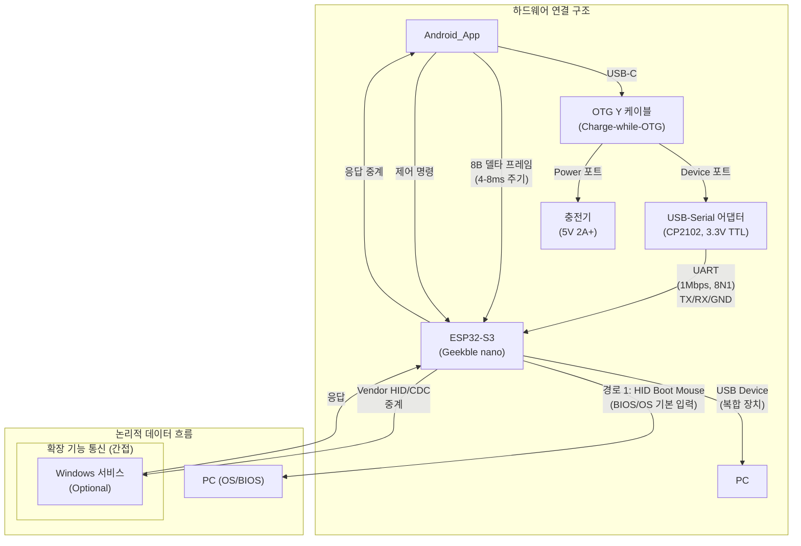

# PCRemote 개발 계획서 (근육장애 사용자를 위한 Android-PC 입력 브릿지)

## 목차
- 1. 프로젝트 개요
  - 1.1 사용자가 처한 문제 상황
  - 1.2 해결책
  - 1.3 프로젝트 소개
  - 1.4 킬링 포인트
  - 1.5 핵심 기능 요약
  - 1.6 개발 범위 및 환경
- 2. 사용자 중심 설계
  - 2.1 사용자 프로필
    - 2.1.1 터치 제약 조건
    - 2.1.2 개발 환경 정보
    - 2.1.3 핵심 기능 요구사항
- 3. 앱 기능 요구사항
  - 3.1 핵심 기능
  - 3.2 페이지별 기능 구성
- 4. 기술 아키텍처
  - 4.1 최단 경로 접근
  - 4.2 기술 스택
  - 4.3 설치 및 설정
- 5. 개발 계획
  - Phase 1~4
- 6. 커스터마이징 요구사항
  - 6.1 접근성 설정
  - 6.2 기능 커스터마이징
- 7. 성능 요구사항
  - 7.1 성능 목표
  - 7.2 안정성 요구사항

## 용어집/정의

- Selected/Unselected: 선택 상태. UI의 선택/강조 여부 표현.
- Enabled/Disabled: 입력 가능 상태. 상호작용 가능 여부.
- BootSafe/Normal: 시스템 운용 상태. BootSafe(최소 입력), Normal(확장 기능 허용).
- TransportState: NoTransport | UsbOpening | UsbReady | BleOpening | BleReady.
- 상태 용어 사용 원칙(금칙어 포함):
  - "활성/비활성" 금지. 선택 상태는 Selected/Unselected, 입력 가능 상태는 Enabled/Disabled로 표기 [[memory:5809234]].

## 1. 프로젝트 개요

### 1.1 사용자가 처한 문제 상황

- 보안/안티치트 환경에서 네트워크 기반 원격 제어 앱이 차단되거나 지연·불안정하여 실사용이 어려움
- BIOS/로그인 전 단계에서 입력 불가
- 무선 연결만 의존 시 지연 및 안정성 저하
- 개인화 커스터마이징 한계: 데드존/더블탭 보정, 스크롤(일반/무한) 전환, 큰 버튼/한 손 제스처 같은 세밀한 기능을 시판 앱에서 구현·유지보수하기 곤란

### 1.2 해결책

- Android 앱 + USB‑OTG + ESP32‑S3 동글로 USB HID 직접 입력 전달
- 연결 정책: 유선(USB) 우선, 불가 시 BLE HOGP 백업
- 단일 터치 중심 UX, 사용자 맞춤 파라미터 제공
- 설치/설정 최소화 및 빠른 반복 개발

### 1.3 프로젝트 소개

PCRemote는 Android 스마트폰을 마우스/키보드로 바꾸어 PC 작업을 가능하게 하는 접근성 보조 도구입니다.
단일 터치 중심 UX, 저지연 유선 경로, Boot‑safe 대응을 핵심으로 합니다.

### 1.4 킬링 포인트

- Boot‑safe 호환: BIOS/로그인 화면에서도 USB HID로 동작
- 초저지연: 유선 우선 경로, 입력 지연 목표 50ms 이하
- One‑touch 접근성: 한 손·단일 터치 중심, 세밀한 커스터마이징
- 멀티 커서 텔레포트: 두 위치 간 즉시 전환으로 작업 시간 단축
- 안정성: 오프라인/보안 환경에서도 일관된 동작

### 1.5 핵심 기능 요약

- 터치패드: 드래그로 커서 이동, DPI 3단계
- 모드 전환: 클릭/이동/스크롤, 축 스냅, 좌/우클릭 전환
- 스크롤: 일반/무한 스크롤, 더블탭으로 종료
- 드래그 앤 드롭: 길게 누르기로 드래그 시작
- 멀티 커서: 가상 커서 표시, 텔레포트 전환
- 키보드/단축키/매크로: 자주 쓰는 키·조합 원터치 실행

### 1.6 개발 범위 및 환경

개발 범위:
이 프로젝트는 사용자 1인의 작업 환경 편의성 개선을 위해 설계 및 개발됩니다.
다양한 기기별 호환성·배포 고려를 배제하고, 특정 환경에서의 안정성과 성능 최적화에 집중합니다.

개발 환경 특화:
- 단일 사용자 최적화: 특정 사용자의 신체 조건과 작업 패턴에 맞춘 맞춤형 개발
- 환경 고정성: 사용자의 특정 PC 환경과 Android 기기에 최적화
- 빠른 반복 개발: 사용자 피드백을 즉시 반영할 수 있는 유연한 개발 프로세스
- 기술적 단순화: 범용성보다 안정성과 성능에 집중

---

## 2. 사용자 중심 설계

### 2.1 사용자 프로필

#### 2.1.1 터치 제약 조건
터치 가능 영역:
- 선호 영역: 스마트폰 좌하단 ~ 중앙 하단 (화면의 약 30% 영역)
- 회피 영역: 우상단, 상단 전체 (손이 닿기 어려운 영역)
터치 패턴:
- 터치 정확도: 단일 지점 터치 및 드래그 정확도는 높음
- 연속 터치: 0.2초 이상의 간격으로 안정적인 연속 터치 가능
- 연속 터치 시 손떨림: 두 번째 터치부터 미세 드래그가 있을 수 있음
시야 분포:
- 주 시야: PC 모니터 (대부분의 시야 집중)
- 부 시야: 스마트폰 (곁눈질로 잠깐씩만 확인)
- UI 설계 영향: 스마트폰 화면을 집중해서 보지 않고도 앱 내 각 컴포넌트의 상태를 직관적으로 인지할 수 있어야 함

#### 2.1.2 개발 환경 정보
Android 스마트폰:
- 모델: Samsung Galaxy s10e
- 해상도: 2280 × 1080
 - OS 버전: Android 12
Windows PC:
- OS: Windows 11 Home
- 모니터: 32인치 QHD (2560 x 1440) + 24인치 FHD (1920 x 1080)
- USB 포트: USB 3.0 포트 4개
- 네트워크: 이더넷 연결
연결 환경:
- USB 케이블: Type-A to Type-C 또는 OTG 어댑터
- BLE: 백업 연결용(HID over GATT)

#### 2.1.3 핵심 기능 요구사항
최우선 기능:
1. 정밀한 커서 제어: 픽셀 단위 정밀한 마우스 커서 이동
2. 단일 터치 접근: 모든 기능을 한 번의 터치로 수행
3. 안정적인 연결: 작업 중 연결 끊김 없는 안정성
4. 빠른 반응: 터치 입력에 대한 즉각적인 반응
주요 기능:
1. 자주 사용 단축키: Ctrl+C/V, Alt+Tab 등
2. 스크롤 기능: 문서 및 웹페이지 스크롤
3. 드래그 앤 드롭: 파일 및 텍스트 선택/이동
4. 모드 전환: 마우스/키보드 모드 간 쉬운 전환

---

## 3. 앱 기능 요구사항

> 상세한 UI/UX 디자인은 `design-guide-app.md` 참조

### 3.1 핵심 기능
터치패드
- 마우스 커서 제어: 터치패드 영역에서 드래그로 PC 마우스 커서 이동
- DPI 조절: DPI 변경 버튼으로 마우스 민감도 3단계 조절 (낮음/보통/높음)
- 모드별 터치 동작:
  - 클릭 모드: 좌클릭/우클릭 전환
  - 이동 모드: 자유 이동/직각 이동 전환(축 스냅)
  - 스크롤 모드: 비활성/일반/무한 전환, 드래그로 페이지 스크롤(상하/좌우)
- 모드 전환: 각 모드 전환은 독립 버튼으로 제어(스크롤 종료는 더블탭 제스처 지원)
- 드래그 앤 드롭: 클릭 모드에서 길게 누르기로 드래그 시작
- 멀티 커서 기능:
  - 2개의 독립된 터치패드로 가상 멀티 커서 환경 구현
  - 터치패드 전환으로 실제 커서가 다른 위치로 즉시 이동 (텔레포트)
  - 멀리 떨어진 화면 영역 간 작업 효율성 극대화 (작업 시간 80% 단축)
  - 가상 커서 이미지로 비활성 커서 위치 시각적 표시
키보드
- 키보드 버튼: 자주 사용하는 키(Ctrl, Alt 등) 버튼 하나로 원터치 실행
- 자주 사용하는 단축키: Ctrl+C, Ctrl+V, Alt+Tab 등 버튼 하나로 원터치 실행
- 매크로 기능: 사전 정의된 작업 시퀀스를 단일 버튼으로 실행

### 3.2 페이지별 기능 구성

> 향후 개발 상황에 따라 달라질 수 있으므로 참고용으로 볼 것.

참조: `Docs/styleframe-BIOS.md`(Boot-safe 전용 페이지), `Docs/styleframe-page3.md`(Minecraft 특화 페이지)

#### 3.2.1 BIOS/Boot-safe 전용 페이지
- 목적: OS 이전 단계(BIOS/로그온/UAC 등)에서 안전하게 최소 입력 제공
- 핵심 컴포넌트: Touchpad(좌클릭 단발), Minimal Actions(옵션: Esc/Enter/F1–F12/Arrow — Boot Keyboard 지원 시)
- 대표 제약: Wheel=0, 드래그/스크롤/우클릭/매크로 비활성
- 상세: `design-guide-app.md` §10.2·§10.6.1·§10.7, `styleframe-BIOS.md`

#### 3.2.2 마우스 중심 페이지
- 목적: 정밀 커서 + 흔용 단축키
- 핵심 컴포넌트: Touchpad, Control Buttons, Actions
- 대표 액션: 이동/클릭/스크롤, DPI 3단계
- 상세: `design-guide-app.md` §4·§5, `styleframe-page1.md`

#### 3.2.3 키보드 중심 페이지
- 목적: 키/조합/락키 집중 입력
- 핵심 컴포넌트: Modifiers, Navigation/Editing, Shortcuts/Media/Lock
- 대표 액션: 조합 입력, 반복 입력
- 상세: `design-guide-app.md` §5, `styleframe-page2.md`

#### 3.2.4 게임 특화 페이지(Minecraft)
- 목적: 게임/작업 특화 매핑(DPad/시점/핫바 등)
- 핵심 컴포넌트: DPad, Camera Touch, Actions
- 상세: `design-guide-app.md` §1.2.1, `styleframe-page3.md`

---

## 4. 기술 아키텍처

### 4.1 최단 경로 접근
목표: 최대한 빠르고 간단하게 동작하는 시스템

PCRemote는 단일 유선 연결을 통해 두 가지 종류의 통신 경로를 제공하는 하이브리드 아키텍처를 사용합니다.

1.  **경로 1: 기본 입력 경로 (단방향, 저지연)**
    - **흐름**: `[Android 앱] → [USB-OTG] → [ESP32‑S3] → [USB HID] → [PC(Windows/BIOS)]`
    - **역할**: 마우스/키보드의 핵심 입력을 전달합니다. 표준 USB HID Boot Protocol을 준수하여 BIOS, BitLocker, UAC 등 OS 부팅 전 단계에서도 안정적인 동작을 보장합니다.

2.  **경로 2: 확장 기능 경로 (양방향)**
    - **흐름**: `[Android 앱] ↔ [USB-OTG] ↔ [ESP32‑S3] ↔ [PC Windows 서비스]`
    - **역할**: "매크로 실행 완료", "UI 상태 동기화" 등 기본 HID 규격으로 처리할 수 없는 복잡한 커스텀 데이터를 양방향으로 주고받습니다. ESP32-S3가 표준 HID 장치 외에 가상 시리얼 포트(CDC-ACM)나 제조사 정의 장치(Vendor-Defined Device)로 동작하여 통신 채널을 확보합니다.

이 구조를 통해 저지연 입력과 기능 확장성을 모두 확보합니다.

통신 방식: USB HID 동글을 통한 유선 연결(가장 안정적)

### 4.2 기술 스택
Android (Kotlin):
- 기본 Activity + Service
- USB‑OTG 전송(동글 직결) 및 양방향 통신

USB HID 동글(펌웨어):
- MCU: ESP32‑S3
- TinyUSB 기반 복합 USB 장치(Composite Device)
  - 인터페이스 1: HID Boot Protocol Mouse + Report Protocol 확장(휠)
  - 인터페이스 2: Vendor-Defined 또는 CDC-ACM (양방향 데이터 채널)
- BLE HOGP(선택) 또는 USB Device 모드

Windows 서비스 (C# .NET, Optional):
- 백그라운드 서비스로 동작
- ESP32-S3의 Vendor/CDC 인터페이스와 통신
- 매크로 실행, UI 상태 동기화 등 고급 기능 처리

### 4.3 설치 및 설정
1. USB HID 동글: 사전 플래시된 펌웨어 사용(PC 연결 시 자동 인식)
2. Android: APK 설치 후 BLE 페어링 또는 USB‑OTG로 동글 연결
3. 연결: 자동 재연결 및 프로파일 저장
4. 관리: 앱 내 설정 화면에서 모든 기능 접근

---

## 5. 개발 계획

- 본 계획은 기간(주/일) 표기 없이 모듈과 완료 기준(Definition of Done, 이하 DoD) 기반으로 실행합니다.
- 모든 구현은 중앙 명세(`Docs/technical-specification.md`)와 설계 가이드(`Docs/design-guide-app.md`, `Docs/touchpad.md`, `Docs/usb-hid-bridge-architecture.md`)를 단일 출처로 삼습니다.
- 선택 상태/입력 가능 상태 용어는 일관되게 `Selected/Unselected`, `Enabled/Disabled`를 사용합니다.

### 5.1 목표와 원칙
- DoD 우선: 기능 단계별로 명확한 산출물·수용 기준을 정의하고 충족 시 완료로 간주
- 크리티컬 패스 우선: 입력 경로 안정화(USB‑OTG → 동글 → USB HID) → 상태/네비 → UI/피드백 → 확장 기능 순
- 단일 출처 참조: 설계·명세 변경은 `Docs/technical-specification.md`에 우선 반영 후 구현 문서/코드에 전파
- 측정 가능성: 성능·안정성 목표는 §7(성능 요구사항)을 준수하며, 측정/테스트 항목을 모듈 DoD에 포함

### 5.2 크리티컬 패스(상위 흐름)
1) 전송 경로: Android ↔ USB‑OTG ↔ ESP32‑S3(부트/리포트) ↔ PC(Windows/BIOS)
2) 연결 정책: 유선(USB) 우선, 불가 시 BLE(HOGP) 백업 신호/스켈레톤 확보
3) 상태 모델: BootSafe ↔ Normal 전환, 연결/끊김/재시도 이벤트 정의
4) UI 피드백: 상단 토스트, 페이지 인디케이터, 햅틱, 입력 차단 오버레이
5) 입력 엔진: 터치패드 제스처/모드/옵션(데드존·보상·스크롤) 정합 구현

참조: `Docs/usb-hid-bridge-architecture.md`, `Docs/design-guide-app.md` §5(토스트/인디케이터/햅틱), §10.4(입력 차단), `Docs/touchpad.md` §3(터치/모드/옵션), `Docs/technical-specification.md`(프로토콜/상태/알고리즘)

### 5.3 모듈별 실행 계획

#### 5.3.1 프로젝트 인프라/구조
- 목적: 모듈 경계 정립 및 빌드 기반 마련
- 산출물: `feature/*`, `core/*` 패키지 구조, 네비게이션 스캐폴드, 디자인 토큰(Material3 다크/폰트)
- DoD:
  - 앱이 빌드/실행되며 기본 네비(탭/스와이프)와 공용 테마 적용
  - 디자인 토큰(색/타이포/스페이싱) 정의 파일 존재, Compose 미리보기 정상
- 의존성: 없음(최상위)
- 검증: 빌드 성공, 런치/탐색 동작, 간단 UI 테스트 1건
- 참조: `Docs/design-guide-app.md` §2, §9

#### 5.3.2 공통 UI 컴포넌트
- 목적: 사용자 주 시야 전환을 최소화하는 피드백 컴포넌트 제공
- 산출물: 상태 알림 토스트, 페이지 인디케이터, 햅틱 API, 입력 차단 오버레이
- DoD:
  - 토스트: 정보/성공/오류/진행 스타일, 표시 시간, 애니메이션 규격 충족, 접근성 LiveRegion 적용
  - 인디케이터: 페이지 수/활성/비활성 상태, 스케일 스프링 애니메이션
  - 햅틱: Light/Medium/Strong/Error/Streaming 카테고리 매핑 및 API 제공
  - 오버레이: 전역 입력 차단/해제, 흑백 필터 페이드 인·아웃
- 의존성: 5.3.1
- 검증: Compose UI 테스트(표시/숨김/애니메이션), 접근성 속성 확인
- 참조: `Docs/design-guide-app.md` §5.2/§5.3/§5.4/§10.4

#### 5.3.3 터치패드(입력 엔진)
- 목적: 저지연 정밀 커서 제어와 스크롤/드래그 등 핵심 제스처 구현
- 산출물: TouchpadWrapper, Area 분할/통합, ControlButtonContainer, 제스처/보정 로직
- DoD:
  - 이동/클릭/스크롤 모드 전환과 DPI/스크롤 감도 옵션 동작
  - 데드존/축 스냅/더블탭/롱프레스 규칙 준수, 스크롤 일반/무한 전환
  - 테두리/가이드 색상/우선순위 정책 적용, 멀티 커서 표시(비선택 커서 이미지)
- 의존성: 5.3.2
- 검증: 알고리즘 단위 테스트(데드존/축 스냅/스크롤 단위·감쇠), 60fps 유지
- 참조: `Docs/touchpad.md` §3, §5; `Docs/technical-specification.md` §5

#### 5.3.4 연결(USB‑OTG/BLE)
- 목적: 안정적·예측 가능한 입력 경로 수립
- 산출물: USB 권한/탐지/연결/전송/해제, Boot↔Report 전환, Keep‑alive, 오류/분리 감지, 재연결 백오프, BLE 스켈레톤
- DoD:
  - 유선 경로에서 BootSafe↔Normal 전환 처리, `KEEP_ALIVE_INTERVAL_MS = 5000` 동작
  - 오류/분리 감지 후 백오프 재연결, 상태 이벤트 브로드캐스트
  - BLE(HOGP) 스캔/페어/연결 인터페이스 스켈레톤 확보(데이터 경로는 연구 결과 반영)
- 의존성: 5.3.1
- 검증: 통합 테스트(연결/끊김/재연결/프로토콜 전환), 입력 지연 < 50ms 목표
- 참조: `Docs/usb-hid-bridge-architecture.md` §5

#### 5.3.5 상태/네비게이션
- 목적: BootSafe ↔ Normal 상태 기계와 페이지 전환 일관성 확보
- 산출물: 상태 머신, 페이지 전환 제스처, 토스트/햅틱 연동, Boot‑safe 전용 페이지
- DoD:
  - 상태 전이(연결/끊김/핸드셰이크) 시 UI/입력 정책이 일관되게 반영
  - Boot‑safe 페이지에서 허용 기능 최소화(이동/좌클릭/드래그)와 배너/토스트 적용
- 의존성: 5.3.2, 5.3.4
- 검증: 통합 테스트(상태 전이, 페이지 전환 제스처), 접근성 점검
- 참조: `Docs/design-guide-app.md` §10.2~§10.7; `Docs/styleframe-BIOS.md`

#### 5.3.6 백그라운드/저장
- 목적: 세션 지속성과 비정상 종료 복구
- 산출물: Foreground Service, SharedPreferences 즉시 저장, 세션 동기화
- DoD:
  - 연결 유지 알림, 페이지/모드/DPI/입력 진행 상태 실시간 저장
  - 비정상 종료 후 안전 모드 복귀 및 세션 일관성 확보
- 의존성: 5.3.4, 5.3.5
- 검증: 재시작/복구 시나리오 테스트, 데이터 일관성 확인
- 참조: `Docs/design-guide-app.md` §10.5; `Docs/technical-specification.md`(플랫폼 계약)

#### 5.3.7 오류/예외 처리
- 목적: 예측 가능한 오류 처리와 사용자 피드백
- 산출물: 연결 오류 UI(테두리 점멸/버튼 그레이아웃/토스트), 타임아웃/권한 오류/재시도/설정 이동
- DoD:
  - 모든 오류 케이스에 대해 사용자 가시 피드백과 재시도/가이드 제공
  - 무효 입력 시 햅틱/토스트 중복 방지 규칙 적용
- 의존성: 5.3.2, 5.3.4
- 검증: 예외 시나리오 통합 테스트, 접근성/국제화 문구 점검
- 참조: `Docs/design-guide-app.md` §10.1~§10.6

#### 5.3.8 테스트/QA
- 목적: 신뢰도와 회귀 안정성 확보
- 산출물: 알고리즘 단위 테스트, Compose UI 테스트, 통합 테스트, 성능 테스트 스크립트
- DoD:
  - 단위/통합/성능 테스트 자동화 스위트 통과, 입력 지연 < 50ms, 60fps 기준 달성
  - 주요 유저 플로우(연결/모드 전환/스크롤/드래그/Boot‑safe 전환) 시나리오화 완료
- 의존성: 전 모듈
- 검증: CI 상 자동 실행, 실패 시 원인/재현 절차 기록
- 참조: `Docs/technical-specification.md`(KPI/측정법)

#### 5.3.9 빌드/배포/CI
- 목적: 반복 가능한 빌드와 기초 품질 게이트
- 산출물: 의존성 버전 고정(`gradle/libs.versions.toml`), 서명/Proguard 설정, 간단 CI(빌드/테스트), 크래시 로깅 검토
- DoD:
  - 로컬/CI 동일 결과 재현, Proguard 예외로 입력 경로 보존, 기본 크래시 수집
- 의존성: 전 모듈
- 검증: CI 파이프라인 성공, 서명 빌드 생성
- 참조: 루트 Gradle 설정, `Android/app/build.gradle.kts`

---

## 6. 커스터마이징 요구사항

> 주의(범위): 본 절의 커스터마이징 항목은 앱 사용 중 런타임 설정이 아니라, 빌드 전 코드단에서 이루어지는 작업입니다. UI로 노출하지 않으며, 값 변경은 소스 코드 상수/구성 변경 후 재빌드를 통해 반영됩니다. 자세한 기준은 `Docs/touchpad.md` §4(코드 레벨 커스터마이징 옵션) 및 `Docs/design-guide-app.md` §10.4.6을 따릅니다.

### 6.1 접근성 설정
- 터치 감도 조절: 사용자의 터치 강도에 맞춘 민감도 조절
- 버튼 크기 조절: 신체 조건에 따른 버튼 크기 확대/축소
- 길게 누르기 시간: 우클릭 등에 필요한 홀드 시간 조절
- 햅틱 피드백: 진동 피드백 강도 조절

### 6.2 기능 커스터마이징
- 단축키 설정: 자주 사용하는 키 조합을 개인별로 설정
- 터치패드 설정: 터치패드 크기 및 민감도 조절
- 페이지 순서: 사용자 선호도에 따른 페이지 배치 순서 변경

---

## 7. 성능 요구사항

### 7.1 성능 목표
- 입력 지연: 50ms 이하(BLE 기준 70ms)
- 연결 안정성: 장시간 연속 사용 가능
- 터치 정확도: 높은 인식률로 안정적인 입력 보장

### 7.2 안정성 요구사항
- 자동 재연결: 연결 끊김 시 자동 복구
- 상태 표시: 연결 상태를 명확히 표시
- 백업 연결: 유선(USB‑OTG) 사용 불가 시 BLE 백업 제공
