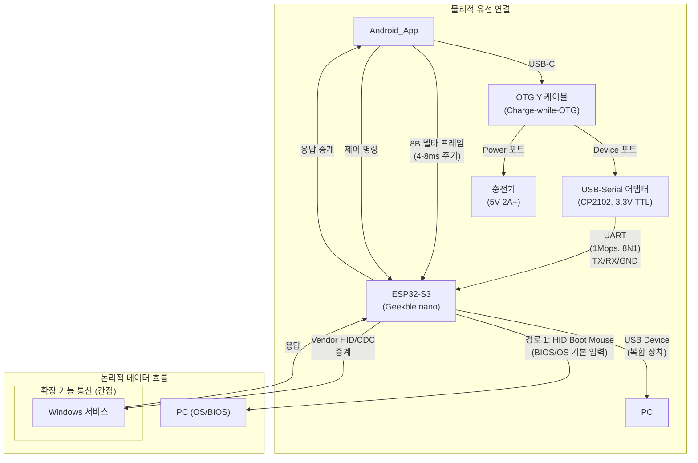

# PCRemote Windows 서버 백엔드 가이드

## 목차
- 1. 개요
  - 1.1 서버의 목적과 역할
  - 1.2 시스템 아키텍처에서의 위치
  - 1.3 Optional 구성 요소로서의 특성
- 2. 용어집/정의
- 3. 시스템 아키텍처
  - 3.1 기술 스택
  - 3.2 구성요소 개요
  - 3.3 통신 방식
- 4. 핸드셰이크 프로토콜
  - 4.1 연결 절차
  - 4.2 타임아웃 및 폴백 처리
  - 4.3 Keep-alive 정책
- 5. 주요 유저 플로우
  - 5.1 서버-앱 최초 연결 및 Normal 모드 전환
  - 5.2 사전 정의 매크로 실행
  - 5.3 녹화 매크로 생성 및 재생
  - 5.4 멀티 커서 텔레포트
  - 5.5 연결 끊김 및 복구
- 6. 고급 기능 구현
  - 6.1 멀티 커서 관리
  - 6.2 매크로 실행 엔진
  - 6.3 녹화 매크로 처리
  - 6.4 장기 작업 플로우
- 7. 설치 및 설정
  - 7.1 시스템 요구사항
  - 7.2 설치 절차
  - 7.3 보안 환경 설정
- 8. 오류 처리 및 복구
  - 8.1 연결 실패 처리
  - 8.2 비정상 종료 복구
  - 8.3 디버깅 및 로깅
- 9. 성능 최적화
  - 9.1 저지연 처리
  - 9.2 리소스 관리
- 10. 참조 및 연관 문서

## 용어집/정의

- **BootSafe/Normal**: 시스템 운용 상태. BootSafe는 OS 이전(BIOS/로그인) 단계, Normal은 OS 진입 후 확장 기능 허용.
- **Selected/Unselected**: 선택 상태. UI의 선택/강조 여부 표현.
- **Enabled/Disabled**: 입력 가능 상태. 상호작용 가능 여부.
- **TransportState**: NoTransport | UsbOpening | UsbReady | BleOpening | BleReady.
- **핸드셰이크**: Android 앱과 Windows 서버 간 연결 확립 및 상태 동기화 과정.
- **Keep-alive**: 연결 유지를 위한 주기적 신호 (5초 주기).
- **상태 용어 사용 원칙(금칙어 포함)**:
  - "활성/비활성" 금지. 선택 상태는 Selected/Unselected, 입력 가능 상태는 Enabled/Disabled로 표기 [[memory:5809234]].

## 1. 개요

### 1.1 서버의 목적과 역할

PCRemote Windows 서버는 Android 앱에서 전송되는 고급 입력 명령을 Windows 환경에서 처리하는 **Optional 구성요소**입니다.

핵심 특징:
- **Optional 구성**: 서버 없이도 ESP32-S3 동글을 통한 기본 HID 입력(마우스/키보드)은 정상 동작
- **고급 기능 제공**: 멀티 커서, 매크로, 녹화 기능 등 단순 HID를 넘어서는 확장 기능 지원
- **보안 환경 적응**: EDR/방화벽 등으로 차단될 수 있는 환경을 고려한 설계
- **저지연 처리**: 전체 입력 지연 목표 50ms 달성에 기여

### 1.2 시스템 아키텍처에서의 위치



연결 플로우:
1. **기본 경로**: Android → 동글 → Windows (HID Boot Mouse로 기본 마우스 기능)
2. **확장 경로**: Android ↔ 동글(중계) ↔ Windows 서버 (Vendor HID/CDC로 고급 기능)

### 1.3 Optional 구성 요소로서의 특성

본 서버는 시스템의 **선택적(Optional) 구성 요소**로서, 서버의 유무에 따라 시스템의 동작 방식과 지원 기능 범위가 달라집니다. 이는 서버가 차단될 수 있는 보안 환경에서의 안정성을 보장하고, 서버의 핵심 가치를 명확히 정의하기 위함입니다.

#### 서버 부재 시 동작 (폴백 시나리오)

Windows 서버가 설치되지 않았거나 방화벽/EDR 등에 의해 차단된 경우, 시스템은 다음과 같이 **동글 단독 모드**로 동작합니다.

- **기본 마우스/키보드 입력**: 동글의 표준 USB HID 경로를 통해 모든 기본 입력이 정상적으로 동작합니다.
- **`BootSafe` 모드**: PC가 OS 진입 전(BIOS, BitLocker, 로그인 화면 등)인 `BootSafe` 상태에서의 입력이 완벽하게 지원됩니다.
- **`Normal` 모드 자동 전환**: 서버 없이도, 동글이 PC로부터 `SET_PROTOCOL=REPORT` 신호를 감지하면 자동으로 `Normal` 모드로 전환하여 휠 스크롤과 같은 확장 HID 기능을 활성화합니다.
- **결론**: 서버가 없어도 핵심적인 PC 제어 기능은 손실되지 않습니다.

> 상세한 동글-PC 간 상호작용은 `Docs/usb-hid-bridge-architecture.md`를 참조하십시오.

#### 서버 존재 시 추가 가치

Windows 서버가 성공적으로 연결되면 다음과 같은 **고급 기능(확장 경로)이 활성화**되어 사용자 경험을 극대화합니다.

- **`Normal` 모드 빠른 전환**: Android 앱이 서버와 5초 이내에 핸드셰이크에 성공하면, 동글의 신호 감지를 기다리지 않고 즉시 `Normal` 모드로 전환하여 지연 시간을 최소화합니다.
- **멀티 커서 텔레포트**: 두 개의 가상 커서 위치 간에 실제 커서를 즉시 이동시키는 기능을 완벽하게 지원합니다.
- **복잡한 매크로 실행**: 키 조합, 마우스 클릭, 딜레이가 포함된 정교한 자동화 작업을 수행합니다.
- **녹화 매크로**: 사용자의 실시간 PC 입력을 녹화하고 그대로 재실행하는 기능을 제공합니다.

## 3. 시스템 아키텍처

### 3.1 기술 스택

**C# .NET 기반 구현**:
- **.NET 6+ (Long Term Support)**: 크로스 플랫폼 호환성 및 성능 최적화
- **Windows API Interop**: 커서 제어, 시스템 이벤트 처리
- **TCP/UDP 통신**: Android 앱과의 핸드셰이크 및 데이터 교환
- **Windows Service 또는 Console Application**: 백그라운드 실행 지원

**필수 라이브러리**:
- System.Windows.Forms (커서 제어)
- System.Net.Sockets (네트워크 통신)
- System.Threading.Tasks (비동기 처리)
- Microsoft.Extensions.Hosting (서비스 라이프사이클)

### 3.2 구성요소 개요

**핵심 모듈**:
1. **Connection Manager**: Android 앱과의 핸드셰이크 및 연결 관리 (**ESP32-S3 브리지 경유**)
2. **Input Engine**: 고급 입력 명령 처리 (멀티 커서, 매크로)
3. **State Manager**: BootSafe ↔ Normal 상태 관리 및 동기화
4. **Macro Engine**: 매크로 실행 및 녹화 기능
5. **Logging & Diagnostics**: 오류 추적 및 성능 모니터링

**보조 모듈**:
- Configuration Manager (설정 파일 관리)
- Security Manager (권한 및 보안 정책)

### 3.3 통신 방식

**Android 앱과의 통신**:
- **Protocol**: PC ↔ ESP32-S3 ↔ Android 앱으로 이어지는 USB 기반 통신. PC 쪽에서는 Vendor-Defined HID 또는 가상 COM 포트(CDC-ACM)를 사용합니다.
- **Message Format**: JSON 기반 구조화 메시지

**동글과의 연계**:
- **직접 통신**: Windows 서비스는 ESP32-S3 동글의 Vendor/CDC 인터페이스와 직접 통신하며, 동글은 이 데이터를 UART를 통해 Android 앱으로 중계합니다.
- SET_PROTOCOL 상태 정보는 Android 앱을 통해 간접 수신

## 4. 핸드셰이크 프로토콜

### 4.1 연결 절차

**Phase 1: Discovery (1-2초)**
1. Android 앱이 네트워크 스캔으로 서버 탐지
2. 서버가 Discovery Response 전송 (서버 버전, 지원 기능 목록)

**Phase 2: Authentication (1-2초)**
1. 상호 인증 (기기 ID 기반 신뢰 관계)
2. 세션 키 교환 (AES-256 대칭 암호화)

**Phase 3: State Sync (1-2초)**
1. 현재 BootSafe/Normal 상태 동기화
2. 지원 가능한 고급 기능 활성화 확인
3. Keep-alive 주기 협상 (기본 5초)

**전체 타임아웃**: 5초 (PRD 요구사항 준수)

### 4.2 타임아웃 및 폴백 처리

**타임아웃 시나리오**:
- **2초 내 Discovery 실패**: 서버 없음으로 간주, 동글 전용 모드 유지
- **5초 내 전체 핸드셰이크 실패**: Android 앱은 기본 HID 경로만 사용
- **보안 소프트웨어 차단**: 연결 실패 로그 기록, 사용자 가이드 제공

**폴백 동작**:
- Normal 모드 전환: 동글의 SET_PROTOCOL 감지만으로 판단
- 고급 기능: 모두 Disabled 상태로 유지
- 재연결: 지수 백오프 방식으로 재시도 (1s, 2s, 4s, 8s)

### 4.3 Keep-alive 정책

**주기**: 5초 (usb-hid-bridge-architecture.md와 일치)
**Ping-Pong 방식**:
1. Android 앱이 PING 전송
2. 서버가 1초 내 PONG 응답
3. 3회 연속 실패 시 연결 불안정으로 간주

**연결 실패 처리**:
- 즉시 고급 기능 Disabled
- Android 앱에 CONNECTION_LOST 신호 전송
- 백그라운드에서 재연결 시도 지속

## 5. 주요 유저 플로우

본 섹션은 Windows 서버가 Android 앱 및 ESP32-S3 동글과 상호작용하는 주요 시나리오를 설명합니다.

### 5.1 서버-앱 최초 연결 및 Normal 모드 전환

이 플로우는 사용자가 PC에서 서버를 실행하고 Android 앱과 처음 연결하여 고급 기능을 활성화하는 과정입니다.

1. **서버 시작 및 대기**:
- 사용자가 Windows에서 `PCRemote Server`를 실행합니다.
- 서버는 지정된 포트(기본 8888)에서 Android 앱의 연결 요청(Discovery)을 리스닝하기 시작합니다.
- `State Manager`는 초기 상태를 `BootSafe`로 설정합니다.

2. **Android 앱의 탐색 및 핸드셰이크 요청**:
- Android 앱이 시작되고, `TransportState`가 `UsbReady`가 되면 동일 네트워크 내에서 서버를 탐색합니다.
- 앱이 서버를 발견하면, 3단계 핸드셰이크(Discovery → Authentication → State Sync)를 시작합니다.
- 참조: `Docs/design-guide-app.md` §10.2

3.**서버의 응답 및 상태 동기화**:
- 서버 `Connection Manager`가 핸드셰이크 요청에 응답합니다.
  - 서버 버전, 지원 기능 목록을 전송합니다.
  - 상호 인증 및 세션 키 교환을 수행합니다.
- `State Sync` 단계에서, 서버는 현재 PC가 OS에 진입한 `Normal` 상태임을 앱에 알립니다. 이는 동글의 `SET_PROTOCOL=REPORT` 감지 정보와 교차 검증됩니다.
  - 참조: `windows-server-guide.md` §4.1

4. **`Normal` 모드 활성화 및 고급 기능 잠금 해제**:
- 핸드셰이크가 5초 내에 성공적으로 완료되면, Android 앱은 `AppMode`를 `Normal`로 전환합니다.
- 앱 UI에서 비활성화(`Disabled`)되었던 고급 기능(멀티 커서, 매크로 등)이 `Enabled` 상태로 변경됩니다.
- 서버는 `Input Engine`과 `Macro Engine`을 활성화하고 앱으로부터의 고급 기능 요청을 처리할 준비를 마칩니다.
- 참조: `Docs/styleframe-BIOS.md` §5

### 5.2 사전 정의 매크로 실행

이 플로우는 사용자가 Android 앱의 `MacroButton`을 탭하여 PC에서 정의된 작업을 자동으로 수행하는 과정입니다.

1. **사용자 입력 (Android 앱)**:
- 사용자가 Android 앱의 특정 `MacroButton`을 탭합니다.
- 앱은 해당 버튼에 할당된 `macroId`를 포함하여 `MACRO_START_REQUEST` 메시지를 동글을 통해 서버로 전송합니다.
- 동시에, 앱은 `UI_DISABLE_ALL_TOUCHABLES_REQUEST`를 자체 처리하여 매크로 실행 중 오작동을 방지하기 위해 UI를 비활성화합니다.
- 참조: `Docs/component-design-guide.md` §2.2.3

2. **서버의 요청 수신 및 매크로 실행**:
- 서버의 `Connection Manager`가 `MACRO_START_REQUEST`를 수신하고 `Macro Engine`에 전달합니다.
- `Macro Engine`은 `macroId`에 해당하는 사전 정의된 작업 시퀀스(키 입력, 마우스 이동/클릭, 딜레이 등)를 조회합니다.
- `Input Engine`을 통해 Windows API(`SendInput`, `SetCursorPos` 등)를 호출하여 작업 시퀀스를 순차적으로 실행합니다.

3. **실행 완료 및 상태 복구**:
- 매크로 시퀀스가 모두 완료되면, `Macro Engine`은 `TASK_COMPLETED(macroId, status=Success)` 메시지를 생성하여 앱으로 전송합니다.
- 만약 중간에 오류가 발생하거나 사용자가 앱에서 강제 중단(`MACRO_CANCEL_REQUEST`)을 요청하면, `status=Error` 또는 `status=Cancelled`로 전송합니다.
- Android 앱은 `TASK_COMPLETED` 메시지를 수신하면 비활성화했던 모든 UI를 다시 활성화(`Enabled`)하고, 상단 토스트를 통해 사용자에게 완료 상태를 알립니다.
- 참조: `Docs/design-guide-app.md` §10.4

### 5.3 녹화 매크로 생성 및 재생

이 플로우는 사용자의 PC 입력을 실시간으로 녹화하여 새로운 매크로를 만들고, 이를 다시 재생하는 과정입니다.

1. **녹화 시작 요청 (Android → 서버)**:
- 사용자가 앱의 `RecordingMacroControls`에서 `Record` 버튼을 탭합니다.
- 앱은 `MACRO_RECORD_START_REQUEST` 메시지를 서버로 전송합니다. 여기에는 녹화 범위(`Mouse`, `Keyboard`, `Both`)와 고유 식별자(`appInstanceId`, `pageId`, `componentId`)가 포함됩니다.
- 참조: `Docs/component-design-guide.md` §4.3, §4.6

2. **서버의 입력 녹화**:
- 서버는 `SetWindowsHookEx` API를 사용해 전역 키보드(`WH_KEYBOARD_LL`) 및 마우스(`WH_MOUSE_LL`) 이벤트를 감지하기 시작합니다.
- 각 입력 이벤트(KeyDown, KeyUp, MouseMove, MouseDown, MouseUp)가 발생할 때마다 타임스탬프와 함께 `MacroStep`으로 변환하여 시퀀스에 저장합니다.
- 서버는 `MACRO_RECORDING_STARTED(recordingId)` 응답을 앱으로 보내 녹화가 시작되었음을 알립니다.

3. **녹화 중지 및 저장**:
- 사용자가 앱의 `Stop` 버튼(녹화 중인 `Record` 버튼)을 탭합니다.
- 앱은 `MACRO_RECORD_STOP_REQUEST(recordingId)`를 서버로 전송합니다.
- 서버는 입력 후킹을 중단하고, 기록된 시퀀스를 `recordingId`와 매핑하여 영구 저장소(파일 또는 DB)에 저장합니다.
- 저장이 완료되면, `MACRO_RECORD_SAVED(recordingId, stepCount, durationMs)` 메시지를 앱으로 전송하여 녹화 결과를 알립니다.

4. **녹화 재생 요청 (Android → 서버)**:
- 사용자가 앱의 `Replay` 버튼을 탭하고 재생 속도(1x, 2x, 3x)를 선택합니다.
- 앱은 `MACRO_PLAY_REQUEST(recordingId, playbackSpeed)` 메시지를 서버로 전송합니다.

5. **서버의 녹화 재실행**:
- 서버는 `recordingId`로 저장된 매크로 시퀀스를 불러옵니다.
- `playbackSpeed`에 맞춰 각 `MacroStep` 사이의 시간 간격을 조절합니다. (예: 2x 속도는 딜레이를 1/2로 줄임)
- `SendInput` API 등을 사용하여 녹화된 입력 시퀀스를 순서대로 재생합니다.
- 재생이 완료되면 `TASK_COMPLETED(recordingId, status=Success)`를 앱으로 전송합니다.
- 참조: `windows-server-guide.md` §5.3

### 5.4 멀티 커서 텔레포트

이 플로우는 Android 앱의 분할된 터치패드를 사용하여 Windows의 실제 커서 위치를 두 개의 가상 위치 간에 즉시 전환하는 과정입니다.

1. **멀티 커서 모드 활성화 (Android)**:
- 사용자가 앱의 `CursorModeButton`을 탭하여 `CursorMode=MULTI`로 전환합니다.
- 앱의 터치패드가 `Touchpad1Area`와 `Touchpad2Area`로 분할됩니다.
- 참조: `Docs/touchpad.md` §3.2.4

2. **가상 커서 위치 설정**:
- 사용자가 `Touchpad1Area`를 조작하면, 서버의 `CursorManager`는 `cursor1`의 가상 위치를 업데이트합니다.
- 사용자가 `Touchpad2Area`를 조작하면, `cursor2`의 가상 위치가 업데이트됩니다.
- 이때 실제 Windows 커서는 움직이지 않고, 서버는 두 개의 `Position` 객체만 내부적으로 관리합니다.

3. **텔레포트 요청 (Android → 서버)**:
- 사용자가 `Touchpad1Area`에서 `Touchpad2Area`로 터치를 전환합니다.
- 앱은 `MULTI_CURSOR_SWITCH(targetCursorId=2)`와 같은 신호를 동글을 통해 서버로 전송합니다.

4. **서버의 커서 위치 변경**:
- `CursorManager`가 `MULTI_CURSOR_SWITCH` 요청을 수신합니다.
- `GetCursorPos()`로 현재 실제 커서 위치를 비활성화될 커서의 가상 위치에 저장합니다 (예: `cursor1 = currentRealCursor`).
- 활성화될 커서의 저장된 가상 위치를 가져와(`newPos = cursor2`), `SetCursorPos(newPos.x, newPos.y)`를 호출하여 실제 커서를 즉시 해당 위치로 이동시킵니다(텔레포트).
- 참조: `windows-server-guide.md` §5.1

### 5.5 연결 끊김 및 복구

이 플로우는 서버와 앱 간의 연결이 비정상적으로 종료되었을 때의 동작을 정의합니다.

1. **연결 끊김 감지 (서버)**:
- 서버는 5초 주기의 `Keep-alive` 핑을 앱으로부터 받지 못한 횟수가 3회를 초과합니다.
- 또는, TCP 연결이 갑작스럽게 종료됩니다.
- 참조: `windows-server-guide.md` §4.3, §7.2

2. **서버 측 안전 모드 전환 및 정리 작업**:
- `Connection Manager`가 연결 종료를 감지하고 `State Manager`에 알립니다.
- 만약 매크로가 실행 중이었다면 `Macro Engine`이 이를 즉시 중단시킵니다.
- `Input Engine`은 현재 눌려있는 모든 키와 마우스 버튼을 해제(`KeyUp`, `MouseUp`)하는 "중립 프레임"을 주입하여 입력이 고착되는 것을 방지합니다.
- 서버는 다시 앱의 연결을 기다리는 리스닝 상태로 돌아갑니다.

3. **앱의 재연결 시도**:
- Android 앱 또한 연결 끊김을 인지하고, 지수 백오프(1s, 2s, 4s...) 방식으로 서버에 재연결을 시도합니다.
- 참조: `Docs/design-guide-app.md` §10.6.1

4.**재연결 및 상태 복구**:
- 앱이 재연결에 성공하면, §5.1과 동일한 핸드셰이크 절차를 다시 수행합니다.
- 이때 앱은 특별한 "복구 연결" 신호를 전송하여, 서버에게 이전 세션의 모든 입력 상태를 다시 한번 초기화하도록 요청할 수 있습니다.
- 핸드셰이크 완료 후, 이전에 저장된 `Normal` 상태와 앱 UI 설정이 복구됩니다.
- 참조: `Docs/design-guide-app.md` §10.6.4

## 6. 고급 기능 구현

### 6.1 멀티 커서 관리

**기능 개요** (참조: `Docs/touchpad.md`):
- 2개의 독립된 가상 커서 위치 관리
- 실제 Windows 커서와 가상 커서 간 텔레포트
- 커서 위치 저장 및 복원

**구현 요소**:
```
CursorManager {
  - Position cursor1, cursor2
  - Position currentRealCursor
  - TeleportTo(cursorId)
  - SaveCurrentPosition(cursorId)
  - GetVirtualCursorImage(cursorId)
}
```

**Windows API 활용**:
- SetCursorPos(): 실제 커서 이동
- GetCursorPos(): 현재 커서 위치 조회
- SetCursor(): 커서 이미지 변경 (가상 커서 표시용)

### 6.2 매크로 실행 엔진

**기능 개요** (참조: `Docs/component-design-guide.md` §2.2.3):
- 사전 정의된 키/마우스 시퀀스 실행
- 실행 중 진행 상태 Android 앱에 알림
- 강제 중단 지원

**실행 플로우**:
1. Android 앱에서 `UI_DISABLE_ALL_TOUCHABLES_REQUEST` 전송
2. 서버가 매크로 실행 시작
3. 주기적으로 진행 상태 업데이트 전송
4. 완료 시 `TASK_COMPLETED` 신호 전송

**매크로 정의 형식**:
```
MacroDefinition {
  - name: string
  - sequence: MacroStep[]
  - repeatCount: int
  - delayBetweenSteps: milliseconds
}

MacroStep {
  - type: "key" | "mouse" | "delay" | "cursor"
  - parameters: object
}
```

### 6.3 녹화 매크로 처리

**기능 개요** (참조: `Docs/component-design-guide.md` §4):
- 사용자 입력 실시간 녹화
- 녹화된 시퀀스 저장 및 재실행
- 전역 핫키를 통한 녹화 시작/종료

**녹화 구현**:
- **Input Hooking**: SetWindowsHookEx()로 전역 키보드/마우스 이벤트 캐치
- **타임스탬프 기록**: 각 입력의 정확한 타이밍 보존
- **필터링**: 불필요한 이벤트 제거 (마우스 미세 움직임 등)

**재실행 구현**:
- **타이밍 재현**: 원본과 동일한 시간 간격으로 입력 재생
- **좌표 보정**: 화면 해상도 변경 시 좌표 스케일링
- **중단 지원**: 재실행 중 ESC 키로 즉시 중단

### 6.4 장기 작업 플로우

**UI 비활성화 프로토콜** (참조: `Docs/design-guide-app.md` §10.4):

**시작 단계**:
1. 서버가 `UI_DISABLE_ALL_TOUCHABLES_REQUEST(pageId)` 전송
2. Android 앱의 해당 페이지 모든 터치 컴포넌트 Disabled
3. 회색 비활성 표현 적용 (#C2C2C2)

**진행 단계**:
- 주기적 진행 상태 업데이트 (선택적)
- 강제 해제 지원: 동일 컴포넌트 재클릭 시 즉시 중단

**완료 단계**:
1. 서버가 `TASK_COMPLETED` 전송
2. Android 앱이 모든 컴포넌트 즉시 Enabled
3. 원래 색상/상태 복구 (300ms 페이드 인)

## 7. 설치 및 설정

### 7.1 시스템 요구사항

**운영체제**:
- Windows 10 1909 이상 (권장: Windows 11)
- .NET 6+ Runtime 설치 필요

**하드웨어**:
- RAM: 최소 100MB, 권장 256MB
- 저장공간: 50MB (로그 파일 포함)
- 네트워크: WiFi 또는 이더넷 (Android 앱과 동일 네트워크)

**권한 요구사항**:
- 관리자 권한 (Windows API 호출용)
- 방화벽 예외 등록 (TCP 포트 허용)
- UAC 정책 조정 (자동 실행용)

### 7.2 설치 절차

**1단계: 다운로드 및 설치**
- MSI 설치 패키지 또는 Portable 버전 제공
- 디지털 서명 검증 (신뢰할 수 있는 게시자)
- 기본 설치 경로: `C:\Program Files\PCRemote Server\`

**2단계: 초기 설정**
- 방화벽 규칙 자동 생성
- Windows 서비스 등록 (선택적)
- 설정 파일 생성: `appsettings.json`

**3단계: Android 앱과 페어링**
- QR 코드 또는 PIN 기반 일회성 페어링
- 기기 ID 교환 및 신뢰 관계 수립
- 연결 테스트 및 기능 확인

### 7.3 보안 환경 설정

**EDR/Anti-virus 대응**:
- 화이트리스트 등록 가이드 제공
- 최소 권한 원칙 적용
- 코드 서명 인증서 활용

**네트워크 보안**:
- TLS 1.3 암호화 필수
- 포트 변경 지원 (기본 8888)
- 로컬 네트워크 범위 제한

**데이터 보호**:
- 개인정보 수집 최소화
- 로그 파일 자동 순환 (최대 10MB)
- 임시 파일 자동 정리

## 8. 오류 처리 및 복구

### 8.1 연결 실패 처리

**일반적인 실패 원인**:
- 방화벽/EDR 차단
- 네트워크 설정 오류
- 포트 충돌
- 인증 실패

**자동 복구 시도**:
1. **포트 스캔**: 대체 포트로 재시도 (8889, 8890, 8891)
2. **방화벽 규칙 재생성**: 관리자 권한으로 규칙 추가
3. **서비스 재시작**: Windows 서비스 모드인 경우 자동 재시작

**사용자 가이드 제공**:
- 실패 원인별 상세 해결 방법
- EDR 소프트웨어별 화이트리스트 등록 가이드
- 로그 파일 위치 및 분석 방법

### 8.2 비정상 종료 복구

**Android 앱 비정상 종료 감지**:
- Keep-alive 3회 연속 실패
- TCP 연결 갑작스런 종료
- 타임아웃 초과 (30초)

**서버 측 정리 작업**:
1. 진행 중인 매크로 즉시 중단
2. 눌린 키/마우스 버튼 모두 해제
3. 커서 위치 안전한 지점으로 이동
4. 임시 파일 정리

**재연결 대기**:
- 백그라운드에서 계속 리스닝
- Android 앱 재시작 시 즉시 핸드셰이크
- 이전 세션 상태 복구 지원

### 8.3 디버깅 및 로깅

**로그 레벨**:
- **TRACE**: 상세한 실행 흐름 (개발용)
- **DEBUG**: 디버깅 정보 (문제 해결용)
- **INFO**: 일반적인 동작 정보
- **WARN**: 경고 상황 (기능은 정상)
- **ERROR**: 오류 발생 (일부 기능 제한)
- **FATAL**: 치명적 오류 (서버 종료)

**로그 파일 관리**:
- 위치: `%APPDATA%\PCRemote Server\Logs\`
- 순환: 10MB 초과 시 자동 아카이브
- 보존: 최근 5개 파일 유지
- 포맷: JSON 구조화 로그 (분석 도구 연동 가능)

**성능 모니터링**:
- 핸드셰이크 소요 시간 측정
- 매크로 실행 지연 추적
- 메모리 사용량 모니터링
- CPU 사용률 경고 (10% 초과 시)

## 9. 성능 최적화

### 9.1 저지연 처리

**목표**: 전체 입력 지연 50ms 이내 기여 (참조: `Docs/PRD.md` §7.1)

**최적화 기법**:
1. **비동기 처리**: Task.Run()으로 blocking 작업 분리
2. **메모리 풀링**: ArrayPool<T> 활용으로 GC 압박 최소화
3. **네이티브 호출**: P/Invoke 최적화로 Windows API 지연 단축
4. **스레드 정책**: 전용 스레드풀로 입력 처리 우선순위 보장

**측정 및 모니터링**:
- Stopwatch로 핸드셰이크 시간 측정
- ETW (Event Tracing for Windows) 활용 심화 분석
- 실시간 지연 시간 Android 앱에 보고

### 9.2 리소스 관리

**메모리 최적화**:
- WeakReference로 대용량 객체 관리
- IDisposable 패턴 철저한 적용
- 매크로 실행 중 메모리 증가 모니터링

**CPU 효율성**:
- 유휴 상태에서 CPU 사용률 1% 이하 유지
- 매크로 실행 중에도 15% 이하 제한
- 스핀락 대신 ManualResetEvent 활용

**네트워크 효율성**:
- Keep-alive 메시지 크기 최소화 (64바이트 이하)
- TCP Nagle 알고리즘 비활성화 (저지연 우선)
- 연결 풀링으로 재연결 오버헤드 최소화

## 10. 참조 및 연관 문서

### 서버 프로그램 관련 문서 체계

본 문서를 포함한 Windows 서버 프로그램 관련 3개 문서는 다음과 같은 관계를 가집니다.

- **`Docs/design-guide-server.md` (디자인 가이드)**: 서버 프로그램이 사용자에게 GUI(그래픽 사용자 인터페이스)를 제공할 경우, 해당 UI의 전체적인 디자인 원칙, 사용자 경험(UX) 흐름, 그리고 각 화면의 레이아웃과 동작 방식을 정의합니다.
- **`Docs/styleframe-server.md` (스타일프레임)**: `design-guide-server.md`에서 정의한 디자인 원칙을 시각적으로 구현하기 위한 구체적인 스타일 가이드입니다. 색상 팔레트, 타이포그래피, 아이콘, 컴포넌트 스타일 등 시각적 요소(UI)를 상세히 다룹니다.
- **`Docs/windows-server-guide.md` (본 문서, 구현 가이드)**: `design-guide-server.md`와 `styleframe-server.md`가 사용자에게 보이는 부분(GUI)을 다루는 것과 달리, 이 문서는 **눈에 보이지 않는 핵심 로직**을 구현하기 위한 기술 명세입니다. 통신 연결, 매크로 동작, 멀티 커서 전환 등 서버의 핵심 기능에 대한 아키텍처, 프로토콜, 알고리즘을 상세히 다룹니다.

**핵심 참조 문서**:
- `Docs/PRD.md`: 전체 프로젝트 요구사항 및 목표
- `Docs/usb-hid-bridge-architecture.md`: 동글과의 연계 구조
- `Docs/technical-specification.md`: 프로토콜 및 상태 전이 명세

**설계 참조 문서**:
- `Docs/design-guide-app.md`: Android 앱과의 플로우 일관성
- `Docs/component-design-guide.md`: 고급 기능 요구사항
- `Docs/touchpad.md`: 멀티 커서 및 터치패드 명세
- `Docs/design-guide-server.md`: Windows 서버 프로그램 UI/UX 설계 원칙

**구현 참조 문서**:
- `.cursor/rules/windows-server-implementation-guide.mdc`: C# .NET 구현 세부사항

**스타일프레임 참조**:
- `Docs/styleframe-BIOS.md`: BootSafe 모드 UX 요구사항
- `Docs/styleframe-page1.md`: 기본 페이지 상호작용
- `Docs/styleframe-page2.md`: 키보드 중심 페이지
- `styleframe-page3.md`: 마인크래프트 특화 페이지
- `Docs/styleframe-server.md`: Windows 서버 프로그램 UI 스타일 가이드

**교차 참조 정책**:
- 용어 정의: 모든 문서에서 동일한 용어집 준수
- 상수/임계값: `Docs/technical-specification.md` 중앙 표준 참조
- 플로우/전환: Android 앱 가이드와 서버 가이드 간 일관성 유지
