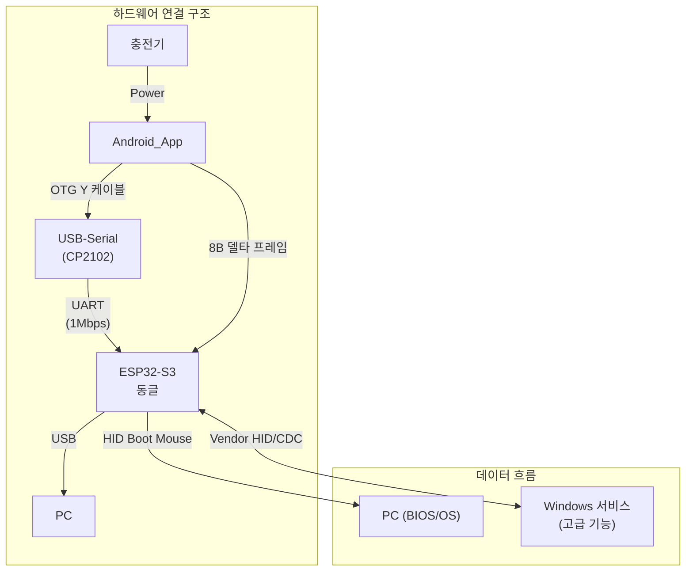

# PCRemote 컴포넌트 디자인 가이드

## 목차
- 1. 터치패드 컴포넌트
- 2. 버튼 컴포넌트
  - 2.1 버튼 구조 및 색상 시스템
  - 2.2 버튼 타입과 기능 매핑
    - 2.2.1 키보드 버튼(KeyboardKeyButton)
    - 2.2.2 단축키 버튼(ShortcutButton)
    - 2.2.3 매크로 버튼(MacroButton)
  - 2.3 구현 가이드(Compose, 공식 문서 준수)
  - 2.4 Disabled 상태 정의(§10.4 준수)
  - 2.5 버튼 키/단축키 프리셋 배열 준비 문서
- 3. 4방향 D패드 컴포넌트
  - 3.2 구조 및 색상 시스템
  - 3.3 상태 모델
  - 3.1 유저 플로우(입력 처리)
  - 3.4 시각/피드백
  - 3.5 Disabled 상태 정의(§10.4 준수)
  - 3.6 구현 가이드(Compose, 공식 문서 준수)
  - 3.7 상수 정의
- 4. 녹화 매크로 컴포넌트
  - 4.1 목적과 개요
  - 4.2 상태 모델
  - 4.3 상호작용(입력 처리)
  - 4.4 UI/피드백·접근성·Disabled
  - 4.5 선택 팝아웃
  - 4.6 프로토콜·식별자·등록
  - 4.7 구현 가이드(Compose, 공식 문서 준수)
  - 4.8 상수/식별자 정의
  - 4.9 Windows 서버 구현 메모(요약)
  - 4.10 가드레일/리스크
  - 4.11 아이콘/도형(이미지) 지침

## 시스템 아키텍처 개요



> **핵심**: 본 문서의 컴포넌트들은 Android 앱 내에서 동작하며, 사용자 입력을 8바이트 델타 프레임으로 변환하여 ESP32-S3 동글로 전송합니다.

## 용어집/정의

- Selected/Unselected: 선택 상태. 시각적 강조 여부를 나타냅니다(페이지 인디케이터 등). 입력 가능 여부와 구분합니다.
- Enabled/Disabled: 입력 가능 상태. 터치/클릭이 가능한지를 의미합니다(장기 작업 중 Disabled 등).
- BootSafe/Normal: 시스템 운용 상태. BIOS/로그온/UAC 등 OS 이전은 BootSafe, OS 진입 후 확장 기능 허용 상태는 Normal.
- TransportState: NoTransport | UsbOpening | UsbReady | BleOpening | BleReady.
- 상태 용어 사용 원칙(금칙어 포함):
  - "활성/비활성" 표현은 금지. 선택 상태는 Selected/Unselected, 입력 가능 상태는 Enabled/Disabled로 표기합니다 [[memory:5809234]].
  - "선택됨/선택 안 됨" 대신 Selected/Unselected 사용.
  - "사용 가능/불가" 대신 Enabled/Disabled 사용.

## UI 컴포넌트 상세 명세

> **참고**: 이 문서는 `Docs/design-guide-app.md`의 `특수 컴포넌트 디자인` 섹션을 별도로 분리한 문서입니다.
> 전체 디자인 가이드는 메인 가이드를 참조하세요.

> 상수/임계값 단일 출처(SSOT): 컴포넌트별 디바운스/반복/크기 등 수치 상수는 `Docs/technical-specification.md` §1.1 중앙 표를 우선 참조합니다. 본 문서의 수치 언급은 중앙 표와 동기화되어야 하며, 상충 시 중앙 표가 우선합니다.

---

## 1. 터치패드 컴포넌트

> 본 프로젝트의 최중요 컴포넌트이자 기능의 수 및 복잡도가 매우 높은 컴포넌트입니다.
> 따라서 `Docs\touchpad.md`에 개별 문서로 작성되었습니다.

---

## 2. 버튼 컴포넌트

### 2.1 버튼 구조 및 색상 시스템

#### 2.1.1 버튼 구조
- 높이: 48dp
- 둥근 모서리: 8dp
- 배경: 상태별 색상
- 텍스트: 16sp, Medium

#### 2.1.2 버튼 색상 시스템
#2196F3: Enabled 상태 버튼 배경색
#121212: 버튼 텍스트
#C2C2C2: Disabled 상태 버튼 배경
#1976D2: 터치 및 Sticky Hold 상태 버튼 배경

### 2.2 버튼 타입과 기능 매핑

본 문서의 버튼은 `Docs/PRD.md` §3.1의 키보드 영역 3종을 지칭합니다.
각 버튼은 탭 1회로 즉시 실행되는 것을 기본으로 하며, 필요 시 길게 누르기/토글 동작을 지원합니다.
색상은 `Docs/design-guide-app.md` §2(색상 시스템)의 토큰을 따릅니다.

#### 2.2.1 키보드 버튼(KeyboardKeyButton) — 단일 키
- 목적: Ctrl, Alt, Shift, Enter, Space, Tab, Backspace 등 단일 키에 대한 KeyDown/KeyUp 전송
- 유저 플로우:
  - 탭: 즉시 `KeyDown → KeyUp`
  - 롱프레스(Sticky Hold, 선택): 임계 초과 시 `isStickyLatched=true`로 Down 유지, 다음 탭에서 Up 전송 후 라치 해제
    - per-key 옵션: `canStickyHoldOnLongPress=true`일 때만 활성(기본 false)
    - 임계시간: `KEY_STICKY_HOLD_LONG_PRESS_THRESHOLD_MS = 500ms`
- 시각/피드백:
  - 색상: 기본 `#2196F3`, Disabled `#C2C2C2`, 터치/StickyHold `#1976D2`
  - 햅틱: Light 1회(§5.4.4)
  - 리플: 사용하지 않음. 대신 200ms 스케일 0.98→1.0 적용
- 상태 모델:
  - `isEnabled: Boolean` — 입력 가능 여부(Enabled/Disabled, §10.4 준수)
  - `isStickyLatched: Boolean` — Sticky Hold 라치 상태(기본 false)
- 접근성/구현:
  - `combinedClickable(onClick=..., onLongClick=...)` 권장, 필요 시 `pointerInput`로 Up 보완
  - `semantics { role = Role.Button; contentDescription = ... }`

#### 2.2.2 단축키 버튼(ShortcutButton) — 조합/시퀀스
- 목적: Ctrl+C, Ctrl+V, Alt+Tab 등 복합 조합을 원터치로 실행
- 유저 플로우:
  - 탭: 정의된 순서로 Down/Up 주입(예: Ctrl+C = CtrlDown → CDown → CUp → CtrlUp)
  - 디바운스: `REINPUT_DEBOUNCE_MS = 150ms` 내 재탭 무시(중복 주입 방지)
- 시각/피드백:
  - 색상: 기본 `#2196F3`, Disabled `#C2C2C2`
  - 햅틱: Light 1회
  - 리플: 사용하지 않음. 200ms 스케일 0.98→1.0 적용
- 상태 모델:
  - `isEnabled: Boolean`
- 접근성/구현:
  - `LaunchedEffect` 기반 시퀀스 실행(`coroutineScope + delay`)
  - `semantics { role = Role.Button; contentDescription = ... }`

#### 2.2.3 매크로 버튼(MacroButton) — 외부(Windows) 매크로 트리거
- 목적: Android 앱이 동글을 통해 PC(Windows) 서버의 특정 매크로 실행을 트리거
- 유저 플로우:
  - 탭: 즉시 `MACRO_START_REQUEST` 전송 → 버튼 Disabled(중복 입력 방지)
  - 진행 표시: 사용하지 않음(인디케이터 비표시). 시작/종료는 상단 상태 알림 토스트로만 표시(§5.2)
  - 종료: `TASK_COMPLETED` 수신 시 버튼 Enabled 복구 + 성공/오류 토스트 표시
  - 강제 해제: 동일 버튼 재탭 시 아래를 즉시 전송
    - 서버 취소 요청: `MACRO_CANCEL_REQUEST(macroId)`
    - UI 강제 해제: `UI_FORCE_ENABLE_ALL_TOUCHABLES_REQUEST(pageId, sourceComponentId)`(§10.4.2)
    - 토스트: 상태 알림 토스트로 "작업이 취소되었습니다"(1000ms)
- 프로토콜(요약):
  - Android → 동글: `MACRO_START_REQUEST(macroId)` 전송
  - 동글 → Windows 서버: `macroId` 전달, 서버가 매크로 실행
  - Windows 서버 → 동글 → Android: `TASK_COMPLETED(macroId, status=Success|Error)` 종료 신호
- 시각/피드백:
  - 색상: 기본 `#2196F3`, Disabled `#C2C2C2`
  - 햅틱: Light 1회(시작/종료 시 토스트와 조합)
- 접근성/구현:
  - `remember { mutableStateOf(false) }`로 비활성 상태 관리, `LaunchedEffect(macroState)`로 복구 처리
  - `semantics { role = Role.Button; contentDescription = ... }`

### 2.3 구현 가이드(Compose, 공식 문서 준수)

목표: §2.1~§2.2의 버튼 디자인/상태/플로우를 Jetpack Compose로 안정적으로 구현하기 위한 공식 API 참조와 표준 구현 패턴을 정의합니다.

핵심 공식 API(이름 기준):
- 레이아웃/스타일: `Box`, `Row`, `Column`, `Modifier.size`, `Modifier.clip(RoundedCornerShape)`, `Modifier.background`, `Text`
- 상호작용: `Modifier.clickable(indication = null)`, `Modifier.combinedClickable(onLongClick=...)`, `InteractionSource`
- 애니메이션: `animateColorAsState`, `animateFloatAsState`, `updateTransition`, `tween`, `spring`
- 상태/수명: `remember`, `rememberUpdatedState`, `LaunchedEffect`, `rememberCoroutineScope`
- 접근성: `Modifier.semantics { role = Role.Button; contentDescription = ... }`, `mergeDescendants()`
- 햅틱: `LocalHapticFeedback.current.performHapticFeedback(...)`

디자인-구현 매핑 요약:
- 크기/모양: 높이 48dp, 최소 터치 48×48dp, `RoundedCornerShape(12.dp)`
- 색상: `#2196F3`(기본), `#FFFFFF`(텍스트), `#C2C2C2`(Disabled, alpha 0.6), `#1976D2`(터치/StickyHold)
- 터치 리플: 사용하지 않음. 대신 200ms `scale` 0.98 → 1.0
- 상태 명확화: `Enabled/Disabled`는 입력 가능 여부, `Selected/Unselected`는 선택 상태 표현(혼동 금지)

상태/이벤트 처리 표준(§2.2 대응):
- 키보드 버튼(KeyboardKeyButton):
  - 탭: 즉시 `KeyDown → KeyUp` 전송
  - 롱프레스 Sticky Hold: `KEY_STICKY_HOLD_LONG_PRESS_THRESHOLD_MS = 500` 설정. 임계 초과 시 `isStickyLatched = true`로 Down 유지, 다음 탭에서 Up 전송 후 해제
  - 권장 API: `combinedClickable(onClick=..., onLongClick=...)`, 필요 시 `pointerInput`로 Up 처리 보완
- 단축키 버튼(ShortcutButton):
  - 시퀀스: 정의된 순서 그대로 Down/Up 주입(예: Ctrl+C = CtrlDown → CDown → CUp → CtrlUp)
  - 디바운스: `REINPUT_DEBOUNCE_MS = 150` 내 재탭 무시(중복 주입 방지)
  - 권장 API: `LaunchedEffect`로 시퀀스 실행(`coroutineScope + delay`)
- 매크로 버튼(MacroButton):
  - 동작: 탭 시 `MACRO_START_REQUEST(macroId)` 전송 → `isEnabled=false`로 비활성 → `TASK_COMPLETED` 수신 시 `isEnabled=true` 복구
  - 진행 표현: 버튼 내부 로더 사용하지 않음. 시작/종료는 상단 상태 알림 토스트로만 표시(§5.2)
  - 강제 해제: 동일 버튼 재탭 시 `MACRO_CANCEL_REQUEST(macroId)` + `UI_FORCE_ENABLE_ALL_TOUCHABLES_REQUEST(pageId, sourceComponentId)` 전송, 토스트 1000ms
  - 권장 API: `remember { mutableStateOf(false) }`로 비활성 상태 관리, `LaunchedEffect(macroState)`로 복구 처리

접근성:
- `semantics.role = Role.Button`, `contentDescription` 제공(Disabled 시 상태 포함)
- 시각 의존 낮춤: 색상 + 아이콘 병행, 토스트는 LiveRegion 사용(Polite)

참조(공식 API 이름): `clickable`, `combinedClickable`, `InteractionSource`, `rememberRipple`, `animateColorAsState`, `animateFloatAsState`, `updateTransition`, `tween`, `spring`, `semantics`, `LocalHapticFeedback`, `LaunchedEffect`

### 2.4 Disabled 상태 정의(§10.4 준수)

본 절은 각 버튼 컴포넌트의 입력 불가 상태(Enabled/Disabled)를 `Docs/design-guide-app.md` §10.4(컴포넌트 비활성화 플로우)에 맞추어 규정한다. 선택 상태(Selected/Unselected)와 입력 가능 상태(Enabled/Disabled)를 혼동하지 말 것.

공통 규칙(모든 버튼 공통):
- 시각: `#C2C2C2` 기반 회색 톤으로 전환, 권장 alpha = 0.6. 내부 아이콘/텍스트는 동일 톤다운 규칙 적용.
- 동작: 입력 차단. Compose에선 `enabled=false` 또는 포인터 이벤트 소비 방식 중 하나를 사용한다.
- 접근성: `contentDescription`에 "(비활성)" 부가, 상태 변화 시 상단 토스트는 LiveRegion(Polite)로 고지.
- 애니메이션: 활성↔비활성 전환 시 150–250ms `tween`으로 색/알파를 부드럽게 변경.
- 용어: 선택 상태는 Selected/Unselected, 입력 가능 상태는 Enabled/Disabled로 표기한다.

트리거/복구:
- 개별 비활성: `UI_DISABLE_SELF_REQUEST(componentId)` 수신 시 해당 버튼만 비활성(§10.4.1).
- 전체 비활성: `UI_DISABLE_ALL_TOUCHABLES_REQUEST(pageId)` 수신 시 페이지 내 모든 터치 가능한 버튼 비활성(§10.4.2).
- 강제 해제: 비활성화를 유발한 동일 소스 재탭 시 강제 해제 요청(`UI_FORCE_ENABLE_ALL_TOUCHABLES_REQUEST`) 전송 가능(§10.4.2).
- 작업 완료: `TASK_COMPLETED` 수신 시 원상 복구(§10.4.3).

버튼 유형별 세부 규정:
1) KeyboardKeyButton
- 자체적으로 Disable을 발신하지 않는다. 외부 비활성/전체 비활성 신호만 준수한다.
- 시각: 배경 `#C2C2C2`(alpha 0.6), 텍스트/아이콘 동일 톤다운. 선택(토글) 하이라이트는 표시하지 않는다.
- 동작: 탭/롱프레스/Sticky Hold 모두 차단. `combinedClickable`의 `enabled=false` 권장.

2) ShortcutButton
- 자체 Disable 발신 없음. 외부/전체 비활성 신호 준수. 자체 재입력 방지는 디바운스(§2.2.2)로 처리하며 Disable과 구분한다.
- 시각/동작/접근성: KeyboardKeyButton과 동일 규칙을 따른다.

3) MacroButton
- 탭 즉시 `MACRO_START_REQUEST(macroId)` 전송 후 본인 `isEnabled=false`로 전환(중복 입력 방지). `TASK_COMPLETED` 수신 시 자동 복구.
- 강제 해제: 동일 버튼 재탭 시 `MACRO_CANCEL_REQUEST(macroId)` + `UI_FORCE_ENABLE_ALL_TOUCHABLES_REQUEST(pageId, sourceComponentId)` 전송(§10.4.2), 즉시 활성화 복구.
- 시각: Disabled 동안 배경 `#C2C2C2`(alpha 0.6). 진행 인디케이터는 사용하지 않으며, 상태 알림은 상단 토스트로만 고지(§5.2).
- Compose 권장: `remember { mutableStateOf(false) }`로 `isEnabled` 관리, `animateColorAsState`로 색 전환, `Modifier.clickable(enabled = isEnabled, indication = null)`.

표준 색상/알파(권장):
- DISABLED_OVERLAY_COLOR = `#C2C2C2`
- DISABLED_OVERLAY_ALPHA = 0.6

참조: `Docs/design-guide-app.md` §2(색상 시스템), §5.2(상태 알림 토스트), §10.4(컴포넌트 비활성화 플로우)

### 2.5 버튼 키/단축키 프리셋 배열 준비 문서

본 절은 버튼 컴포넌트(§2.2)의 실제 사용 시, 코드 단에서 손쉽게 선택·구성할 수 있도록 키보드 단일 키 및 단축키 조합의 “프리셋 배열”을 어떤 구조로 설계·정의할지에 대한 문서입니다.
구현 코드는 포함하지 않으며, 명세·분류·식별자 규칙과 카탈로그만 제시합니다.
용어는 `Selected/Unselected`(선택 상태)와 `Enabled/Disabled`(입력 가능 상태)를 엄격히 구분합니다.

#### 2.5.1 목표와 범위
- **목표**: 디자이너/기획/개발이 공통으로 참조 가능한 키/단축키 프리셋 카탈로그와 데이터 스키마를 확정해, 추후 코드에서 배열만 참조하여 신뢰성 있게 재사용.
- **범위**: Windows 환경 중심. Android/USB-HID 브리지(입력 주입) 정책은 `Docs/usb-hid-bridge-architecture.md` 최종안에 따름.
- **비포함**: 실제 주입 가능 여부의 저수준 제약 처리(예: 보안 시퀀스)는 런타임 정책으로 분리. 본 절은 선택·구성 관점의 준비 문서.

#### 2.5.2 데이터 스키마(문서상 제안)
- KeyPreset(단일 키)
  - `id`(UPPER_SNAKE_CASE): 예 `KEY_ENTER`, `MOD_CTRL`.
  - `labelKo`/`labelEn`: 표시용 라벨.
  - `category`: `Modifiers | Editing | Navigation | System | Media | Function | Numpad | Symbols | Alphanumeric` 등.
  - `platformMapping`(참고 키 식별): `windows.vk`(예: `VK_RETURN`), `hid.usagePage/usageId`(옵션), `android.keyCode`(옵션).
  - `isModifier: Boolean`: Ctrl/Shift/Alt/Win 등 구분.
  - `canStickyHoldOnLongPressDefault: Boolean`: §2.2.1 및 `KEY_STICKY_HOLD_LONG_PRESS_THRESHOLD_MS = 500` 정책과 연계.
  - `tags: [String]`: 검색/필터용 태그(예: "text", "system").
  - 접근성: `contentDescriptionTemplate`(상태 포함 표현 가이드).
- ShortcutPreset(단축키 조합/시퀀스)
  - `id`(UPPER_SNAKE_CASE): 예 `SC_COPY`, `SC_PASTE`, `SC_TASK_MANAGER`.
  - `labelKo`/`labelEn`
  - `category`: `Editing | Navigation | System | WindowMgmt | Media | Browser | AppCommon` 등.
  - `combo`: 키 조합 식별자 배열(예: `[MOD_CTRL, KEY_C]`).
  - `sequencePolicy`: Down/Up 순서 규칙. 기본은 “모디파이어 Down → 일반키 Down → 일반키 Up → 모디파이어 Up”.
  - `reinputDebounceMs`: 기본 `REINPUT_DEBOUNCE_MS = 150`(§2.2.2).
  - 제한/주의: 보안 시퀀스 등 런타임에서 차단될 수 있음을 명시.

> 구현 시에는 위 스키마를 코드 상 상수/배열로 매핑함.

#### 2.5.3 단일 키 프리셋 카테고리/카탈로그(요약)
- Modifiers: `MOD_CTRL`, `MOD_SHIFT`, `MOD_ALT`, `MOD_WIN`
- Editing(Text): `KEY_ENTER`, `KEY_BACKSPACE`, `KEY_DELETE`, `KEY_TAB`, `KEY_SPACE`
- Navigation: `KEY_UP`, `KEY_DOWN`, `KEY_LEFT`, `KEY_RIGHT`, `KEY_HOME`, `KEY_END`, `KEY_PAGE_UP`, `KEY_PAGE_DOWN`
- System: `KEY_ESC`, `KEY_PRINT_SCREEN`, `KEY_INSERT`
- Function: `KEY_F1` … `KEY_F12`
- Alphanumeric: `KEY_0` … `KEY_9`, `KEY_A` … `KEY_Z`
- Symbols(예): `KEY_BRACKET_LEFT([)`, `KEY_BRACKET_RIGHT(])`, `KEY_SEMICOLON(;)`, `KEY_APOSTROPHE(')`, `KEY_COMMA(,)`, `KEY_PERIOD(.)`, `KEY_SLASH(/)`, `KEY_BACKSLASH(\)`
- Media(하드웨어 지원 시): `KEY_MEDIA_PLAY_PAUSE`, `KEY_MEDIA_NEXT_TRACK`, `KEY_MEDIA_PREV_TRACK`, `KEY_VOLUME_UP`, `KEY_VOLUME_DOWN`, `KEY_VOLUME_MUTE`

주: 실제 `windows.vk` 매핑은 표준 Virtual-Key를 따릅니다. HID Usage 매핑은 필요 시 병기합니다.

#### 2.5.4 단축키 프리셋 카테고리/카탈로그(Windows 중심, 요약)
- Editing: `SC_COPY(CTRL+C)`, `SC_PASTE(CTRL+V)`, `SC_CUT(CTRL+X)`, `SC_UNDO(CTRL+Z)`, `SC_REDO(CTRL+Y)`, `SC_SELECT_ALL(CTRL+A)`, `SC_SAVE(CTRL+S)`, `SC_OPEN(CTRL+O)`, `SC_NEW(CTRL+N)`, `SC_PRINT(CTRL+P)`
- Navigation/App: `SC_FIND(CTRL+F)`, `SC_FIND_NEXT(F3)`, `SC_REFRESH(F5 or CTRL+R)`
- System/WindowMgmt: `SC_TASK_MANAGER(CTRL+SHIFT+ESC)`, `SC_CLOSE_WINDOW(ALT+F4)`, `SC_SWITCH_WINDOW(ALT+TAB)`(전환형), `SC_DESKTOP_SHOW(WIN+D)`, `SC_FILE_EXPLORER(WIN+E)`, `SC_RUN(WIN+R)`
- Browser: `SC_NEW_TAB(CTRL+T)`, `SC_CLOSE_TAB(CTRL+W)`, `SC_REOPEN_CLOSED_TAB(CTRL+SHIFT+T)`, `SC_NEXT_TAB(CTRL+TAB)`, `SC_PREV_TAB(CTRL+SHIFT+TAB)`, `SC_ADDR_FOCUS(ALT+D or CTRL+L)`
- Media: `SC_MEDIA_PLAY_PAUSE`, `SC_MEDIA_NEXT`, `SC_MEDIA_PREV`, `SC_VOL_UP`, `SC_VOL_DOWN`, `SC_MUTE`

주의(주입 제약): `CTRL+ALT+DEL`(Secure Attention Sequence), `WIN+L`(잠금) 등 일부 시스템 시퀀스는 일반 입력 주입으로 동작하지 않을 수 있습니다. 런타임에서 “미지원/권한 필요” 경고 처리 권장.

#### 2.5.5 식별자/네이밍 규칙
- 상수형 ID는 UPPER_SNAKE_CASE. 단일 키는 `KEY_*`, 모디파이어는 `MOD_*`, 단축키는 `SC_*` 접두.
- 라벨/검색을 위한 `aliases`(동의어) 필드 권장. 예: `SC_REFRESH` ↔ `SC_RELOAD`.
- 로컬라이즈 라벨은 `labelKo`/`labelEn` 병행.

#### 2.5.6 UI/상태/접근성 연계
- Disabled: §2.4 규칙 준수(입력 차단, 회색 톤, LiveRegion 토스트).
- Selected: 버튼 자체의 토글/Sticky Hold 상태 표현과 혼동하지 않도록 주의.
- 햅틱/피드백: §2.3 및 §5.2 정책 사용. 단축키 실행 시 디바운스는 `REINPUT_DEBOUNCE_MS = 150` 준수.

#### 2.5.7 품질 기준(검토 체크리스트)
- 중복/충돌 없는 ID 네임스페이스 유지.
- 모디파이어 Down/Up 순서 일관성.
- 보안/시스템 시퀀스의 지원 한계 주석 명시.
- i18n 라벨/접근성 문구 제공.

#### 2.5.8 후속 작업 안내(코드 반영 시)
- 위치 제안(코드, 참고용): `Android/app/src/main/java/.../presets/KeyboardPresets.kt`, `ShortcutPresets.kt` 등으로 분리(한 파일 하나의 주요 기능 원칙).
- 테스트: Windows 대상 주입 시퀀스 시뮬레이션과 디바운스/Sticky Hold 검증.

---

## 3. 4방향 D패드 컴포넌트

### 3.2 구조 및 색상 시스템

#### 3.2.1 구조
- 컨테이너 크기(권장): 120dp × 120dp 정사각형
- 모양: 원형 또는 둥근 사각형(`RoundedCornerShape(12.dp)` 이상)
- 배경: VectorDrawable(`dpad.xml`) 베이스 레이어 사용(뷰박스 12×12, 방향 팔 4개 폴리곤)
- 레이어: 베이스(배경) · 방향 하이라이트(선택 시)
- 최소 터치 영역: 48dp × 48dp

영역 분할(센서틱 히트맵):
- 중심 원형: 반지름 = 컨테이너의 0.25–0.30
- 방향(상/하/좌/우) 4개 + 대각선(좌상/우상/좌하/우하) 4개 = 총 8분할
- 판정 방식: 중심 기준 벡터 각도로 섹터 매핑(45° 단위, 경계 허용오차 10°)
  - 중앙 영역 입력: 입력 없음(무시)

#### 3.2.2 색상 시스템
`#C2C2C2`: 기본 테두리; 비활성(Disabled) 오버레이(alpha 0.6)
`#2196F3`: 선택(Selected) 하이라이트; 방향 영역 오버레이(alpha 0.3)
`#FFFFFF`: 텍스트/아이콘(배경 대비 4.5:1 이상일 때)

#### 3.2.3 이미지 소스 매핑(VectorDrawable `dpad.xml`)
- 뷰박스: 12 × 12. 폴리곤 4개가 각 방향 팔을 구성(상/좌/우/하).
- 폴리곤 인덱스 → 방향 매핑(위에서부터 선언 순서 기준):
  - 0: Up, 1: Left, 2: Right, 3: Down
- 폴리곤 정점(정규 좌표, 원본 단위 그대로 사용 — 렌더 시 컨테이너 크기에 비례 스케일):
  - Up: [(8.25,0.28),(8.24,2.98),(5.99,5.20),(3.75,2.96),(3.75,0.28)]
  - Left: [(0.28,8.25),(0.28,3.75),(2.98,3.76),(5.20,6.01),(2.96,8.25)]
  - Right: [(11.72,3.75),(11.72,8.25),(9.02,8.24),(6.80,5.99),(9.04,3.75)]
  - Down: [(8.25,11.72),(3.75,11.72),(3.75,9.04),(5.99,6.80),(8.24,9.02)]
- 대각선 하이라이트: 선택된 두 방향 팔의 폴리곤을 동시에 오버레이(예: UpLeft = Up + Left).
- 리소스 네이밍/적용 권장:
  - Android 리소스는 소문자 스네이크케이스 권장. 런타임 적용은 `dpad` 리소스 ID 기준으로 관리.
  - 빌드 시 `DPad.svg` → VectorDrawable(`dpad.xml`) 변환 권장. SVG 그대로 사용할 경우 `coil-compose` + `SvgDecoder`를 사용해 로드.

### 3.3 상태 모델
- `isEnabled: Boolean` — 입력 가능 여부(Enabled/Disabled)
- `currentDirection: Direction?` — 현재 선택된 방향(null = 없음)
  - `Direction = Up | Down | Left | Right | UpLeft | UpRight | DownLeft | DownRight`
- `activePointerId: PointerId?` — 동일 터치 유지 전환 보장을 위한 포인터 식별자

### 3.1 유저 플로우(입력 처리)
- 탭:
  - 방향 영역 탭: 해당 방향 Down → Up 즉시 전송
  - 중앙 영역 탭: 입력 없음(무시)
- 드래그 전환:
  - 동일 포인터 유지 시 섹터 간 전환 허용(§1.2.1 DPad 예외)
  - 전환 시 이전 방향 Up → 새 방향 Down(레이턴시 최소화, 최대 1프레임 내)
- 대각선 입력:
  - 대각선 섹터에서는 두 방향을 동시에 Down/Up 처리(예: UpLeft = Up+Left)
- 디바운스:
  - 동일 방향 재탭 50ms 이내 무시(`REINPUT_DEBOUNCE_MS = 50`)

### 3.4 시각/피드백
- Selected 방향: VectorDrawable(`dpad.xml`) 내 해당 방향 팔(폴리곤)을 선택 색으로 오버레이 + 컨테이너 테두리 `#2196F3`
- Unselected: 원본 상태 유지
- 햅틱:
  - 탭/전환: Light 1회

### 3.5 Disabled 상태 정의(§10.4 준수)

- 용어: 선택 상태는 `Selected/Unselected`, 입력 가능 상태는 `Enabled/Disabled`로 구분한다(혼동 금지).

트리거/복구(§10.4 연동):
- 개별 비활성: `UI_DISABLE_SELF_REQUEST(componentId)` 수신 시 본 컴포넌트만 비활성화(§10.4.1).
- 전체 비활성: `UI_DISABLE_ALL_TOUCHABLES_REQUEST(pageId)` 수신 시 페이지 내 터치 가능한 요소 전체 비활성화(§10.4.2).
- 강제 해제: 동일 소스 재탭 등으로 `UI_FORCE_ENABLE_ALL_TOUCHABLES_REQUEST` 수신 시 즉시 활성화 복구(§10.4.2). DPad는 해당 요청을 발신하지 않는다.
- 작업 완료: `TASK_COMPLETED` 수신 시 활성 복귀(§10.4.3).

시각:
- 회색 오버레이 `#C2C2C2`(alpha 0.6) 적용, 선택 하이라이트(Selected 오버레이) 및 컨테이너 테두리 하이라이트는 숨김.
- 전환 애니메이션: 150–250ms `tween`으로 알파/색상을 부드럽게 변경.

동작:
- 입력 차단: `enabled=false` 또는 포인터 이벤트 소비로 모든 탭/드래그 입력을 무효화.
- 포커스/접근성 포커스블 비활성화.

이벤트/상태 정리:
- Disabled 진입 시:
  - `currentDirection != null`이면 즉시(최대 1프레임 내) 해당 방향의 Up 신호를 주입한다. 대각선인 경우 두 방향 모두 Up 주입.
  - `currentDirection = null`, `activePointerId = null`로 초기화.
- Disabled 해제 시:
  - 자동 Down 또는 재선택 없음. 사용자의 새로운 탭/드래그 입력을 대기한다.

드래그 중 비활성 전환:
- 포인터가 유지된 상태에서 비활성 전환되면, 위 “Disabled 진입 시” 규칙에 따라 Up을 즉시 주입하고 이후 포인터 입력을 무시한다(재활성 전까지).

Compose 구현 권장(§10.4.6 참조):
- 상위 계층에 `DisabledContainer(targetId)`를 두어 회색 오버레이와 입력 차단을 통합 적용.
- `Modifier.pointerInput` 블록 내부에서 `isEnabled`를 확인해 이벤트를 조기에 소비.

접근성:
- `contentDescription`에 "(비활성)" 문구를 부가하고, 상태 변화는 상단 상태 알림 토스트로 LiveRegion(Polite) 고지.

표준 색상/알파(권장):
- DISABLED_OVERLAY_COLOR = `#C2C2C2`
- DISABLED_OVERLAY_ALPHA = 0.6

### 3.6 구현 가이드(Compose, 공식 문서 준수)
핵심 공식 API(이름 기준):
- 레이아웃/스타일: `Box`, `Canvas`/`Image`, `Modifier.size`, `Modifier.clip`, `Modifier.background`
- 상호작용: `Modifier.pointerInput`, `detectTapGestures`, `awaitPointerEventScope`, `consume`/`consumePositionChange`
- 애니메이션: `animateColorAsState`, `animateFloatAsState`, `updateTransition`, `tween`, `spring`
- 상태/수명: `remember`, `rememberUpdatedState`, `LaunchedEffect`, `rememberCoroutineScope`
- 접근성: `Modifier.semantics { role = Role.Button; contentDescription = ... }`, `mergeDescendants()`
- 햅틱: `LocalHapticFeedback.current.performHapticFeedback(...)`

상태/이벤트 처리 표준:
- 탭: 섹터 판정 → 방향에 따라 Down/Up
- 롱프레스: 지원하지 않음(연속 입력 기능 없음)
- 드래그: `awaitPointerEventScope`에서 포인터 이동 각도→섹터 재판정, 방향 변경 시 Up/Down
- 대각선: 섹터가 대각선이면 2키 동시 주입
- 비활성: 상위 `DisabledContainer(targetId)`로 회색 처리 + 입력 차단(§10.4.6 참조)

영역 판정(각도 기반 8분할) 의사코드:
```
center = size.center
vector = (touch - center)
if (vector.length < centerRadius) -> None // 중앙 입력 무시
angle = atan2(-vector.y, vector.x) // 우측 0°, 반시계+
sector = round(angle / 45deg) mod 8
map sector → Direction
```

이미지/리소스 권장:
- 베이스: `painterResource(id = R.drawable.dpad)`로 VectorDrawable(`dpad.xml`)을 회색 톤으로 렌더
- 하이라이트: 아래 중 택1
  1) Canvas에 폴리곤 정점(§3.2.3)을 스케일링해 Path로 그려 `#2196F3` 오버레이
  2) 벡터 자산 분리(Up/Left/Right/Down 전용) 후 선택된 방향만 색 틴트로 오버레이
- 움직임/정점 라운딩 필요: Canvas Path 고려(라운딩 다각형) — `Docs/design-guide-app.md` §9.3 참조
- 해상도: 최소 240dp 기준 2x 이상 소스

### 3.7 상수 정의
- `REINPUT_DEBOUNCE_MS = 50`

참조(공식 API 이름): `pointerInput`, `detectTapGestures`, `awaitPointerEventScope`, `animateColorAsState`, `animateFloatAsState`, `updateTransition`, `tween`, `spring`, `semantics`, `LocalHapticFeedback`, `LaunchedEffect`

## 4. 녹화 매크로 컴포넌트

### 4.1 목적과 개요
- 목적: PC에서 수행한 작업(키보드/마우스 입력 시퀀스)을 기록해 이후 사용자가 원할 때 동일 시퀀스를 재생(Repeat)하는 복합 컨트롤입니다.
- 구성: Record 버튼 + Replay 버튼으로 이루어진 컴포지트 컴포넌트(`RecordingMacroControls`).
  - Record 버튼: 녹화 시작/종료 토글(녹화 중에는 Stop 역할).
  - Replay 버튼: 최근 녹화를 재생(없으면 Disabled).

선행 규칙: 선택 상태는 `Selected/Unselected`, 입력 가능 상태는 `Enabled/Disabled`로 구분합니다. 시각/상호작용은 `Docs/design-guide-app.md` §2, §5.2, §10.4를 준수합니다.

### 4.2 상태 모델

- `isEnabled: Boolean` — 입력 가능 여부
- `isRecording: Boolean` — 녹화 중 여부
- `isPending: Boolean` — 요청 전송 후 응답 대기
- `isScopeSelectorOpen: Boolean` — 녹화 범위 선택 팝아웃 오픈
- `recordingScope: RecordingScope` — `Mouse | Keyboard | Both`(기본 `Both`)
- `isSpeedSelectorOpen: Boolean` — 재생 속도 선택 팝아웃 오픈
- `playbackSpeedMultiplier: Int` — 1|2|3(기본 1)
- `appInstanceId: String` — 앱 설치 고유 ID(UUID)
- `sessionId: String` — 연결 세션 ID(UUID)
- `pageId: String` — 페이지 식별자(고정 문자열)
- `componentId: String` — 페이지 내 유일 컴포넌트 식별자(빌드-안정)
- `lastRecordingId: String?` — 최근 녹화 ID
- `lastRecordingSummary: RecordingSummary?` — 요약(stepCount, durationMs)

### 4.3 상호작용(입력 처리)

- Record 버튼
  - Idle → Tap: 범위 선택 팝아웃 오픈(`isScopeSelectorOpen=true`). 범위 선택 시 `MACRO_RECORD_START_REQUEST(..., recordingScope)` 전송 → `MACRO_RECORDING_STARTED` 수신 후 `isRecording=true`, 팝아웃 닫힘.
  - Recording → Tap(Stop): `MACRO_RECORD_STOP_REQUEST(recordingId)` 전송 → `MACRO_RECORD_SAVED` 수신 시 `isRecording=false`, 요약/ID 갱신.
  - 강제 해제: 대기 중 동일 소스 재탭 시 `MACRO_RECORD_CANCEL_REQUEST` + `UI_FORCE_ENABLE_ALL_TOUCHABLES_REQUEST` 전송 허용.
- Replay 버튼
  - Enabled 조건: `lastRecordingId != null && !isRecording && !isPending`.
  - Tap: 속도 선택 팝아웃 오픈 → 속도 선택 시 `MACRO_PLAY_REQUEST(recordingId | (appInstanceId, sessionId, pageId, componentId), playbackSpeed)` 전송 → 완료 신호 수신 후 팝아웃 닫힘.
- 디바운스: `REINPUT_DEBOUNCE_MS = 150ms`.

### 4.4 UI/피드백·접근성·Disabled

- 색상/애니메이션: 기본 `#2196F3`, Disabled `#C2C2C2`(alpha 0.6), 녹화 중 `#1976D2`. 스케일 0.98→1.0(200ms), 전환 150–250ms `tween`.
- 토스트/햅틱: 시작/종료/저장/완료는 상단 토스트, 햅틱 Light 1회.
- Disabled: `UI_DISABLE_*` 수신 시 회색 오버레이 + 입력 차단. 자동 Stop 전송은 하지 않음(명시 취소만).
- 접근성: `role=Role.Button`, 상태 포함 `contentDescription`. LiveRegion=Polite 토스트.

### 4.5 선택 팝아웃(Anchored Overlay: 공통/범위/속도)

공통 정책(Record/Replay 공용): `Popup` + `PopupProperties(focusable=true, dismissOnBackPress/clickOutside=true)`, `AnimatedVisibility`, `onGloballyPositioned`로 앵커 좌표 계산, 컨텐츠 레이어 `blur(RECORD_SCOPE_BLUR_DP)` + 스크림 `#121212`(alpha=`RECORD_SCOPE_MENU_SCRIM_ALPHA`). 버튼 크기 40dp, 간격 12dp, 반경 72dp 원호 배치 또는 수평 3열.

- 4.5.1 녹화 범위 선택(Mouse | Keyboard | Both)
  - 오픈: Record(Idle) 탭. 닫힘: 선택/바깥 탭/Back.
  - 선택: `recordingScope` 설정 → `MACRO_RECORD_START_REQUEST(..., recordingScope)` 전송.
- 4.5.2 재생 속도 선택(1×|2×|3×)
  - 오픈: Replay 탭. 닫힘: 선택/바깥 탭/Back.
  - 선택: `playbackSpeedMultiplier ∈ {1,2,3}` 설정 → `MACRO_PLAY_REQUEST(..., playbackSpeed)` 전송.

### 4.6 프로토콜·식별자·등록

- 등록: `COMPONENT_REGISTER(appInstanceId, sessionId, pageId, componentId, type="RecordingMacroControls")`(초기 1회).
- 녹화: `MACRO_RECORD_START_REQUEST(appInstanceId, sessionId, pageId, componentId, recordingScope)` → `MACRO_RECORDING_STARTED(recordingId)` → `MACRO_RECORD_STOP_REQUEST(recordingId)` → `MACRO_RECORD_SAVED(recordingId, stepCount, durationMs)`.
- 재생: `MACRO_PLAY_REQUEST(recordingId | (appInstanceId, sessionId, pageId, componentId), playbackSpeed)` → `TASK_COMPLETED(recordingId, status)`.
- 취소: `MACRO_RECORD_CANCEL_REQUEST(recordingId)`(옵션), UI 강제 해제는 `UI_FORCE_ENABLE_ALL_TOUCHABLES_REQUEST` 병행.
- `recordingId` 부재 시: 서버는 `(appInstanceId, pageId, componentId)`의 최신 녹화를 조회.
- 메시지 이름/필드는 `Docs/usb-hid-bridge-architecture.md`에서 최종 확정.

### 4.7 구현 가이드(Compose, 공식 문서 준수)

- 핵심 API: `Row`, `Box`, `Modifier.size`, `Modifier.clip(RoundedCornerShape)`, `Modifier.clickable(indication=null, enabled=...)`, `animateColorAsState`, `animateFloatAsState`, `LaunchedEffect`, `remember`, `rememberCoroutineScope`, `LocalHapticFeedback`, `semantics`.
- 컴포지션/상태/이벤트: 두 버튼 나란히 배치, `isRecording/isPending` 상태 관리, 서버 이벤트로 전이 처리, 요청 중 동시 입력 잠금.

### 4.8 상수/식별자 정의

- `REINPUT_DEBOUNCE_MS = 150`
- `PLAYBACK_SPEED_OPTIONS = [1, 2, 3]`, `DEFAULT_PLAYBACK_SPEED = 1`
- `RECORD_SCOPE_MENU_SCRIM_ALPHA = 0.40`, `RECORD_SCOPE_BLUR_DP = 8`, `RECORD_SCOPE_BUTTON_SIZE_DP = 40`, `RECORD_SCOPE_BUTTON_SPACING_DP = 12`, `RECORD_SCOPE_RADIUS_DP = 72`
- 식별자 상수: `APP_INSTANCE_ID`(설치 시 생성/영구 저장), `SESSION_ID`(연결마다 생성), `PAGE_ID_*`(고정 문자열), `COMPONENT_ID_RECORDING_MACRO_*`(페이지 내 유일)

### 4.9 Windows 서버 구현 메모(요약)

- 녹화: `SetWindowsHookEx(WH_KEYBOARD_LL/WH_MOUSE_LL)` 또는 Raw Input. Secure Desktop/UAC 등 제한 환경에서는 비활성.
- 재생: Win32 `SendInput`, 스텝 간 지연을 `1/playbackSpeed`로 스케일링, 자체 주입은 `dwExtraInfo`로 마킹하여 필터.
- 제어 채널: 8B HID 델타와 별도로 Vendor HID(Feature/Output Report) 또는 CDC-ACM(가상 COM) 사용(세부는 `Docs/usb-hid-bridge-architecture.md`).

### 4.10 가드레일/리스크

- `componentId`는 빌드 간 안정 상수 유지(순서 기반 금지). 변경 시 서버 매핑 마이그레이션 필요.
- 세션 격리: `sessionId` 변경과 무관하게 `(appInstanceId, pageId, componentId)` 키는 유지.
- 녹화 중 끊김: 서버 정책에 따라 부분 녹화 폐기 또는 임시 저장 후 재시도.

### 4.11 아이콘/도형(이미지) 지침

- 목적: `RecordingMacroControls`의 각 버튼/팝아웃 항목에 대해 이미지 소스(VectorDrawable SVG vs. 커스텀 Shape) 선택 기준과 에셋/사이징/틴트/접근성 표준을 명확히 합니다.
- 원칙: 정적 아이콘은 `@drawable`의 VectorDrawable(SVG) 우선, 동적 기하(모핑/정점 라운딩 등)가 필요한 경우에만 Canvas Path/Clip 기반 커스텀 Shape를 제한적으로 사용합니다(`Docs/design-guide-app.md` §9.1.2, §9.3 준수).

#### 4.11.1 메인 버튼(Record/Stop, Replay)

- 공통
  - 아이콘 크기: `RECORDING_MACRO_ICON_SIZE_DP = 24`(컨테이너 48dp 대비 50%).
  - 아이콘 틴트: 버튼 텍스트 색상 토큰과 동일(테마 다크/라이트에 따라 자동).
  - 터치 피드백: 리플 사용하지 않음, 200ms 스케일 0.98→1.0만 적용(§4.4).
  - 접근성: `contentDescription`에 상태 포함(예: "녹화 시작", "녹화 중지", "최근 녹화 재생").

- Record/Stop 토글(녹화 버튼)
  - 기본 아이콘: VectorDrawable 권장.
    - `ic_macro_record.xml` — 가득 찬 원형(Record)
    - `ic_macro_stop.xml` — 정사각형(Stop)
  - 전환: `isRecording`에 따라 아이콘 스왑. 150–250ms `tween`으로 색/알파/스케일을 부드럽게 전환.
  - 커스텀 Shape 대안: 동적 형태 변화가 필요할 때만 `Canvas` Path 사용을 고려.

- Replay 버튼
  - 기본 아이콘: VectorDrawable 권장.
    - `ic_macro_replay.xml` — 순환(replay) 기호 또는 재생 반복 아이콘
  - Enabled 조건(§4.3) 충족 시만 컬러 틴트(활성), 비활성 시 회색 알파(§4.4, DISABLED 규칙).

#### 4.11.2 범위 선택 팝아웃(Record: Mouse | Keyboard | Both)

- 아이콘 정책: VectorDrawable 우선. 크기 24dp, 팝아웃 버튼 사이즈 40dp 내 중앙 정렬.
- 매핑
  - Mouse: `ic_scope_mouse.xml`(신규 필요) — 간단한 마우스 실루엣
  - Keyboard: `ic_scope_keyboard.xml` — 기존 `@drawable/Keyboard.svg`를 VectorDrawable로 변환하여 사용 권장
  - Both: `ic_scope_both.xml`(권장) 또는 Mouse+Keyboard 두 아이콘을 0.8×로 겹쳐 합성
- 틴트: 활성 선택 항목은 선택 색(§4.4의 기본 색), 비선택은 기본/중립 색. 접근성 대비 4.5:1 유지.

#### 4.11.3 속도 선택 팝아웃(Replay: 1× | 2× | 3×)

- 1차 표기: 텍스트 라벨("1×","2×","3×") 권장 — 가독성/현지화/접근성 우수.
- 대안 아이콘: 상황에 따라 다음 Vector 자산 사용 가능(선택 사항)
  - `ic_speed_normal.xml`(기존 `Normal.svg` 기반)
  - `ic_speed_fast.xml`(기존 `Fast.svg` 기반)
  - 3×의 경우 `ic_speed_fast.xml` 재사용 또는 아이콘 중첩으로 가속감 표현(권장: 텍스트 우선 유지)
- 크기/틴트: §4.11.1 규칙과 동일. 선택 항목은 선택 색 하이라이트.

#### 4.11.4 리소스 네이밍/파이프라인

- 네이밍: 소문자 스네이크케이스(`ic_macro_record.xml`, `ic_macro_stop.xml`, `ic_macro_replay.xml`, `ic_scope_mouse.xml`, `ic_scope_keyboard.xml`, `ic_scope_both.xml`).
- 에셋 소스: 가능하면 빌드 타임에 SVG→VectorDrawable 변환. 런타임 SVG 사용 시 `coil-compose` + `SvgDecoder`를 사용.
- 해상도/뷰박스: 뷰박스는 정사각형을 권장(예: 24×24). 벡터 내부 여백은 균일(2dp) 유지.

#### 4.11.5 Disabled/상태별 시각 규칙(요약)

- Disabled: 아이콘/라벨 모두 회색 톤(`DISABLED_OVERLAY_COLOR=#C2C2C2`, `alpha=0.6`) 적용. 입력 차단(§4.4).
- Recording: 녹화 버튼은 `Stop` 아이콘을 사용하고 버튼 배경은 녹화 중 색(`#1976D2`)을 적용.
- Hover/Press 없음: 모바일 터치 환경 특성상 별도 hover 미적용. Press는 스케일만.

참조: `Docs/design-guide-app.md` §2(색상 시스템), §5.2(상태 알림 토스트), §9.1.2(아이콘/도형 선택 기준), §9.3(Shape 활용 계획), §10.4(Disabled 플로우)

#### 4.11.6 에셋 적용 요약/매핑

- 소스/형식(§4.11 머리말, §4.11.4)
  - 정적 아이콘은 VectorDrawable 우선. SVG는 빌드 타임에 변환.
  - 런타임 SVG 필요 시에만 `coil-compose + SvgDecoder` 사용.
  - 뷰박스 권장: 24×24, 내부 여백 균일(2dp).
  - 네이밍: 소문자 스네이크케이스(`ic_macro_record.xml` 등).

- 메인 버튼(§4.11.1)
  - Record/Stop 토글: `ic_macro_record.xml`(가득 찬 원형), `ic_macro_stop.xml`(정사각형). `isRecording`에 따라 전환(150–250ms `tween`).
  - Replay: `ic_macro_replay.xml`(순환 기호). Enabled일 때만 컬러 틴트.
  - 아이콘 크기: `RECORDING_MACRO_ICON_SIZE_DP = 24`; 틴트는 버튼 텍스트 색과 동일. 리플 미사용, 스케일 0.98→1.0(200ms).
  - 접근성: 상태 포함 `contentDescription`(예: "녹화 시작", "녹화 중지", "최근 녹화 재생").

- 범위 선택 팝아웃(§4.11.2)
  - `ic_scope_mouse.xml`(신규), `ic_scope_keyboard.xml`(기존 `Keyboard.svg` 변환 권장), `ic_scope_both.xml`(권장, 합성 가능).
  - 크기 24dp, 팝아웃 버튼(40dp) 내 중앙 정렬. 활성 항목만 선택 색으로 틴트.

- 속도 선택 팝아웃(§4.11.3)
  - 기본: 텍스트 라벨("1×","2×","3×").
  - 대안 아이콘: `ic_speed_normal.xml`(기존 `Normal.svg`), `ic_speed_fast.xml`(기존 `Fast.svg`). 3×는 `ic_speed_fast.xml` 재사용 또는 전용 생성.
  - 크기/틴트 규칙은 메인 버튼과 동일, 선택 항목 하이라이트.

- 상태별 시각/Disabled(§4.11.5, §4.4)
  - Disabled: 회색 톤(`DISABLED_OVERLAY_COLOR=#C2C2C2`, `alpha=0.6`), 입력 차단.
  - Recording: Record 버튼은 `Stop` 아이콘 사용, 배경 `#1976D2` 적용.

- 리포지터리 내 기존 SVG → VectorDrawable 매핑(참고)
  - `Android/app/src/main/res/drawable/Stop.svg` → `ic_macro_stop.xml`
  - `Android/app/src/main/res/drawable/Replay.svg` → `ic_macro_replay.xml`
  - `Android/app/src/main/res/drawable/Normal.svg` → `ic_speed_normal.xml`
  - `Android/app/src/main/res/drawable/Fast.svg` → `ic_speed_fast.xml`
  - `Android/app/src/main/res/drawable/3x.svg` → `ic_speed_fast.xml` 재사용 또는 `ic_speed_3x.xml`
  - `Android/app/src/main/res/drawable/Keyboard.svg` → `ic_scope_keyboard.xml`
  - (옵션) `Android/app/src/main/res/drawable/Play.svg` → `ic_media_play.xml`, `Android/app/src/main/res/drawable/Pause.svg` → `ic_media_pause.xml`

위 매핑/규칙을 기준으로 각 화면의 `RecordingMacroControls`에 동일 사이징/틴트/접근성 정책을 일관 적용한다.
