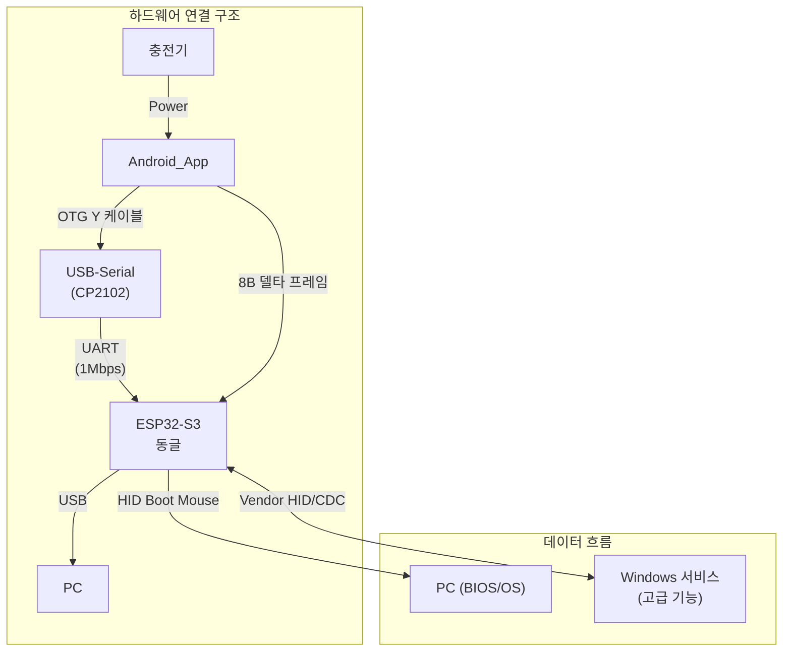

# PCRemote 앱 디자인 가이드

## 목차
- 1. 디자인 원칙
  - 1.1 핵심 원칙
  - 1.2 사용자 제약 고려사항
    - 1.2.1 터치 제약 조건
    - 1.2.2 시야 분배 특성
    - 1.2.3 하드웨어 환경
- 2. 색상 시스템
- 3. 타이포그래피
  - 3.1 폰트 체계
  - 3.2 텍스트 사용 원칙
- 4. 레이아웃 가이드라인
  - 4.1 화면 구성
  - 4.2 터치 영역 최적화
- 5. 공통 컴포넌트
  - 5.1 공통 컴포넌트 개요
  - 5.2 상태 알림 토스트
  - 5.3 페이지 인디케이터
  - 5.4 햅틱 피드백
  - 5.5 공통 컴포넌트 사용 가이드라인
- 6. 특수 컴포넌트 디자인
- 7. 접근성 가이드라인
- 8. 상호작용 디자인
  - 8.1 제스처 정의
  - 8.2 피드백 시스템
- 9. 개발 가이드라인
  - 9.1 UI 개발 방식
  - 9.2 디자인 토큰
  - 9.3 Shape 활용 계획
  - 9.4 컴포넌트 구현 원칙
  - 9.5 성능 최적화
- 10. 앱 전체 유저 플로우
  - 10.1 앱 실행 및 초기화 플로우
  - 10.2 동글 연결 플로우
  - 10.3 페이지 네비게이션 플로우
  - 10.4 컴포넌트 비활성화 플로우
  - 10.5 앱 종료 및 백그라운드 처리
  - 10.6 오류 처리 플로우
  - 10.7 BIOS/Boot-safe 전용 페이지 플로우
- 11. 페이지별 스타일프레임 링크

## 시스템 아키텍처 개요



> **핵심**: 본 앱은 사용자의 터치 입력을 8바이트 델타 프레임으로 변환하여 USB-Serial을 통해 ESP32-S3 동글로 전송합니다.

## 용어집/정의

- Selected/Unselected: 선택 상태. 시각 강조/선택 여부 표현. 예: 페이지 인디케이터 Selected 닷.
- Enabled/Disabled: 입력 가능 상태. 탭/제스처 허용 여부. 예: 작업 중 버튼 Disabled.
- BootSafe/Normal: 시스템 운용 상태. BootSafe는 OS 이전(휠 금지), Normal은 Report 허용.
- TransportState: NoTransport | UsbOpening | UsbReady | BleOpening | BleReady.
- 상태 용어 사용 원칙(금칙어 포함):
  - "활성/비활성" 금지. 선택 상태는 Selected/Unselected, 입력 가능 상태는 Enabled/Disabled로 표기 [[memory:5809234]].
  - "선택됨/선택 안 됨" → Selected/Unselected, "사용 가능/불가" → Enabled/Disabled.

## 1. 디자인 원칙

### 1.1 핵심 원칙
- 접근성 우선: 근육장애 사용자를 위한 단일 터치 최적화
- 직관적 조작: 복잡한 학습 없이 즉시 사용 가능
- 시각적 명확성: PC 모니터 집중 시에도(앱 화면을 직접 보지 않고도) 상태 파악 가능
- 안정성 보장: 작업 중단 없는 연결 및 입력 신뢰성

### 1.2 사용자 제약 고려사항

#### 1.2.1 터치 제약 조건
터치 가능 영역:
- 선호 영역: 스마트폰 좌하단~중앙 하단 (화면의 약 30% 영역)
  - 이 영역에서 가장 안정적이고 정확한 터치 조작 가능
  - 모든 핵심 기능은 이 영역 내에 배치되어야 함
- 회피 영역: 우상단, 상단 전체 (손이 닿기 어려운 영역)
  - 이 영역에는 정보 표시만 허용
  - 터치 조작이 필요한 요소는 절대 배치 금지
터치 패턴 특성:
- 터치 정확도: 단일 지점 터치 및 드래그 정확도는 높음
  - 정밀한 커서 제어 및 버튼 터치 가능
  - 컴팩트한 UI 요소 배치 허용
- 연속 터치: 0.2초 이하의 간격으로 연속 터치 어려움, 터치 정확도는 높으나 두 번째 터치부터 미세 드래그가 있을 수 있음
  - 빠른 연속 입력 지원 필요
  - 터치 간격을 고려한 UI 반응 속도 설계
  - 의도치 않은 커서 이동 발생을 막아주는 로직 필요함
- 좌우 우선 조작: 사용자의 손 기능상 스마트폰의 상하보다 좌우 공간을 활용하기가 더 수월함
  - 컴포넌트를 상하로 길게 배치하기보다는 좌우에 약간 더 넓게 배치하는 것이 좋음
  - 버튼 그리드는 가로 방향으로 더 많은 열을 배치하고, 세로 방향은 최소화
  - 터치패드의 경우 가로 폭을 최대한 활용하고 세로 높이는 적절히 제한
  - 슬라이드 제스처는 좌우 방향을 우선하고, 상하 슬라이드는 보조적으로 활용
- 터치 시작점 기준 동작: 모든 컴포넌트를 동작시킬 때 터치 시작점을 기준으로 해당 컴포넌트만 동작해야 함
  - 터치 시작 시점에 위치한 컴포넌트가 터치 종료까지 해당 컴포넌트로 인식되어야 함
  - 드래그 중 다른 컴포넌트 영역으로 이동해도 원래 터치한 컴포넌트가 계속 동작해야 함
    ex) 터치패드로 마우스 커서 이동 시 손가락이 터치패드 밖으로 나가더라도 손만 떼지 않으면 커서 이동이 계속 이루어짐
  - 예외(DPad): DPad 컴포넌트는 동일 터치를 유지한 채로 손가락을 이동하여 다른 방향 버튼으로 전환할 수 있어야 함

#### 1.2.2 시야 분배 특성
시야 분포:
- 주 시야: PC 모니터 (대부분의 시야 집중)
  - 사용자의 주요 작업 공간
  - 스마트폰은 보조 도구 역할
- 부 시야: 스마트폰 (곁눈질로 잠깐씩만 확인)
  - PC 작업 중 잠깐씩만 확인
  - 직관적인 상태 인지 필요
UI 설계 영향:
- 시각적 정보 전달: 평소 작업 환경에서 스마트폰의 위치가 사용자가 직접 보기 힘든 위치에 존재함
  - 앱 내 컴포넌트들의 상태 및 정보를 나타낼 때 특정 배경색 및 테두리 또는 아이콘을 활용해 정보를 표시해야 함
  - 색상과 아이콘으로 상태 구분
  - 텍스트보다 시각적 요소 우선
- 즉시 확인: 잠깐 보는 것만으로도 현재 상태 파악 가능
  - 명확한 색상 구분
  - 직관적인 아이콘 사용
  - 최소한의 텍스트 정보

#### 1.2.3 하드웨어 환경
타겟 디바이스: Samsung Galaxy s10e
- 해상도: 2280 × 1080
- 화면 크기: 5.8인치
- OS: Android 12

#### 1.2.4 사용자 제약/시야 분포 기반 UX 요구사항 매핑

출처: PRD §2.1.1(터치 제약 조건/시야 분포)

- 배치(Placement):
  - 핵심 조작 컴포넌트는 좌하단~중앙 하단 약 30% 범위에 우선 배치합니다(§1.2.1, §4.1, §4.2).
  - 상단 영역은 정보 표시 전용으로 유지합니다. 터치 가능한 컨트롤은 배치하지 않습니다. 페이지 인디케이터(§5.3), 상태 알림 토스트(§5.2)만 허용합니다.
- 히트 타겟과 간격:
  - 최소 48dp, 권장 56dp의 터치 영역을 확보하고, 인접 요소 간 최소 8dp 간격을 유지합니다(§4.2, §7.1).
- 연속 터치/디바운스:
  - 연속 터치가 200ms 이하 간격으로 발생할 수 있음을 고려하여, 의도치 않은 재트리거를 막는 디바운스 기본값을 200ms로 권장합니다(컴포넌트 특성에 따라 조정)(§8.1).
  - 두 번째 터치에서 발생하는 미세 드래그는 터치 시작점 소유권 고정 정책으로 억제합니다(§1.2.1).
- 터치 시작점 고정 및 예외:
  - 기본은 터치 시작점 기준 단일 소유권(owner-lock) 유지(드래그 중 다른 컴포넌트로 이동해도 원 소유 유지)입니다(§1.2.1).
  - 예외(DPad): 동일 터치를 유지한 채 방향 전환을 허용합니다(§1.2.1 예외 규칙).
- 시야 분포 대비 정보 설계:
  - 사용자는 PC 모니터에 주 시야를 두므로, 앱은 색상과 아이콘 중심으로 상태를 전달하고 텍스트는 최소화합니다(§1.2.2, §7.2).
  - 페이지 인디케이터는 상단 15% 지점(§5.3), 토스트는 상단 중앙(§5.2)에 배치하여 곁눈질로도 즉시 인지 가능하게 합니다.
  - 대비는 최소 4.5:1을 유지하고(§7.2), Disabled/Unselected 표현은 회색 계열(#C2C2C2, alpha≈0.6)을 사용합니다(§2, §5.3, §10.4).
- 즉시 피드백:
  - 입력에는 10ms 내 촉각 피드백(§5.4)을 제공하고, 시각적 전환은 300~400ms 내에서 통일합니다(§5.2, §5.3, §10.3).
  - 중요한 상태 변화는 상단 토스트로 즉시 알립니다(§5.2).
- 네비게이션:
  - 페이지 전환 제스처는 좌우만 유효하고 상하는 무시합니다. 터치 영역은 중앙 여백+하단 빈 공간을 활용합니다(§4.1, §10.3.1).
- 검증 기준(요약):
  - 핵심 조작 버튼 5개 표본의 히트 타겟이 각 56dp 이상이며 인접 간격이 8dp 이상이다.
  - 상단 15% 영역에는 터치 가능한 컨트롤이 없고, 페이지 인디케이터는 터치 불가 요소로 표시된다.
  - 200ms 이내의 빠른 재탭은 의도치 않은 재트리거를 발생시키지 않거나 동일 컴포넌트 소유 내에서만 처리된다.
  - 토스트는 상단 중앙에서 색상+아이콘만으로 2초 내 상태를 식별 가능하다.
  - DPad는 동일 터치 유지 시 방향 전환이 가능하고, 다른 컴포넌트는 터치 시작점 소유권을 유지한다.

---

## 2. 색상 시스템

### #121212

- 앱 전체 배경
- 특수 컴포넌트 기본 배경
- 상태 알림 토스트 아이콘
- 상태 알림 토스트 텍스트
- 상태 알림 토스트 그림자 (30% 투명도)

### #FFFFFF

- 기본 텍스트
- 로딩 스피너

### #2196F3

- 주요 액션 버튼 및 Enabled/Selected 상태
- 페이지 인디케이터 Selected 닷
- 페이지 전환 애니메이션 (20% 투명도로 사용됨)
- 상태 알림 토스트 기본 배경
- 상태 알림 토스트: 통신 성공 상태 배경

### #C2C2C2

- Disabled/Unselected 공통 표현
- 페이지 인디케이터 Unselected 닷
- 컴포넌트 Disabled/Unselected 모드 시 배경/아이콘/텍스트 톤다운 기준
- 권장 투명도: 60%

### #FF9800

- 상태 알림 토스트: 로딩 스피너

### #F44336

- 오류 표시
- 연결 실패 상태
- 상태 알림 토스트: 통신 오류 상태 배경

---

## 3. 타이포그래피

### 3.1 폰트 체계

폰트: Pretendard(`Android\app\src\main\res\fonts`에 있음)
크기 체계
- 제목 (H1): 24sp, Bold
- 부제목 (H2): 20sp, Medium
- 본문 (Body): 16sp, Regular
- 캡션 (Caption): 14sp, Regular
- 버튼 텍스트: 16sp, Medium

### 3.2 텍스트 사용 원칙
- 최소 텍스트: 아이콘과 색상으로 상태 표현 우선
- 명확한 라벨: 기능 버튼에는 간결한 한글 라벨
- 상태 정보: 연결 상태, 모드 정보는 텍스트로 명시

---

## 4. 레이아웃 가이드라인

### 4.1 화면 구성
상단 페이지 인디케이터 영역 (10%)
└── 페이지 인디케이터 (현재 페이지 위치 표시)

중앙 여백 영역 (30%)
└── 빈 공간 (페이지 전환 슬라이드 제스처 영역)

하단 조작 영역 (60%)
├── 터치패드/버튼 컴포넌트 (좌측 하단 집중 배치)
├── 모드 변경 컨트롤
├── 기능 버튼들
└── 컴포넌트 간 여백 (페이지 전환 슬라이드 제스처 영역)

페이지 전환 슬라이드 제스처 영역
- 중앙 여백 영역 전체 + 하단 조작 영역의 빈 공간
- 좌우 슬라이드로 페이지 전환
- 상하 슬라이드는 무시

### 4.2 터치 영역 최적화
최소 터치 영역: 48dp × 48dp (Android 권장)
권장 터치 영역: 56dp × 56dp (여유 공간 확보)
터치패드 영역:
- 1:2 비율(가로:세로) 고정
- 화면 폭의 80% 이내 배치
- 최소 160×320dp
- 부모 크기에 따른 반응형 스케일링
버튼 간격: 16dp
화면 가장자리 여백: 16dp

---

## 5. 공통 컴포넌트

### 5.1 공통 컴포넌트 개요

- 앱의 모든 페이지 및 상황에서 사용되는 UI 요소들입니다.
- 특정 페이지에 종속되지 않고 앱 전체에서 일관된 사용자 경험을 제공합니다.

### 5.2 상태 알림 토스트 (Status Notification Toast)

#### 5.2.1 개요

앱의 중요한 상태 변화나 사용자에게 알려야 할 정보를 화면 상단에 일시적으로 표시하는 컴포넌트

주요 특징:
- 자동 사라짐: 3-5초 후 자동으로 숨겨짐
- 시각적 우선 순위: 색상과 아이콘으로 중요도 구분
- 접근성 고려: 곁눈질로도 상태 파악 가능
- 알약 형태: 양쪽 끝이 완전히 둥근 직사각형 디자인

#### 5.2.2 디자인 명세

위치 및 크기:
- 화면 상단 중앙 (상단에서 15% 지점, 상태표시줄 아래)
- 너비: 화면 폭의 90% (최대 400dp)
- 높이: 고정 56dp (알약 형태에 최적화)
- 여백: 화면 좌우 가장자리에서 16dp
배경 및 스타일:
- 배경색: #2196F3 (메인 컬러, 불투명, 100% 불투명도)
- 모서리: 완전 둥근 모서리 (28dp radius - 높이의 절반)
- 그림자: #000000 (30% 투명도, 6dp blur, 2dp offset)
- 테두리: 없음
- 형태: 알약 모양 (양쪽 끝이 완전히 둥근 직사각형)
내부 구성:
- 아이콘 (좌측): 24dp × 24dp, 좌측 여백 16dp
- 텍스트 (중앙): 16sp, #121212, Pretendard-Medium
- 여백: 아이콘과 텍스트 간 12dp
- 패딩: 상하 16dp, 좌우 20dp
- 정렬: 수직 중앙 정렬

#### 5.2.3 상태별 스타일

성공 상태 (연결됨, 작업 완료):
- 배경색: #2196F3 (메인 컬러)
- 아이콘: Success 아이콘(벡터 드로어블)
- 텍스트: "동글에 연결되었습니다."
- 표시 시간: 3초
진행 상태 (연결 중):
- 배경색: #FF9800 (주황색)
- 아이콘: 원형 인디케이터(`CircularProgressIndicator`) 또는 회전 애니메이션(2초 주기)
- 텍스트: "연결 중..."
- 표시 시간: 무제한 (상태 해제까지)
오류 상태 (연결 실패, 오류):
- 배경색: #F44336 (빨간색)
- 아이콘: Error 아이콘(벡터 드로어블)
- 텍스트: "장치 연결에 실패했습니다. 재연결을 시도합니다."
- 표시 시간: 5초
정보 상태 (페이지 전환):
- 배경색: #2196F3 (파란색)
- 아이콘: 각 페이지를 상징하는 아이콘(벡터 드로어블)
- 텍스트: "키보드 페이지로 전환"
- 표시 시간: 2초

#### 5.2.4 애니메이션 및 전환

등장 애니메이션:
- 시작: 화면 상단에서 아래로 튀어나옴 (translateY: -100dp → 0dp)
- 지속시간: 350ms
- 이징: EaseOutBack (약간의 바운스 효과)
- 스케일: 0.8 → 1.0 (동시에 적용)
사라짐 애니메이션:
- 종료: 화면 상단으로 위로 사라짐 (translateY: 0dp → -100dp)
- 지속시간: 300ms
- 이징: EaseInBack (부드러운 수축 효과)
- 스케일: 1.0 → 0.8 (동시에 적용)
상태 전환:
- 색상 변경: 250ms 트랜지션 (EaseInOut)
- 아이콘 변경: 페이드 효과 (200ms)
- 텍스트 변경: 크로스페이드 (250ms)
- 전체적인 전환: `AnimatedVisibility` 기반 크로스페이드/슬라이드/스케일 조합

#### 5.2.5 구현 가이드(Compose, 공식 문서 준수)

목표: 위 디자인 스펙(§5.2.1~§5.2.4)을 Jetpack Compose로 안정적으로 구현하기 위한 공식 API 참조와 기본 구현 패턴을 제시합니다.

핵심 공식 API(이름 기준):
- 애니메이션: `AnimatedVisibility`, `EnterTransition`(`fadeIn`, `slideInVertically`, `scaleIn`), `ExitTransition`(`fadeOut`, `slideOutVertically`, `scaleOut`), `tween`, `Easing`(`EaseOutBack`, `EaseInBack`, `EaseInOut`)
- 상태/수명: `LaunchedEffect`, `remember`, `rememberCoroutineScope`
- 레이아웃/인셋: `Box`, `Row`, `Modifier.statusBarsPadding()`, `Modifier.wrapContentSize(Alignment.TopCenter)`
- 접근성: `Modifier.semantics { LiveRegion = LiveRegionMode.Polite; contentDescription = ... }`

디자인-구현 매핑 요약:
- 위치/크기: 상단 중앙 정렬, 너비 90%(최대 400dp), 높이 56dp, 패딩 20×16dp
- 형태: `RoundedCornerShape(28.dp)`로 알약 형태(높이의 절반)
- 색상: 상태별 배경색(성공/정보 `#2196F3`, 경고 `#FF9800`, 오류 `#F44336`), 텍스트 `#121212`
- 애니메이션: 등장 350ms(EaseOutBack) 슬라이드+페이드+스케일, 사라짐 300ms(EaseInBack)
- 접근성: `LiveRegion=Polite`, `contentDescription=메시지`
- 표시 시간: 성공 3s, 오류 5s, 정보 2s, 경고는 상태 해제까지 유지(무제한)

개발 메모:
- 이 컴포넌트는 하단 `Snackbar`가 아닌 상단 커스텀 토스트이므로 `SnackbarHost` 대신 전용 호스트/상태를 사용합니다.
- 페이지 전환 등 다른 상위 오버레이와 겹칠 수 있으니 z-레벨 우선순위를 고려하여 상단에 배치하세요.

참조(공식 API 이름): `AnimatedVisibility`, `EnterTransition.fadeIn/slideInVertically/scaleIn`, `ExitTransition.fadeOut/slideOutVertically/scaleOut`, `tween`, `Easing`, `SemanticsProperties.LiveRegion`

### 5.3 페이지 인디케이터 (Page Indicator)

#### 5.3.1 개요

현재 활성화된 페이지와 전체 페이지 수를 시각적으로 표시하는 컴포넌트

주요 특징:
- 직관적 네비게이션: 현재 위치 즉시 파악
- 미니멀 디자인: 시야 방해 최소화
- 터치 비활성: 정보 표시 전용 (터치 불가)
- 자동 동기화: 페이지 전환과 실시간 연동

#### 5.3.2 디자인 명세

위치 및 크기:
- 화면 상단 중앙 (상단에서 15% 지점)
- 전체 너비: 자동 조절 (페이지 수에 따라)
- 높이: 8dp
- 여백: 좌우 16dp
개별 인디케이터:
- Unselected 닷: 지름 8dp, #C2C2C2
- Selected 닷: 지름 12dp, #2196F3
- 간격: 8dp
- 모서리: 완전한 원형

#### 5.3.3 상태별 스타일

Unselected 상태:
- 크기: 8dp × 8dp
- 색상: #C2C2C2 (회색)
- 투명도: 60%
- 애니메이션: 없음
활성 상태:
- 크기: 12dp × 12dp
- 색상: #2196F3 (파란색)
- 투명도: 100%
- 애니메이션: 스케일 효과 (1.5배 확대)
전환 애니메이션:
- 크기 변경: 200ms 스프링 애니메이션
- 색상 변경: 150ms 트랜지션
- 투명도 변경: 100ms 트랜지션

#### 5.3.4 구현 가이드(Compose, 공식 문서 준수)

목표: §5.3.1~§5.3.3의 디자인 스펙을 Jetpack Compose로 안정적으로 구현하기 위한 공식 API 참조와 기본 구현 패턴을 제시합니다.

핵심 공식 API(이름 기준):
- 레이아웃: `Box`, `Row`, `Arrangement.spacedBy`, `Modifier.wrapContentSize(Alignment.TopCenter)`, `Modifier.statusBarsPadding()`, `Modifier.offset(...)`
- 애니메이션: `animateDpAsState`, `animateColorAsState`, `animateFloatAsState`, `Animatable`, `tween`, `spring`
- 접근성: `Modifier.semantics { contentDescription = ...; mergeDescendants() }`, `role = Role.Image`
- Pager 연동: `androidx.compose.foundation.pager.HorizontalPager`, `rememberPagerState`

표준 API 형태(권장):

Pager 연동 예시(자동 동기화):

디자인-구현 매핑 요약:
- 위치/크기: 상단 15% 오프셋, 가로 정중앙 정렬, 닷 간격 8dp
- 상태 전환: 크기 8→12dp(tween 200ms), 색상 150ms, 투명도 100ms
- 모양: `CircleShape`로 완전한 원형 유지
- 오버슈트: 선택 시 1.5x로 튀긴 뒤 스프링으로 1.0x 회귀(`Animatable + spring`)
- 접근성: `contentDescription = "페이지 X / N"`, 비터치 정보 요소로 유지

참조(공식 API 이름): `animateDpAsState`, `animateColorAsState`, `animateFloatAsState`, `Animatable`, `tween`, `spring`, `HorizontalPager`, `rememberPagerState`, `semantics`

### 5.4 햅틱 피드백 (Haptic Feedback)

#### 5.4.1 개요

터치 조작에 대한 촉각적 반응을 제공하는 시스템.
본 프로젝트는 플랫폼 표준에 맞춘 사전 정의(Predefined) 효과를 우선 사용하고, 필요한 경우 진폭(Amplitude)·지속 시간(Duration) 기반의 수동 구성으로 폴백한다.

핵심 원칙:
- 즉시성: 터치 이벤트와 10ms 이내로 트리거
- 일관성: 동일 상황에는 동일 카테고리 사용
- 배터리 효율: 스크롤 등 반복 이벤트에서는 간헐적(Threshold 기반) 트리거
- 접근성: 시스템 진동 설정/알림 간섭 모드(DND) 존중, 앱 내 토글 제공

#### 5.4.2 카테고리와 시스템 매핑

아래 카테고리는 앱 문서 용어 ↔ Android OS/Compose 매핑을 명확히 정의한다.
`minSdk = 28`, `compileSdk = 36` 기준으로 설계하며, API 29 미만에서는 수동 구성으로 폴백한다.

용어 명확화:
- 이하 "가벼운/중간/강한"은 사용자 터치의 압력이나 접촉 시간 길이를 뜻하지 않는다.
- 앱이 트리거하는 햅틱 피드백의 체감 강도(강약) 등급을 의미한다.

- 가벼운 피드백(Light):
  - 용도: 일반 버튼 터치, 토글, 경미한 상태 변화
  - OS 매핑: `VibrationEffect.createPredefined(EFFECT_TICK)`(API 29+) → 폴백 `createOneShot(12–16ms, amplitude≈40)`
  - Compose 매핑: `LocalHapticFeedback.current.performHapticFeedback(HapticFeedbackType.TextHandleMove)`

- 중간 피드백(Medium):
  - 용도: 모드 전환, 설정 변경 확정, 페이지 인디케이터 점프
  - OS 매핑: `EFFECT_CLICK`(API 29+) → 폴백 `createOneShot(24–32ms, amplitude≈80)`
  - Compose 참고: 일반 클릭은 Compose Haptic만으로 강도를 보장하기 어려우므로 OS 우선 사용 권장

- 강한 피드백(Strong):
  - 용도: 페이지 전환, 중요 실행, 연결 성공
  - OS 매핑: `EFFECT_HEAVY_CLICK`(API 29+) → 폴백 `createOneShot(45–55ms, amplitude≈120)`

- 오류(Error):
  - 용도: 입력 무효, 연결 실패, 경고
  - OS 매핑: `EFFECT_DOUBLE_CLICK`(API 29+) → 폴백 `createWaveform([0, 12, 40, 12], [80, 0, 80, 0], repeat=-1)`
    - 대안: `createWaveform([0, 12, 40, 12], intArrayOf(80, 0, 80, 0), -1)`과 유사. 구현 시 언어/시그니처 주의

- 연속/진행(Progressive/Scrolling):
  - 용도: 스크롤/드래그 진행감, 무한 스크롤 임계 진입
  - 정책: 연속 진동 지속은 배터리/발열 이슈로 금지. 이벤트 임계 통과 시 짧은 Tick만 간헐적으로 트리거(최대 30Hz 미만, 권장 ≤10Hz)
  - 매핑: `EFFECT_TICK` 또는 `createOneShot(10–12ms, amplitude≈30–50)`

 참고:
- 진폭(Amplitude) 범위는 1–255. 기기별 보정이 상이하므로 절대치로 UX가 고정되지 않음. 위 수치는 기준값으로 제시
- `VibratorManager`(API 31+) 사용 가능 시 장치 기본 진동 채널을 통해 트리거, 그 이하에서는 `Vibrator` 사용

#### 5.4.3 구현 가이드(안드로이드)

권장 순서: (1) OS 사전 정의 효과 우선, (2) 버전 폴백, (3) Compose Haptic은 보조로 사용

Compose 보조 예시: 

#### 5.4.4 트리거 규칙

- 클릭/탭: Light 1회
- 설정 확정/모드 변경/인디케이터 점프: Medium 1회
- 페이지 전환/중요 액션/연결 성공: Strong 1회
- 오류/무효 입력/연결 실패: Error 1회
- 스크롤/드래그: 임계 통과 시 Light 간헐 트리거(최대 10Hz 권장)

예외/제약:
- 시스템 진동 비활성, 방해 금지(DND) 시 트리거 생략
- 반복 입력 시 50ms 이내 재트리거 방지(디바운스)
- 배터리 저전력 모드에서는 Strong → Medium 자동 강등 권장

### 5.5 공통 컴포넌트 사용 가이드라인

#### 5.5.1 일관성 원칙

디자인 일관성:
- 모든 공통 컴포넌트는 동일한 디자인 언어 사용
- 색상, 크기, 간격의 일관된 적용
- 애니메이션 타이밍과 이징의 통일
사용 패턴:
- 동일한 상황에서는 동일한 컴포넌트 사용
- 컴포넌트 조합 시 일관된 레이아웃
- 접근성 고려사항의 일관된 적용

#### 5.5.2 성능 최적화

렌더링 최적화:
- 공통 컴포넌트의 재사용으로 메모리 효율성
- 애니메이션의 GPU 가속 활용
- 불필요한 리렌더링 방지
터치 응답성:
- 햅틱 피드백의 즉시 반응
- 애니메이션과 터치 이벤트의 분리
- 백그라운드 작업과 UI 업데이트의 분리

---

## 6. 특수 컴포넌트 디자인

> 📋 컴포넌트 상세 명세: 각 컴포넌트의 상세한 디자인 명세는 별도 문서 `Docs/component-design-guide.md`를 참조하세요.

---

## 7. 접근성 가이드라인

### 7.1 터치 접근성
- 터치 영역 확보: 최소 48dp, 권장 56dp
- 터치 간격: 인접 요소 간 최소 8dp 간격
- 터치 피드백: 모든 터치에 햅틱 + 시각적 피드백

### 7.2 시각적 접근성
- 고대비: 배경 대비 최소 4.5:1 비율
- 상태 구분: 색상 + 아이콘 + 텍스트 조합
- 애니메이션: 부드러운 전환 (300ms 이하)
- 크기 조절: 동적 텍스트 크기 지원

### 7.3 사용성 접근성
- 단일 터치: 모든 기능을 한 번의 터치로 수행
- 즉시 피드백: 입력 즉시 시각적/햅틱 반응
- 상태 표시: 현재 모드/연결 상태 항상 표시
- 오류 방지: 실수 입력 최소화 설계

---

## 8. 상호작용 디자인

### 8.1 제스처 정의

앱 전체 공통 제스처:
단일 터치:
- 모든 버튼 및 터치 가능 요소: 기능 실행
- 최소 터치 시간: 50ms
- 터치 영역: 최소 48dp × 48dp
슬라이드 제스처:
- 좌우 슬라이드: 페이지 전환
- 최소 이동 거리: 화면 폭의 20%
- 애니메이션: 스프링 효과 (400ms)
- 터치 영역: 화면 전체
길게 누르기:
- 인식 영역: 페이지 전환 슬라이드 제스처 터치 영역 내
- 모든 입력 상태 초기화
- 최소 길게 누르기 시간: 5000ms

### 8.2 피드백 시스템

앱 전체 공통 피드백:
햅틱 피드백:
- 일반 터치: 가벼운 진동 (10ms)
- 페이지 전환: 강한 진동 (50ms)
- 설정 변경: 중간 진동 (25ms)
- 오류 발생: 더블 진동 (10ms × 2)
- 연결 상태 변화: 중간 진동 (25ms)
시각적 피드백:
- 터치: 리플 효과 (300ms)
- 상태 변경: 색상 전환 (200ms)
- 페이지 전환: 슬라이드 애니메이션 (400ms)
- 연결 상태: 상단 상태 표시 색상 변경
- 알림: 토스트 메시지 표시 (3-5초)

---

## 9. 개발 가이드라인

### 9.1 UI 개발 방식

#### 9.1.1 Jetpack Compose 기반 개발

핵심 원칙:
- Jetpack Compose 우선: 이 앱의 UI는 Jetpack Compose 방식으로 개발할 예정
- 선언적 UI: 상태 기반 UI 구성으로 코드 가독성 및 유지보수성 향상
- Composable 함수: 재사용 가능한 UI 컴포넌트로 모듈화된 개발
- 상태 호이스팅: 단일 진실 공급원(Single Source of Truth) 패턴 적용
- 커스텀 도형: 일반 도형은 `RoundedCornerShape`, `CircleShape` 등 Material Shape 우선. 동적 기하(라운딩된 다각형/모핑/커스텀 클리핑 등)가 필요한 경우에도 VectorDrawable/Canvas Path로 처리(외부 라이브러리 미사용)
- 아이콘/로고: `@drawable`의 `VectorDrawable`(SVG) 자산 우선. 복잡한 브랜딩/픽토그램은 에셋으로 관리
기술 스택:
- UI 프레임워크: Jetpack Compose
- 상태 관리: ViewModel + StateFlow
- 테마 시스템: Material Design 3 기반 다크 테마
- 애니메이션: Compose Animation API
- 네비게이션: Compose Navigation

#### 9.1.2 아이콘/도형 선택 기준 (VectorDrawable vs Canvas/Path)

- VectorDrawable(@drawable, SVG) 권장 시나리오
  - 정적인 아이콘/로고/픽토그램, 해상도 독립적 표현이 필요한 경우
  - 테마 색상 틴트/알파 변경만으로 충분한 경우
  - 낮은 런타임 오버헤드와 쉬운 에셋 파이프라인이 중요한 경우
- Canvas/Path 권장 시나리오
  - 라운딩된 다각형 기반 도형, 정점별 모서리 라운딩, 도형 모핑 등 동적 기하 효과가 필요한 경우
  - 이미지/컨테이너에 커스텀 클리핑을 적용해야 하는 경우(예: 스캘럽/물결/별 모양 클립)
  - 런타임 도형 생성이 디자인/상호작용 요구사항에 직접 연결되는 경우
- 비권장/주의
  - 복잡한 로고/픽토그램을 코드로 재현하려는 용도로 커스텀 Path/Clip을 남용하지 말 것(유지보수·일관성 저하)
  - 성능: `remember {}`로 도형/경로 캐싱, `drawWithCache`/`clip` 사용 시 overdraw 최소화
  - 접근성: 클리핑만으로 의미가 변하지 않음. 아이콘에는 적절한 `contentDescription` 제공

 

### 9.2 디자인 토큰

> 상수/임계값 표준화: 상호작용/애니메이션/접근성 관련 시간·크기 임계는 `Docs/technical-specification.md` §1.1 중앙 표를 단일 출처로 참조합니다. 본 문서 수치는 중앙 표와 동기화되어야 하며, 상충 시 중앙 표가 우선합니다.

### 9.3 Shape 활용 계획

#### 9.3.1 적용 대상 컴포넌트

터치패드 컴포넌트:
- 메인 터치 영역: 둥근 모서리 직사각형(16dp) — 표준 `RoundedCornerShape`로 구현(외부 라이브러리 불필요)
- 모드 제어 버튼: 완전한 원형 — 표준 `CircleShape`
- DPI 표시 영역: 반투명 원형 배경 — Vector 또는 표준 Shape
D패드 컴포넌트:
- 전체 D패드: 원형 또는 둥근 사각형 컨테이너 — 표준 Shape
- 개별 방향 버튼: 부채꼴/삼각형 — 정적이면 VectorDrawable 권장, 모핑/정점 라운딩이 필요하면 Canvas Path로 구현
- 중앙 버튼: 원형 — 표준 `CircleShape`
버튼 시스템:
- 주요 기능 버튼: 둥근 모서리 직사각형(12dp) — 표준 Shape
- 소형 제어 버튼: 완전한 원형 — 표준 Shape
- 토글 버튼: 상태 시각화는 색/스트로크/음영 변경 우선, 모양 변화는 필요 시에만 최소화
페이지 인디케이터:
- 비활성 상태: 작은 원형(4dp)
- 활성 상태: 알약형(8dp) — 표준 Shape로 충분

#### 9.3.2 Shape 기반 시각적 피드백

상태별 모양 변화:
- 터치 시: 살짝 납작해지는 효과 (scaleY 0.95)
- 활성화 시: 테두리 두께 증가 + 모서리 radius 증가
- 비활성화 시: 투명도 감소 + 모서리 radius 감소
- 드래그 시: 그림자 깊이 증가
모드별 모양 구분:
- 일반 모드: 기본 둥근 직사각형
- 우클릭 모드: 살짝 기울어진 직사각형 (회전 효과)
- 스크롤 모드: 타원형 또는 늘어난 직사각형
- 멀티 커서 모드: 분할된 모양 (좌우로 나뉜 형태)

### 9.4 컴포넌트 구현 원칙

- Composable 함수: 각 UI 컴포넌트를 독립적인 Composable 함수로 구현
- 상태 관리: ViewModel + StateFlow 패턴으로 상태 관리
- 테마 시스템: Material Design 3 기반 다크 테마 적용
- 애니메이션: Compose Animation API 활용한 부드러운 전환 효과

### 9.5 성능 최적화

- 레이아웃 최적화: 중첩 최소화, 지연 로딩
- 터치 응답성: 50ms 이하
- 메모리 관리: 비트맵 캐싱, 리사이클링 적용
- 배터리 효율: 백그라운드 최적화, 센서 사용 최소화

---

## 10. 앱 전체 유저 플로우

### 10.1 앱 실행 및 초기화 플로우

#### 10.1.1 앱 실행/권한
1. 앱 아이콘 터치
   ↓
2. 권한 요청(최초 1회)
   - USB Host 권한(OTG 장치 접근)
   - 알림 권한(연결 상태/백그라운드 서비스 알림)
   - BLE 권한은 폴백 경로일 뿐이므로 선택적(USB 불가 시에만 요청)
   ↓
3. 메인 화면 진입 및 트랜스포트 디스커버리 시작

#### 10.1.2 초기 상태 설정

초기 상태 모델(요약):
- TransportState: {NoTransport, UsbOpening, UsbReady, BleOpening, BleReady}
- AppMode: {BootSafe, Normal} — 기본값 BootSafe

메인 화면 초기 상태:
- 연결 상태: "미연결"(회색)
- 현재 페이지: Boot-safe 전용 페이지 또는 기본 홈(설정에 따라)
- 페이지 인디케이터: 현재 페이지 Selected
- 상태 알림 토스트: 숨김 상태

#### 10.1.3 트랜스포트 디스커버리(유선 우선)
순서: USB‑OTG →(실패 시) BLE(HOGP)
- USB‑OTG: `UsbManager`로 VID/PID 매칭 → 권한 확인 → 포트 오픈 시도
- BLE(HOGP): USB 불가 시에만 스캔/페어/연결을 시도(시간/배터리 비용 최소화)
- 성공 시 TransportState를 UsbReady/BleReady로 전이하고 §10.2로 진행

### 10.2 동글 연결 플로우(간접 연결: Android → 동글 → Windows)

> 앱이 동글에 8바이트 델타 프레임을 전송하고, 동글이 이를 USB HID(부트/리포트 프로토콜)로 PC에 주입하는 간접 연결 구성을 전제로 합니다.
> 유선(USB‑OTG) 우선, 불가 시 BLE(HOGP) 폴백을 사용합니다.

#### 10.2.1 트랜스포트 오픈(USB 우선)
1) USB‑OTG 장치 감지/권한 확인 → 포트 오픈 시도
- 상태 알림 토스트: "USB 동글 확인 중..."
- 성공: TransportState=UsbReady, 토스트 "USB 연결됨"(파란색, 3초)
- 실패: "USB 연결 실패"(빨간색, 5초) 후 1회 재시도 → 계속 실패 시 BLE 폴백으로 전환

2) BLE(HOGP) 폴백(USB 불가 시에만)
- 상태 알림 토스트: "BLE 폴백 연결 시도..."
- 첫 번째 bonded 장치 우선, 없으면 스캔/페어링
- 성공: TransportState=BleReady, 토스트 "BLE 연결됨"(파란색, 3초)
- 실패: 토스트 "연결 실패"(빨간색, 5초) + 지수 backoff 재시도

타임아웃/재시도:
- 1차 연결 타임아웃: 10초
- 재시도: 1s, 2s, 4s, 8s(backoff 최대 8s)

#### 10.2.2 컨트롤 플레인 핸드셰이크(앱 ↔ 동글)
- 트랜스포트 준비 완료 시, 앱은 keep‑alive(5초 주기) 및 초기 헬스 체크 프레임 전송
- 동글은 "Ready"/"SetProtocol"/"Error" Notify(또는 응답 코드)로 상태 제공
- 앱은 수신 신호에 따라 AppMode를 결정하는 §10.2.3으로 전이

#### 10.2.3 호스트 상태 감지/모드 전환(BootSafe ↔ Normal)
판단 기준(둘 중 하나 충족 시 Normal):
- 동글이 PC로부터 HID SET_PROTOCOL=REPORT 전환을 감지했다고 Notify
- Windows 서버 앱과의 핸드셰이크가 5초 이내 성립(서버 앱이 차단된 환경에선 생략 가능)

전환 규칙:
- 진입: 기본 BootSafe → 조건 충족 시 Normal 전환(§10.7 참조)
- 해제: 트랜스포트 끊김(USB 분리/BLE 끊김) 즉시 BootSafe로 회귀
- 피드백: 토스트 "OS 모드로 전환되었습니다"(파란색, 2초), 햅틱 Medium

UI/표시 규칙(요약):
- 초기 표시: `TransportState ∈ {UsbReady, BleReady}` 진입 시 기본값으로 `AppMode=BootSafe` 설정, BIOS 전용 페이지 표시.
  - 토스트(정보, 2초) 각 1회 순차 표시: "PC: BIOS 모드", "BIOS 페이지 표시"; 두 토스트 사이 간격 300ms(첫 토스트 종료 후)
- 조건 미충족 시: `AppMode=BootSafe` 유지(휠/확장 기능 `Disabled`).
- 회귀/오류 처리: §10.2.4(연결 유지/재연결) 규칙을 따른다.

#### 10.2.4 연결 유지/재연결
- Keep‑alive: 5초 주기(응답 누락 3회 시 연결 불안정으로 간주, UI 경고)
- USB 분리 감지: 즉시 "연결 끊김"(빨간색) → BootSafe 회귀 → 백오프 재연결
- BLE 신호 약화: 즉시 경고 토스트 → 동일 백오프 정책
- 재연결 성공 시: 토스트 "재연결되었습니다"(파란색, 3초) + 이전 DPI/모드 복구

#### 10.2.5 전송 프레임 정책(요약)
- 주기: 4–8 ms(125–250 Hz)
- 프레임: 8바이트 델타(버튼/상대 X/Y/휠/플래그) — 상세는 `Docs/usb-hid-bridge-architecture.md` 참조
- 긴 델타: 동글에서 분할/클리핑 처리, 앱은 의미 단위 유지
- 트랜스포트 분리 또는 keep‑alive 누락 3회 시 즉시 `BootSafe` 회귀 → 토스트(빨강) "연결 끊김" → 백오프 재연결(1→2→4→8s).
- 페이지/UI 정책 요약(용어 일관: 선택 `Selected/Unselected`, 입력 가능 `Enabled/Disabled`):
  - BootSafe: 허용 입력은 X/Y 상대 이동과 3버튼(L/M/R). 휠 보고는 항상 0(`BOOT` 모드) — UI의 휠/스크롤/멀티 커서/매크로는 `Disabled` 처리.
    - 시도 시 토스트(파랑, 2초): "고급 기능은 OS 진입 후 사용 가능합니다".
  - Normal: 동글 `SET_PROTOCOL=REPORT` 감지 후 휠/확장 기능 활성.

메모:
- 서버 앱이 차단된 환경(EDR/정책)에서는 동글 Notify만으로 Normal 전환 판단합니다(보조 지표 생략). `Docs/styleframe-BIOS.md` §2 참조.

### 10.3 페이지 네비게이션 플로우

#### 10.3.1 페이지 전환 방식

슬라이드 제스처:
- 좌우 슬라이드: 페이지 전환
- 즉시 피드백: 터치와 동시에 페이지 밀림 효과 시작
- 전환 임계값: 화면 폭의 20% (이 거리 이상 밀면 페이지 전환 완료)
- 미완성 시: 20% 미만에서 손을 떼면 원래 위치로 스프링 애니메이션
- 완성 시: 20% 이상에서 손을 떼면 다음 페이지로 전환
- 애니메이션: 스프링 효과 (400ms)
- 햅틱 피드백: 강한 진동 (50ms)
- 페이지 전환 시 토스트 알림 표시
페이지 인디케이터:
- 화면 중앙 상단에 n개 닷 표시
- 현재 페이지: 파란색 활성 닷 (#2196F3, 크기: 12dp)
- 다른 페이지: Unselected 닷(#C2C2C2, 크기: 8dp, 투명도: 60%)
- 페이지 전환 시 애니메이션
터치 영역:
- 화면 전체 영역
- 좌우 슬라이드만 지원 (상하는 무시)

주의:
- BootSafe 모드에서는 기본적으로 Boot-safe 전용 페이지만 표시되며 페이지 네비게이션은 비활성입니다(§10.7). Normal 전환 후 일반 네비게이션이 활성화됩니다.

#### 10.3.2 페이지별 상태 유지

페이지 전환 시:
- 각 페이지 내 각 컴포넌트의 모드/상태 유지
  ex) 터치패드 모드, DPI 설정, 버튼 활성화 상태

### 10.4 컴포넌트 비활성화 플로우

#### 10.4.1 특정 컴포넌트 비활성화

- 트리거: `UI_DISABLE_SELF_REQUEST(componentId)` 이벤트 수신
- 처리(시각/동작):
  - 시각: 회색 전환(권장 `#C2C2C2`, alpha 0.6)
  - 동작: 입력 차단(`enabled=false` 또는 포인터 이벤트 소비)
- 복구: 동글 `TASK_COMPLETED` 수신 시 활성 모드 복귀(멱등)
- 참고: 포괄 정책. 컴포넌트별 상세 표현(텍스트/아이콘/알파/애니메이션)은 각 컴포넌트 문서에서 정의

#### 10.4.2 모든 터치 가능한 컴포넌트 비활성화

- 트리거: `UI_DISABLE_ALL_TOUCHABLES_REQUEST(pageId)` 이벤트 수신
- 처리(범위/시각/동작):
  - 범위: 해당 페이지의 모든 터치 가능한 컴포넌트
  - 시각: 회색 비활성 표현(권장 `#C2C2C2`)
  - 동작: 입력 차단(`enabled=false` 또는 포인터 이벤트 소비)
  - 예외: 정보 컴포넌트(예: 페이지 인디케이터, 토스트)는 정상 표시 유지
- 복구: 동글 `TASK_COMPLETED` 수신 시 일괄 활성 모드 복구

- 강제 해제(Force Release):
  - 트리거: 비활성화를 유발한 동일 소스 컴포넌트(`sourceComponentId`)를 다시 클릭할 때
  - 동작: 즉시 강제 해제 요청 전송 → 모든 터치 가능한 컴포넌트 활성화 복구
    - 이벤트: `UI_FORCE_ENABLE_ALL_TOUCHABLES_REQUEST(pageId, sourceComponentId)`
    - 토스트: 상태 알림 토스트(§5.2)로 "작업이 취소되었습니다"(표시 시간 2~3초)
  - 예시(매크로 버튼): `MacroButton` 탭 → 작업 시작 → 페이지 비활성화(입력 차단) → 같은 버튼을 다시 탭하면 강제 해제 요청 전송 및 즉시 활성화 복구(서버 취소 요청 여부/절차는 구현에 따름)

#### 10.4.3 작업 완료 및 컴포넌트 활성화

- 정상 완료:
  - 페이드 아웃 200~300ms
  - 입력 즉시 복구(해제와 동시에)
  - 시각: 원래 색상/상태 복구
- 실패 시:
  - 즉시 비활성 해제, 입력 즉시 복구
  - 오류 상황 토스트 안내

#### 10.4.4 예외 상황 처리

- 앱 최소화: 작업 상태 백그라운드 유지, 복원 시 진행 상황 확인, 중단 시 자동 재시작/사용자 확인
- 연결 끊김: 작업 즉시 중단, 비활성 상태 즉시 해제, 연결 복구 후 재실행 옵션 제공
- 시스템 오류: 안전한 작업 중단, 오류 로그 저장, 비활성 상태 강제 해제, 사용자 안내

#### 10.4.5 국소 비활성 대상과 범위

> 개발 과정에서 지속적으로 추가될 수 있음.

- 커서 모드 전환 진행 중(`touchpad.md` §3.2.4):
  - 차단 범위: `TouchpadArea` + `ControlButtonContainer`
  - 유지 범위: 페이지 인디케이터, 상단 토스트 등은 정상 색 유지
  - 지속 시간: 핸드셰이크 완료 또는 최대 700ms
  - 피드백: 버튼 Medium 햅틱(25ms), 상단 로더 선택 표시
- 페이지 인디케이터(§10.3.1):
  - 입력: 항상 비허용(정보용)
  - 색상: 비활성 닷 `#C2C2C2` 고정

#### 10.4.6 구현 가이드(Compose)

- 구성 요소:
  - DisableController: 상태 {disabledComponentIds: Set<ID>, isDisableAllTouchables: Boolean, reason}
  - DisabledContainer(targetId): 회색 비활성 표현 + 입력 차단
- 표준 계층(예시):
  ```
  Box(fillMaxSize) {
    ContentLayer()                   // 정상 컨텐츠
    DisabledAreasOverlay()           // 비활성 대상들만 회색 표시 + 입력 차단
  }
  ```
- 시각 효과:
  - 회색 비활성 표현(권장 `#C2C2C2`, alpha 0.6)
  - 버튼/아이콘/텍스트는 토큰에 따라 desaturate/alpha 적용
  - ColorMatrix(흑백) 미사용
- 접근성:
  - 오버레이 활성 시 `contentDescription="작업 중"` + live region 알림
  - 포커스 이동 금지(포커서블 비활성), 토크백에 진행 상태 간단 고지

### 10.5 앱 종료 및 백그라운드 처리

#### 10.5.1 앱 종료 플로우
1. 뒤로가기 버튼 첫 번째 터치
   ↓
2. 상태 알림 토스트 표시
   - 메시지: "종료하려면 뒤로가기 버튼을 한 번 더 누르세요."
   - 표시 시간: 3초
   - 색상: 정보 상태 (파란색)
   ↓
3. 3초 내 두 번째 뒤로가기 버튼 터치
   ↓
4. 앱 종료 실행
   - 서버 연결 해제
   - 중립 프레임(모든 버튼 해제, dx/dy=0) 2~3회 전송 후 포트 닫기
   - 설정 저장
   - 앱 완전 종료

3초 초과 시:
   - 토스트 메시지 사라짐
   - 앱 종료 플로우 초기화
   - 메인 화면 유지

#### 10.5.2 백그라운드 처리
앱 최소화 시:
- 연결 유지 (백그라운드 서비스)
- 알림 표시 (연결 상태)
- 배터리 최적화 고려
- 모든 페이지별 상태를 SharedPreferences에 즉시 저장
- 진행 중인 사용자 입력 상태 저장 (드래그 여부, 수정키 상태)

앱 복원 시:
- 즉시 연결 상태 확인
- UI 상태 복원
- 사용자 입력 준비

시스템 메모리 부족 시:
- 백그라운드 서비스 우선 유지
- UI 상태는 저장 후 해제
- 메모리 확보 후 자동 복원

### 10.6 오류 처리 플로우

#### 10.6.1 트랜스포트 오류(USB/BLE)
USB 분리/포트 오픈 실패:
- 즉시 BootSafe로 회귀 + 토스트 "USB 연결이 끊어졌습니다"(#F44336)
- 재연결: 백오프(1→2→4→8s), 설정에서 수동 재시도 버튼 제공

BLE 타임아웃/신호 약화:
- 토스트 "BLE 신호가 불안정합니다" + 자동 재시도(백오프)
- USB 재가용 감지 시 즉시 USB로 전환 시도

권한 오류:
- 필요한 권한 안내(USB Host, 알림), 설정 이동 버튼, 권한 부여 후 자동 재시도

수동 재시도:
- "다시 시도" 버튼 제공(연결 시나리오와 동일 정책 적용)

#### 10.6.2 동글/호스트 상태 오류
동글 Ready 미수신/프로토콜 전환 실패:
- 10초 초과 시 경고 토스트, 로그 저장, 재시도 또는 BLE 폴백

OS 미진입(SET_PROTOCOL 전환 없음):
- BootSafe 유지, 주기적 안내 토스트(선택): "고급 기능은 OS 진입 후 사용 가능합니다"

#### 10.6.3 앱 오류/복구
예상치 못한 오류:
- "오류가 발생했습니다" 메시지
- 오류 로그 저장
- "앱 재시작" 버튼

메모리 부족:
- "메모리 부족" 경고
- 불필요한 기능 비활성화
- 성능 최적화 모드 전환

크래시 발생:
- 자동 복구 시도
- 안전 모드로 진입
- 사용자에게 알림

#### 10.6.4 앱 비정상 종료 복구
앱 강제 종료 시:
- 서버 측에서 3회 연속 핑 실패 시 즉시 연결 해제 처리
- 클라이언트 비정상 종료 감지 시 모든 입력 상태 초기화
  - 눌린 마우스 버튼 모두 해제
  - 눌린 키보드 수정키 모두 해제
  - 드래그 상태 강제 종료

앱 재시작 시 복구 플로우:
- 비정상 종료 여부 확인
  - 마지막 정상 종료 플래그 확인
  - 저장된 타임스탬프와 현재 시간 비교
  - 비정상 종료로 판단되면 복구 모드 진입
- 복구 모드 실행
  - 상태 알림 토스트: "이전 세션을 복구하는 중..."
  - 저장된 연결 정보로 즉시 재연결 시도
  - 백그라운드 서비스 우선 복구
  - UI 상태는 연결 완료 후 점진적 복원
- 서버 측 상태 정리 요청
  - 재연결 시 특별한 "복구 연결" 신호 전송
  - 서버에게 이전 세션의 모든 입력 상태 초기화 요청
  - 양측 상태 동기화 완료 후 정상 서비스 재개

폰 전원 꺼짐 대응:
배터리 부족 감지 시:
- 경고 알림: "배터리 부족 - 연결이 곧 끊어질 수 있습니다"
- 절전 모드 자동 전환
  - 불필요한 애니메이션 비활성화
  - 화면 밝기 최소화 요청
  - 백그라운드 서비스 우선 순위 최고로 설정
- 서버에 "절전 모드 진입" 알림 전송

갑작스런 전원 차단 시:
- 다음 부팅 시 자동 앱 실행 (사용자 설정에 따라)
- 부팅 완료 알림으로 사용자에게 재연결 안내
- 원터치로 이전 상태 복구할 수 있는 위젯 제공

점진적 기능 복원:
연결 복구 후:
- 1단계: 기본 터치패드 기능만 활성화 (안전 모드)
- 2단계: 저장된 페이지별 상태 순차 복원
  - 터치패드 DPI 설정 복원
  - 활성화된 버튼 상태 복원  
  - 마지막 활성 페이지로 이동
- 3단계: 고급 기능 활성화 (멀티 커서 등)
- 4단계: 정상 서비스 완전 복원

복원 실패 시:
- 안전 모드로 대체 실행 (기본 기능만)
- 상태 알림 토스트: "일부 설정이 초기화되었습니다"
- 사용자가 수동으로 설정을 재조정할 수 있도록 안내

### 10.7 BIOS/Boot-safe 전용 페이지 플로우

> 이 절의 상세 내용은 별도 문서 `Docs/styleframe-BIOS.md`로 이관되었습니다.
> 목적, 진입/해제 트리거, 허용/비활성 기능, 네비게이션/예외, 시각/상호작용, 개발 메모는 해당 문서를 참조하세요.

---

## 11. 페이지별 스타일프레임 링크

본 문서는 앱 전반의 설계/정책을 다룹니다. 각 페이지에 공통 컴포넌트(토스트, 페이지 인디케이터 등)와 특수 컴포넌트(DPad, 모드 버튼 등)가 실제로 배치된 시각 구조는 아래 스타일프레임 문서를 참조하세요.

- BIOS/Boot-safe 전용 페이지: [Styleframe - BIOS/Boot-safe](styleframe-BIOS.md)
- 기본 홈/터치패드 페이지: [Styleframe - Page 1](styleframe-page1.md)
- 키보드/작업 페이지: [Styleframe - Page 2](styleframe-page2.md)

메모:
- 스타일프레임 문서는 배치(레이아웃)·상태 표현(Selected/Unselected, Enabled/Disabled)·시각 피드백을 빠르게 검토하기 위한 단일 출처입니다.
- 상세 컴포넌트 스펙은 `Docs/component-design-guide.md`를, 동작/플로우는 본 문서의 §10을 우선 참조하세요.