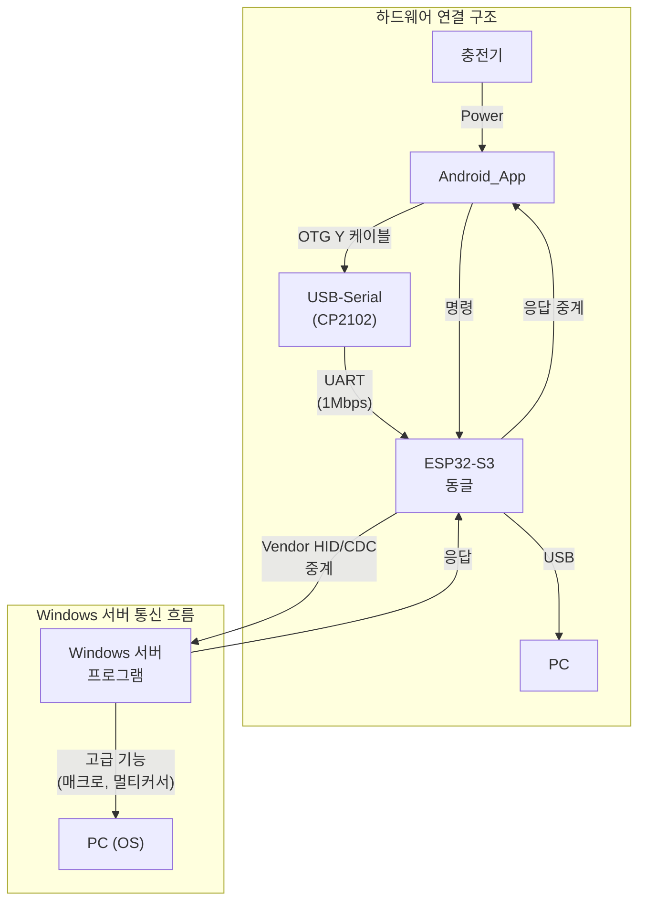

# PCRemote Windows 서버 디자인 가이드

## 시스템 아키텍처 개요

```mermaid
graph TD
    subgraph "하드웨어 연결 구조"
        Android_App -- "OTG Y 케이블" --> USB_Serial["USB-Serial<br/>(CP2102)"]
        USB_Serial -- "UART<br/>(1Mbps)" --> ESP32_S3["ESP32-S3<br/>동글"]
        ESP32_S3 -- "USB" --> PC
        Charger["충전기"] -- "Power" --> Android_App
    end

    subgraph "Windows 서버 통신 흐름"
        Android_App -- "명령" --> ESP32_S3
        ESP32_S3 -- "Vendor HID/CDC<br/>중계" --> Windows_Server["Windows 서버<br/>프로그램"]
        Windows_Server -- "고급 기능<br/>(매크로, 멀티커서)" --> PC_OS["PC (OS)"]
        Windows_Server -- "응답" --> ESP32_S3
        ESP32_S3 -- "응답 중계" --> Android_App
    end
```

> **핵심**: Windows 서버 프로그램은 ESP32-S3를 통해 Android 앱과 간접 통신하며, 고급 기능을 제공합니다.

(내용 추가 예정)
