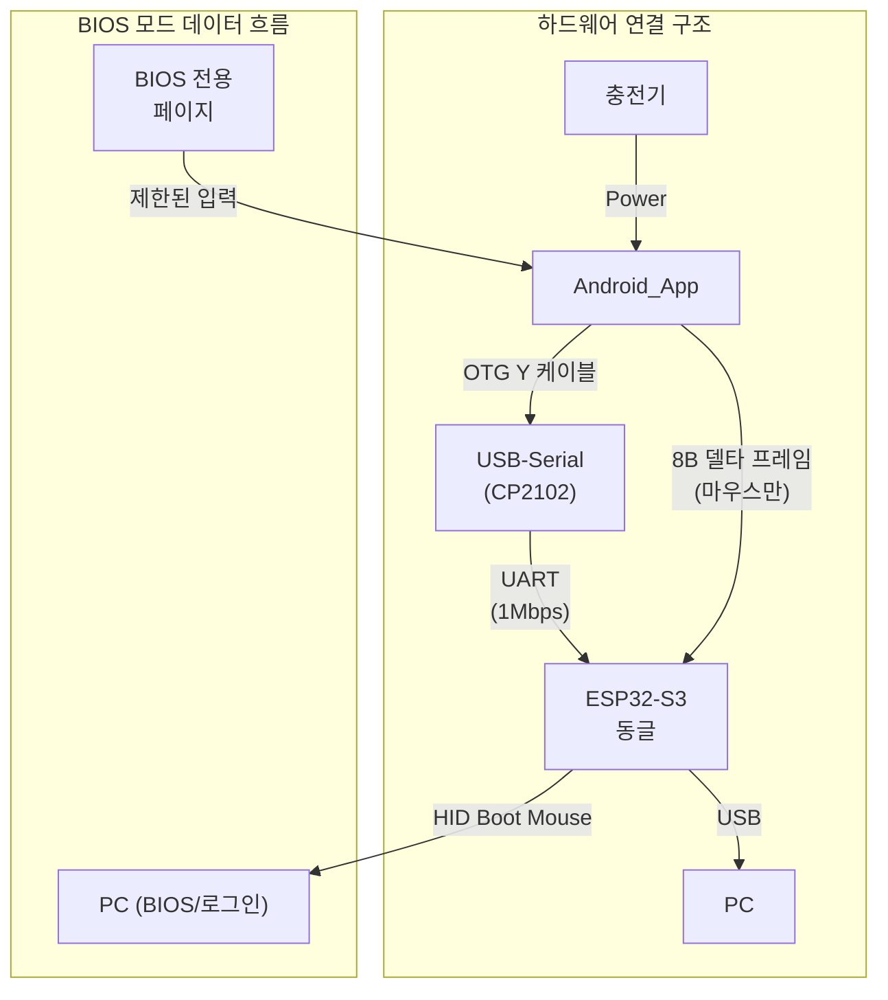

## 목차
- 1. 개요
- 2. 레이아웃 구조
  - 2.1 좌측 Touchpad 영역
  - 2.2 우측 Minimal Actions 패널
  - 2.3 ASCII 레이아웃(개략)
- 3. 허용/비활성 기능(프로토콜 제약)
- 4. 상호작용 및 상태
- 5. 진입/해제 트리거(모드 전환)
- 6. 반응형/적응 규칙
- 7. 아이콘/이미지 가이드
- 8. 구현 메모(개발자용)
- 9. 상태 머신(개발 메모)
- 10. 예외/폴백

## 시스템 아키텍처 개요



> **핵심**: BIOS 모드에서는 기본 마우스 기능(이동, 3버튼)만 지원하며, 휠/고급 기능은 비활성화됩니다.

## 용어집/정의

- Selected/Unselected: 선택 상태. 시각 강조 여부(예: 방향 하이라이트). 입력 가능과 구분.
- Enabled/Disabled: 입력 가능 상태. Boot-safe 단계에서는 많은 요소가 Disabled.
- BootSafe/Normal: 페이지 운용 상태. 본 문서는 BootSafe 전용.
- 상태 용어 사용 원칙(금칙어 포함): "활성/비활성" 금지. Selected/Unselected, Enabled/Disabled로 표기 [[memory:5809234]].

 

## 1. 개요

이 문서는 BIOS/Boot-safe 전용 페이지의 스타일프레임을 정의합니다. 본 페이지는 PC가 OS 이전 단계(BIOS/UEFI, BitLocker PIN, 로그인 화면, UAC Secure Desktop)에 있을 때에도 표준 HID Boot Mouse로 동작하도록 최소 UI만 제공합니다. 상태 용어는 선택 여부는 `Selected/Unselected`, 입력 가능 여부는 `Enabled/Disabled`를 사용합니다 [[memory:5809234]].

참조: `Docs/design-guide-app.md` §10.2.3, §10.6.1, §10.7(플로우), `Docs/usb-hid-bridge-architecture.md` §2.2, §5.1.1, §6.10(BOOT↔REPORT), `Docs/PRD.md` §1.3~§1.4(핵심 가치/경로).

## 2. 레이아웃 구조

- 기본 그리드: 2-열 구조(좌: Touchpad, 우: Minimal Actions). 페이지 네비게이션/인디케이터는 기본 숨김.
- 권장 비율(가로 기준): 좌측 72% / 우측 28% (작은 화면에서는 좌 68%/우 32%까지 허용).
- 화면 여백: 바깥 16dp, 컬럼 간격 12dp, 그룹 간 세로 간격 12~16dp.
- 상태 안내: 상단 토스트(`Docs/design-guide-app.md` §5.2)로만 제공. 별도 배너 없음.

### 2.1 좌측 Touchpad 영역

- 배치: 좌측 모서리 밀착(anchor-left), 상하 중앙 정렬.
- 크기: 컬럼 폭 100%, 1:2 종횡비(Width:Height), 최소 폭 320dp, 최소 높이 560dp.
- 모서리/마스크: 12dp 라운드, 상태 우선순위에 따른 경계선(`Docs/touchpad.md` §3 참조).
- 모드/옵션 노출: 없음. 패드 내부 탭=좌클릭 단발만 허용. 드래그/스크롤/우클릭/멀티커서는 Disabled.
- 구현 소스: `Docs/touchpad.md`의 `Touchpad1Area`만 사용.
- 고정 모드: `PrimaryMode=MOVE`, `MoveMode=FREE`, `ClickMode=LEFT`, `CursorMode=SINGLE`.

시각 토큰(권장):
- 배경: `#121212`
- 패드 표면: `#1E1E1E`
- 경계/강조: `#2196F3`(선택/포커스), Disabled는 `#C2C2C2` 60% alpha

### 2.2 우측 Minimal Actions 패널
 
- 스크롤 컨테이너. 상단에서 하단: Primary Actions → Boot Keyboard Cluster(옵션) → Utilities.
- 터치 타겟 ≥ 56dp, 간격 8~12dp, 리플 비활성.
 
1) Primary Actions(행 배치)
- `LClick`(필수): 탭=좌클릭 단발. 패드 영역 탭과 동일 동작(보조 접근성).
 
2) Boot Keyboard Cluster(옵션)
- 구성: `Esc`, `Enter`, `F1–F12`(수평 스크롤), `Arrow Keys(↑/↓/←/→)` D-Pad.
- 노출 조건: 동글/펌웨어가 HID Boot Keyboard를 지원하는 경우 `Enabled`. 미지원이면 전부 `Disabled` 상태로 표기하고 탭 시 안내 토스트 "이 기능은 현재 하드웨어에서 사용할 수 없습니다".
- 상호작용:
  - `Esc`, `Enter`, `F1–F12`: 단발 입력(길게 눌러도 반복 없음).
  - `Arrow Keys`: 단발 입력(길게 눌러도 반복 없음). 입력 시 순간 `Selected` 시각 상태.
- 레이아웃:
  - Function Row: 한 줄, 가로 공간 부족 시 수평 스크롤. 최소 동시 표시 수 6.
  - D-Pad: 3×3 내 교차 배열(상/하/좌/우), 소형 화면에서는 2열로 자동 재배치.
 
3) Utilities(행 배치)
- `Reconnect`(선택): 연결 재시도 트리거(정책에 따라 설정 화면로 이동).
- `Help`(선택): "OS 진입 후 고급 기능 사용 가능" 안내.

### 2.3 ASCII 레이아웃(개략)

```text
┌──────────────────────────────────────────────────────────────────────────────┐
│ ┌──────────────────────────────────────────────┐  ┌─────────────────────────┐ │
│ │                Touchpad (1:2)                │  │   Minimal Actions       │ │
│ │  [Control Buttons · Click | Move (only)]     │  │   [LClick]              │ │
│ │                                              │  │                         │ │
│ │                                              │  │                         │ │
│ │                                              │  │  ─────────────────────  │ │
│ │                                              │  │  [F1 F2 F3 F4 F5 F6 …]  │ │
│ │                                              │  │  [Esc]   [Enter]        │ │
│ │                                              │  │     [↑]                 │ │
│ │                                              │  │   [←] [↓] [→]           │ │
│ └──────────────────────────────────────────────┘  │  ─────────────────────   │ │
│                                                   │   [Reconnect]  [Help]    │ │
│                                                   └─────────────────────────┘ │
└──────────────────────────────────────────────────────────────────────────────┘
  «권장 비율: 좌 72% / 우 28%, Portrait 기준, 휠/확장 기능 숨김, 상단 토스트로 상태 안내, Boot Keyboard 지원 시 키 클러스터 노출»
```

## 3. 허용/비활성 기능(프로토콜 제약)

- 허용(UI/신호): X/Y 상대 이동, 좌클릭 단발.
- 선택 허용(Boot Keyboard): `Esc`, `Enter`, `F1–F12`, `Arrow Keys(↑/↓/←/→)`. 하드웨어/펌웨어가 Boot Keyboard를 지원하지 않는 경우 해당 UI는 `Disabled`.
- 비활성: Wheel 보고 금지(항상 0), 클릭-드래그 금지, 확장 리포트/매크로/기타 키보드 키(일반 타이핑)/페이지 전환/인디케이터 제스처.
- UI 정책: 휠/스크롤 관련 UI는 Boot-safe에서 숨김(`Disabled`). 시도 시 토스트: "고급 기능은 OS 진입 후 사용 가능합니다"(파란색, 2초).

## 4. 상호작용 및 상태

- 용어: 선택 상태 `Selected/Unselected`, 입력 가능 여부 `Enabled/Disabled` [[memory:5809234]].
- 피드백: 성공 `Success`(초록), 오류 `Error`(빨강), 진행 `Streaming`(파랑) 아이콘/색상 토큰 사용. 과다 피드백 방지(토스트+햅틱 중복 금지).
  - Boot-safe 진입 시: 상단 토스트(정보, 2초) 각 1회 순차 표시 "PC: BIOS 모드", "BIOS 페이지 표시" — 두 토스트 사이 간격 300ms(`Docs/design-guide-app.md` §5.2 규격)
- 햅틱: Light(탭), Error(거부).
- 디바운스: 버튼 300~500ms, 드래그 전환 시 100ms 보호.
- 접근성: 라벨은 명령형.
  - 키 입력: 방향키는 길게 눌러 Auto-repeat(초기 지연 400ms, 반복 간격 60ms). Esc/Enter/F1–F12는 단발. 누름 동안 시각 상태는 `Selected`, 사용 불가 시 `Disabled`.

### 간이 Touchpad 요약

- 목적: Boot-safe 단계에서 최소 입력만 제공하는 간이 터치패드 동작 요약.
- 구조:
  - 좌측 `Touchpad1Area` 단일 사용, 1:2 비율 고정. `ControlButtonContainer`는 숨김.
  - 모드 고정: `PrimaryMode=MOVE`, `MoveMode=FREE`, `ClickMode=LEFT`, `CursorMode=SINGLE`.
  - 테두리: 기본 `#2196F3`. 오류 시 빨간 점멸(§8 오류 처리 규칙 준수).
- 상호작용:
  - 탭: 좌클릭 단발.
  - 드래그: 커서 X/Y 상대 이동. 클릭-드래그(누른 채 이동)는 금지.
  - 더블탭/롱프레스/스크롤/우클릭/멀티 커서/DPI/스크롤 감도: 비활성(무효 입력, 토스트 정책 준수).
- 간이 유저 플로우:
  1) 진입 시 Boot-safe 토스트 2단 표시 → 패드 활성(§4, §5).
  2) 탭 → 좌클릭 전송.
  3) 드래그 → 포인터 이동 전송.
  4) 키 클러스터(옵션) 탭 → 해당 키 단발 전송.
  5) 연결 오류/분리 → 즉시 회귀 + 오류 토스트, 자동 재탐색(§8).

## 5. 진입/해제 트리거(모드 전환)

- 진입: 기본 `BootSafe`. 정상 연결 이전에는 항상 Boot-safe 페이지 표시.
- 해제(두 조건 중 하나 충족 시 `Normal`):
  - 동글이 호스트의 HID `SET_PROTOCOL=REPORT` 전환을 감지했다고 Notify(`Docs/usb-hid-bridge-architecture.md` §2.2, §6.10).
  - OS 단계에서 확장 리포트 수신/동기화 완료(플랫폼 의존) — 정책적으로 동글 Notify 우선.
- 회귀: 트랜스포트 끊김(USB 분리/BLE 끊김) 또는 오류 시 즉시 BootSafe로 회귀(`Docs/design-guide-app.md` §10.6.1).
- 피드백: Boot-safe 진입 시 상단 토스트(정보, 2초) 각 1회 순차 표시 "PC: BIOS 모드", "BIOS 페이지 표시" — 두 토스트 사이 간격 300ms. Normal 전환 시 토스트 "OS 모드로 전환되었습니다"(파랑, 2초) + 햅틱 Medium.

## 6. 반응형/적응 규칙
 
- 폭 < 360dp: 우측 패널을 아이콘형 단일 열로 축소. Primary Actions는 [LClick]만 노출. Function Row(F1–F12)는 수평 스크롤로 전환(최소 동시 6개 표시).
- 폭 ≥ 600dp(Landscape/Tablet): Touchpad 확대, Actions는 2열까지 확장. D-Pad는 고정 3×3 유지.
- 높이 제약: Utilities를 우선 스크롤로 이동하여 Primary Actions 가시성 우선. 키 클러스터는 접기/펼치기 토글 제공 가능.

## 7. 아이콘/이미지 가이드
 
- 내부 자산 우선: `res/drawable/`의 VectorDrawable(@drawable, xml) 사용(기존 SVG는 빌드 타임 변환). 예: `ic_lclick.xml`, `ic_rclick.xml`, `dpad.xml`, `ic_error.xml`, `ic_success.xml`.
- Function Row/`Esc`/`Enter`는 텍스트 라벨 키캡 스타일 사용(아이콘 불필요).
- 대체 텍스트: 버튼 라벨과 동일. Disabled 시 "비활성" 포함 가능.

## 8. 구현 메모(개발자용)

- Compose: Boot-safe에서 페이지 인디케이터/탭/스와이프 네비게이션은 `Disabled`. 상태 안내는 상단 토스트(`Docs/design-guide-app.md` §5.2)로 제공.
- 상태 저장: Boot-safe에서는 별도 상태를 저장하지 않음. Normal 전환 시 Touchpad/DPI 등은 일반 규칙으로 복구.
 - HID/프로토콜: Boot 모드에서는 wheel=0 강제, 3버튼+X/Y만 보고. 동글의 `SET_PROTOCOL=REPORT` Notify 수신 시 내부 상태 `Normal`로 전환하여 휠/확장 허용(`Docs/usb-hid-bridge-architecture.md` §5.1.1, §6.10).
 - Boot Keyboard(옵션): HID Usage 매핑 — Esc `0x29`, Enter `0x28`, Arrow Right `0x4F`, Arrow Left `0x50`, Arrow Down `0x51`, Arrow Up `0x52`, F1–F12 `0x3A–0x45`. Boot Keyboard 8바이트 리포트(6KRO) 사용. 키 유지 시 반복 전송되므로 앱은 키다운 유지/해제만 정확히 관리(불필요한 폴링 금지).
- 오류 처리: 연결 끊김/오류 시 즉시 회귀 + 토스트 `Error`. 백오프 재연결은 `Docs/design-guide-app.md` §10.2.4 준수.
- 성능 목표: 입력 지연 < 50ms, 60fps 유지. 프레임 주기 4–8 ms(125–250 Hz) 권장.
 
## 9. 상태 머신(개발 메모)

- states: {BootSafe, Normal}
- events: {BleConnected, OsEnteredFromDongle, ServerHandshakeOk, BleDisconnected}
- transitions:
  - BootSafe --(OsEnteredFromDongle | ServerHandshakeOk)--> Normal
  - Normal --(BleDisconnected)--> BootSafe

## 10. 예외/폴백

- 일부 BIOS에서 마우스 미지원: 페이지는 유지하되 상단 토스트로 "이 화면은 마우스를 지원하지 않을 수 있습니다" 안내
- OS 미진입 장시간(>60s): "고급 기능은 OS 진입 후 사용 가능합니다" 토스트. 설정에 "항상 기본 홈으로 시작"(전문가 옵션) 제공
- 서버 접근 차단(EDR/정책): 동글 Notify만으로 전환 판단(서버 핸드셰이크 생략)

---

문서 간 역할 분리: 앱 전반 정책은 `Docs/design-guide-app.md`, 프로토콜/펌웨어는 `Docs/usb-hid-bridge-architecture.md`, 제품 요구사항은 `Docs/PRD.md`를 우선 참조하세요. Touchpad 동작/감도/모드 정의는 `Docs/touchpad.md`를 따르되 Boot-safe 제약(휠 금지, 최소 UI)을 우선합니다. 또한 Boot-safe 전용 페이지의 시각/상호작용·레이아웃 세부는 본 문서가 단일 출처입니다.

 
