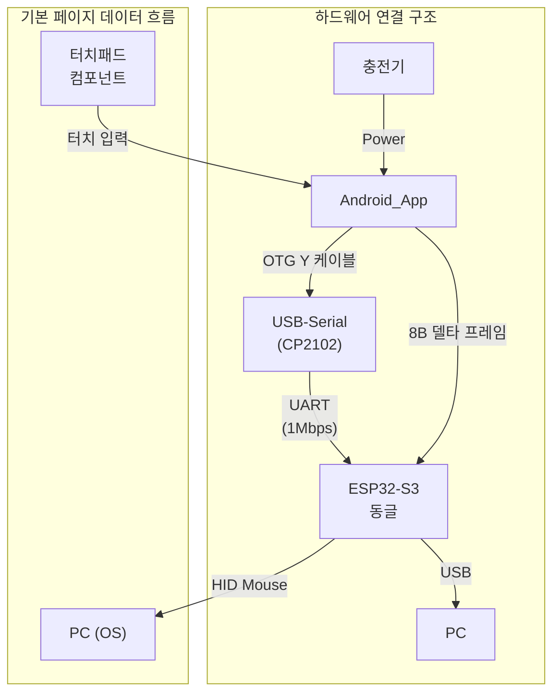

## 목차
- 1. 개요
- 2. 레이아웃 구조
  - 2.1 좌측 Touchpad 영역
  - 2.2 우측 Actions 패널
  - 2.3 ASCII 레이아웃(개략)
- 3. 상호작용 및 상태
- 4. 아이콘/이미지 가이드
- 5. 반응형/적응 규칙
- 6. 구현 메모(개발자용)

## 시스템 아키텍처 개요



> **핵심**: 터치패드 기반의 기본 마우스 제어 페이지입니다. 모드 변경, DPI 조절 등의 기능을 제공합니다.

## 용어집/정의

- Selected/Unselected: 선택 상태. 인디케이터/버튼 강조 등 시각 선택 표현.
- Enabled/Disabled: 입력 가능 상태. 버튼/제스처 허용 여부.
- 상태 용어 사용 원칙(금칙어 포함): "활성/비활성" 금지. 선택은 Selected/Unselected, 입력 가능은 Enabled/Disabled [[memory:5809234]].

 

## 1. 개요

이 문서는 메인 조작 페이지(Page 1)의 스타일프레임을 정의합니다. 레이아웃은 좌측에 Touchpad를 좌측 모서리에 밀착 배치하고, 우측에는 특수 키(Special Keys), 키 조합(Shortcuts), 매크로(Macros)를 세 영역으로 나누어 배치합니다. 상태 용어는 선택 여부는 `Selected/Unselected`, 입력 가능 여부는 `Enabled/Disabled`를 사용합니다 [[memory:5809234]].

참조: `Docs/design-guide-app.md` §5(토스트/인디케이터/햅틱), §9(컴포넌트 시각/토큰), `Docs/component-design-guide.md` §2(버튼/단축키/매크로), `Docs/touchpad.md` §3(패드/모드/옵션).

## 2. 레이아웃 구조

- 기본 그리드: 2-열 구조(좌: Touchpad, 우: Actions). 세로 스크롤은 우측 패널에서만 허용.
- 권장 비율(가로 기준): 좌측 64% / 우측 36% (작은 화면에서는 좌 60%/우 40%까지 축소 허용).
- 화면 여백: 바깥 16dp, 컬럼 간격 12dp, 그룹 간 세로 간격 12~16dp.
- 방향: Portrait 최적화. Landscape에서는 우측 패널을 2열 그리드로 자동 확장.

### 2.1 좌측 Touchpad 영역

- 배치: 좌측 모서리에 밀착(anchor-left), 상하 중앙 정렬.
- 크기: 컬럼 폭의 100%를 사용, 세로 방향으로는 가용 높이 내에서 비율 유지.
- 종횡비: 1:2 (Width:Height), 최소 폭 320dp, 최소 높이 560dp. 비율을 유지하기 어려울 경우 상단 여백을 우선으로 조정.
- 모서리 및 마스크: 12dp 라운드 코너, 경계선은 상태 우선순위에 따라 표시(`Docs/touchpad.md` §3.4 참조).
- 모드/옵션 노출: 패드 내부 상단 15% 높이에 모드/옵션 버튼 컨테이너를 오버레이(Click/Move/Scroll/Cursor, DPI/Scroll 감도). 시각적 강조는 과도하지 않게(반투명 배경, 블러 미사용).

시각 토큰(권장):
- 배경: `#121212`
- 패드 표면: `#1E1E1E`
- 경계/강조: `#2196F3`(선택/포커스), Disabled는 `#C2C2C2` 60% alpha

### 2.2 우측 Actions 패널

- 스크롤 컨테이너. 세 그룹을 상단에서 하단 순으로 배치: Special Keys → Shortcuts → Macros.
- 그룹 헤더: 굵게, 소문자 라벨 금지. 필요시 보조 설명 캡션 12sp.
- 각 버튼 컴포넌트는 `KeyboardKeyButton`/`ShortcutButton`/`MacroButton`을 사용. 리플은 비활성, 터치 타겟은 ≥ 56dp, 간격 8~12dp.

#### A. Special Keys(2열 그리드)

권장 키 세트(8개): `Esc`, `Tab`, `Enter`, `Backspace`, `Delete`, `Space`, `Home`, `End`.

 - 아이콘/라벨: 키 텍스트 라벨 기본, 필요 시 VectorDrawable(예: `ic_scope_keyboard.xml`, SVG는 빌드 타임 변환) 보조 아이콘 사용.
- 길게 누르기(롱프레스): `Enter`는 반복 입력 가속 지원(토스트 피드백).
- 상태: 비선택 표시 `Unselected`, 입력 가능/불가 `Enabled/Disabled` 표기 규칙 준수.

#### B. Shortcuts(2열 그리드)

권장 조합(8개): `Ctrl+C`, `Ctrl+V`, `Ctrl+S`, `Ctrl+Z`, `Ctrl+Shift+Z`, `Ctrl+X`, `Alt+Tab`, `Win+D`.

- 조합 표기: 키칩 형태(예: `Ctrl` + `C`)로 시각화. 누름 순서 충돌 방지 로직은 `Docs/component-design-guide.md` §2.2 참조.
- `Alt+Tab`: 누르고 있는 동안 `Selected` 유지, 해제 시 입력 종료.
- `Win+D`: 토글형 아님, 단발성 트리거. 중복 입력 보호(500ms 디바운스).

#### C. Macros(세로 리스트)

권장 기본: `Macro 1`, `Macro 2`, `Macro 3` — 사전 정의된 실행 전용 매크로(녹화/편집 기능 없음).

- 성격: 빌드 시 고정 매핑, 런타임 유저 수정 불가(페이지 레이아웃 정책 준수).
- 실행: 시작/종료 시 토스트로만 알림(진행률/스피너 미표시). 성공/오류 색상 토큰 준수.
- 동시 실행: 기본 금지(실행 중 해당 버튼 `Disabled`). 필요 시 다른 매크로와의 병행 여부는 정책으로 결정.
- 재진입 보호: 입력 디바운스 500ms, 실행 중 재트리거 무시.
- 취소: 기본 미지원. 별도 중지 기능이 필요한 매크로는 별개 `Stop` 액션 버튼으로 설계.
- 아이콘: VectorDrawable 권장(예: `ic_media_play.xml`). `ic_media_stop.xml`은 별도 중지 액션이 있을 때만 사용.

### 2.3 ASCII 레이아웃(개략)

```text
┌──────────────────────────────────────────────┐  ┌──────────────────────────────┐
│                  Touchpad (1:2)              │  │          Actions (Scroll)     │
│                                              │  │ ┌─ Special Keys ────────────┐ │
│  [ControlButtonContainer · 15% overlay]      │  │ │ Esc Tab Enter Backspace... │ │
│  Click · Move · Scroll · Cursor | DPI | Sens │  │ └───────────────────────────┘ │
│                                              │  │ ┌─ Shortcuts ───────────────┐ │
│                                              │  │ │ Ctrl+C Ctrl+V Ctrl+S ...  │ │
│                                              │  │ └───────────────────────────┘ │
│                                              │  │ ┌─ Macros ─────────────────┐ │
│                                              │  │ │  Play  Macro1  Macro2    │ │
│                                              │  │ └───────────────────────────┘ │
└──────────────────────────────────────────────┘  └──────────────────────────────┘
  «권장 비율: 좌 64% / 우 36%, Portrait 기준»
```

## 3. 상호작용 및 상태

- 명명 규칙: 선택 상태는 `Selected/Unselected`, 입력 가능 여부는 `Enabled/Disabled`를 사용 [[memory:5809234]]. 문서 및 코드 주석 모두 동일 규칙 적용.
- 피드백: 성공 `Success`(초록), 오류 `Error`(빨강), 진행 `Streaming`(파랑) 아이콘/색상 토큰 사용. 토스트는 §5.2 정책 준수.
- 햅틱: Light(탭), Medium(중요), Error(거부). 이중 피드백 방지(같은 이벤트로 토스트+햅틱 중복 발생 금지).
- 접근성: 라벨은 간결한 명령형. 조합 키는 보이스 리드아웃에 "단축키" 접두사.

## 4. 아이콘/이미지 가이드

 - 내부 자산 우선: `res/drawable/`의 VectorDrawable(@drawable, xml) 사용(기존 SVG는 빌드 타임 변환). 예: `ic_lclick.xml`, `ic_rclick.xml`, `ic_scope_keyboard.xml`, `ic_media_play.xml`, `ic_media_stop.xml`, `ic_scroll.xml`.
 - 커스텀 셰이프(Canvas Path/Clip)는 단순 기하 형태에 한해 사용. 복잡 아이콘은 VectorDrawable 사용(SVG는 빌드 타임 변환).
- 대체 텍스트: 버튼 라벨과 동일, 필요 시 "비활성" 상태를 명시.

## 5. 반응형/적응 규칙

- 폭 < 360dp: 우측 패널 그룹 수를 줄이거나 탭으로 분리(상단 세그먼트 컨트롤). 기본은 스크롤 유지.
- 폭 ≥ 600dp(Landscape/Tablet): 우측 패널 그리드를 최대 3열까지 확장, 버튼 최소 폭 120dp 유지.
- 높이 제약 시: Macros를 우선 스크롤링 영역으로 배치하여 키/조합 가시성 우선 확보.

## 6. 구현 메모(개발자용)

- Compose: Pager/Indicator는 본 페이지에서 `Selected` 고정, 네비게이션 제스처는 `Enabled`(페이지 전환 제스처는 §10.3 정책 준수).
- 상태 저장: 페이지/모드/DPI/입력 진행 상태를 즉시 저장. 비정상 종료 시 복구 규칙 준수.
- 일괄 스타일 전환: Disabled/Unselected는 컨테이너 단위 색/알파로 처리(위젯 개별 상태 바인딩 최소화).
- 전송: HID 입력은 Report 경로 우선. 조합 키는 프레이밍 순서 규칙(키다운→키업) 지켜 전송.

---

문서 간 역할 분리: 앱 전반 정책은 `Docs/design-guide-app.md`를, 컴포넌트 수준 동작은 `Docs/component-design-guide.md`를, 터치/스크롤/패드 동작은 `Docs/touchpad.md`를 우선 참조하세요.

