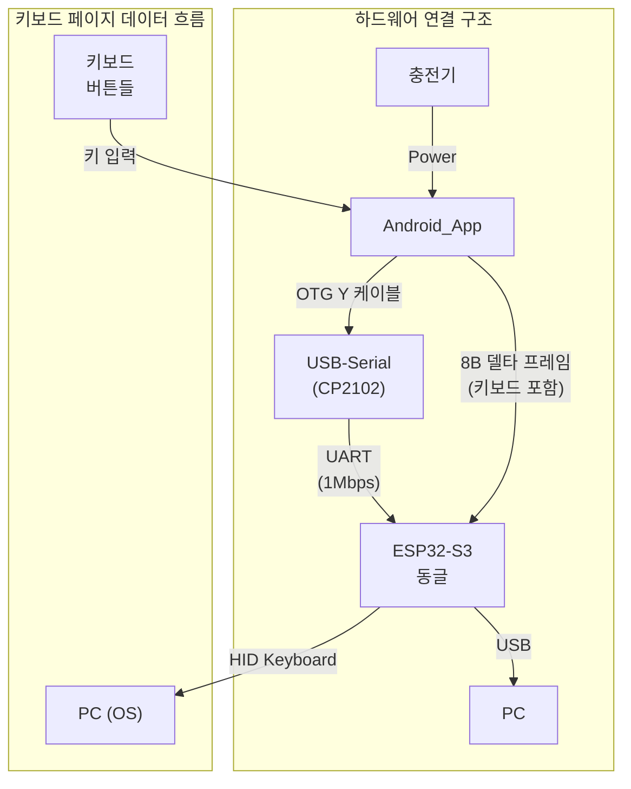

## 목차
- 1. 개요
- 2. 레이아웃 구조
  - 2.1 좌측 Key Cluster
  - 2.2 우측 Actions 패널
  - 2.3 ASCII 레이아웃(개략)
- 3. 상호작용 및 상태
- 4. 아이콘/이미지 가이드
- 5. 반응형/적응 규칙
- 6. 구현 메모(개발자용)

## 시스템 아키텍처 개요



> **핵심**: 키보드 버튼, 단축키, 매크로 버튼을 통해 다양한 키보드 입력을 지원하는 페이지입니다.

## 용어집/정의

- Selected/Unselected: 선택 상태. 키/락키 등의 시각 선택/강조 표현.
- Enabled/Disabled: 입력 가능 상태. 버튼/반복 입력 허용 여부.
- 상태 용어 사용 원칙(금칙어 포함): "활성/비활성" 금지. 선택은 Selected/Unselected, 입력 가능은 Enabled/Disabled [[memory:5809234]].

 

## 1. 개요

이 문서는 Page 2를 키보드 중심 인터페이스로 설계한 스타일프레임입니다. 터치패드는 본 페이지에서 기본적으로 노출하지 않으며, 키 입력과 단축키 트리거를 빠르게 수행하는 것이 목적입니다. 상태 용어는 선택 여부는 `Selected/Unselected`, 입력 가능 여부는 `Enabled/Disabled`를 사용합니다 [[memory:5809234]].

참조: `Docs/design-guide-app.md` §5(토스트/인디케이터/햅틱), §9(컴포넌트 시각/토큰), `Docs/component-design-guide.md` §2(KeyboardKeyButton/ShortcutButton), `Docs/touchpad.md` §3(모드/옵션 용어 규칙).

## 2. 레이아웃 구조

- 2-열 구조(좌: Key Cluster, 우: Actions). 세로 스크롤은 우측 패널에서만 허용.
- 권장 비율(가로 기준): 좌측 64% / 우측 36%. 최소 좌 60%/우 40%까지 허용.
- 화면 여백: 바깥 16dp, 컬럼 간격 12dp, 그룹 간 세로 간격 12~16dp.
- 본 페이지에서는 Touchpad를 기본 숨김. 필요 시 별도 페이지 혹은 상단 탭으로 제공.

### 2.1 좌측 Key Cluster

- 구성: Modifiers Bar → Navigation/Editing Grid → Function Row 순으로 상단에서 하단 배치.

1) Modifiers Bar(상단 고정)
- 키: `Ctrl`, `Shift`, `Alt`, `Win`(4개).
- Sticky 규칙: 탭=일시 고정(다음 입력까지, 최대 800ms), 더블탭=토글 고정(해제 시까지 지속), 길게 누르기(≥400ms)=누르는 동안만 유지.
- 시각: `Selected`는 강조색(`'#2196F3'`), `Disabled`는 톤다운(`'#C2C2C2'`, alpha 0.6).

2) Navigation/Editing Grid(중앙)
- 화살표: Inverted-T(`↑` 중앙 상단, `←`/`→` 좌우, `↓` 중앙 하단). 길게 누르면 Key Repeat.
- 에디팅: `Backspace`, `Delete`, `Enter`, `Tab`, `Home`, `End`, `PageUp`, `PageDown`(2~3열 그리드).
- Key Repeat: OS 설정을 따르되, 앱 레벨에서 25~30Hz 상한(최대 40ms 주기)으로 스로틀링.

3) Function Row(하단)
- F1~F12를 수평 스크롤(Chips 또는 Compact 버튼). 길게 누르기 반복 지원.
- 그룹 간 경계는 얇은 디바이더(알파 0.2) 사용.

### 2.2 우측 Actions 패널

- 스크롤 컨테이너. 상단에서 하단 순으로 Shortcuts → Media Controls → Lock Keys.
- 각 버튼은 `ShortcutButton`/`KeyboardKeyButton`을 사용. 터치 타겟 ≥ 56dp, 간격 8~12dp, 리플 비활성.

1) Shortcuts(2열 그리드, 권장 12개)
- 기본: `Ctrl+C`, `Ctrl+V`, `Ctrl+S`, `Ctrl+Z`, `Ctrl+Shift+Z`, `Ctrl+X`, `Ctrl+N`, `Ctrl+O`, `Ctrl+P`, `Ctrl+W`, `Ctrl+T`, `Alt+F4`.
- `Alt+Tab`은 누름 유지형이므로 본 그룹 대신 Modifiers+`Tab` 조합을 이용(UX 혼동 방지).
- 조합 표기: 키칩(예: `Ctrl` + `S`). 누름 순서/해제 순서는 `Docs/component-design-guide.md` §2.2를 따른다.

2) Media Controls(행 배치)
- 항목: `Play/Pause`(토글), `Stop`.
- 아이콘: VectorDrawable 권장(`ic_media_play.xml`, `ic_media_pause.xml`, `ic_media_stop.xml`). Next/Prev/Volume은 본 페이지 기본 제외(아이콘 자산/공간 고려). 기존 SVG는 빌드 타임에 VectorDrawable로 변환.

3) Lock Keys(행 배치)
- 항목: `CapsLock`, `NumLock`, `ScrollLock`.
- 표시: `Selected`=켜짐(라쳇), `Unselected`=꺼짐. 상태는 HID LED Report 기반으로 동기화.
- 충돌: 상태 미동기화 감지 시 토스트 `Error`(2초) 표출 후 재동기화 시도.

### 2.3 ASCII 레이아웃(개략)

```text
┌──────────────────────────────────────────────────────────────┐  ┌──────────────────────────────┐
│  Modifiers: [Ctrl] [Shift] [Alt] [Win]                       │  │        Shortcuts (2열)       │
├──────────────────────────────────────────────────────────────┤  │  Ctrl+C  Ctrl+V  Ctrl+S  ... │
│  Navigation / Editing Grid                                   │  ├──────────────────────────────┤
│      [↑]                                                     │  │        Media Controls        │
│   [←]   [→]    Backspace Delete Enter Home End PgUp PgDn     │  │   [Play/Pause]   [Stop]      │
│      [↓]                                                     │  ├──────────────────────────────┤
├──────────────────────────────────────────────────────────────┤  │           Lock Keys          │
│  F1 F2 F3 F4 F5 F6 F7 F8 F9 F10 F11 F12 (수평 스크롤)       │  │   [CapsLock] [NumLock] [Scr] │
└──────────────────────────────────────────────────────────────┘  └──────────────────────────────┘
  «권장 비율: 좌 64% / 우 36%, Portrait 기준»
```

## 3. 상호작용 및 상태

- 상태 용어: 선택 상태는 `Selected/Unselected`, 입력 가능 여부는 `Enabled/Disabled` [[memory:5809234]].
- Sticky Modifiers: 상기 규칙(탭/더블탭/롱프레스). UI에 토글 배지 노출. 더블탭 토글 상태에서는 페이지 전환 시 자동 해제.
- Key Repeat: 화살표/Backspace/Space/Enter 기본 지원. 프레임 상한을 두어 60fps 성능을 저해하지 않도록 한다.
- 단축키 충돌: 동일 키조합 중복 트리거 방지(디바운스 500ms). Danger 조합은 `Disabled` 기본(예: 시스템 전역 영향이 큰 조합).
- 피드백: 성공 `Success`(초록), 오류 `Error`(빨강). 토스트는 §5.2 정책을 따른다. 중복(토스트+햅틱) 방지.
- 접근성: 보이스 라벨은 "키", "단축키" 접두사로 구분. Lock Keys는 상태를 함께 읽어준다.

## 4. 아이콘/이미지 가이드

- 내부 자산 우선: `res/drawable/`의 VectorDrawable(@drawable, xml) 사용(기존 SVG는 빌드 타임 변환). 예: `ic_scope_keyboard.xml`, `ic_media_play.xml`, `ic_media_pause.xml`, `ic_media_stop.xml`.
- 키 버튼은 텍스트 라벨 기본. 복잡 아이콘은 VectorDrawable 사용(필요 시 빌드 타임 변환).
- 대체 텍스트: 라벨과 동일. Disabled 시 "비활성" 포함 가능.

## 5. 반응형/적응 규칙

- 폭 < 360dp: Function Row를 드롭다운/수평 스크롤로 축소. Shortcuts는 탭 전환으로 그룹 분할 가능.
- 폭 ≥ 600dp(Landscape/Tablet): 좌측 Key Grid 열 수 확장(3열→최대 4열), 우측 Shortcuts 3열까지 확장.
- 높이 제약 시: Media/Lock을 우선 스크롤로 이동하여 Shortcuts 가시성을 확보.

## 6. 구현 메모(개발자용)

- Compose: `KeyboardKeyButton`/`ShortcutButton` 사용. 모디파이어는 Selection 상태와 토글 배지를 명확히 표현.
- 상태 저장: 모디파이어 토글/락키/최근 사용 단축키를 즉시 저장. 세션 복구 시 불일치 방지.
- HID 전송: 단일 키는 KeyDown→KeyUp. 조합 키는 모디파이어(KeyDown)→주키(KeyDown)→주키(KeyUp)→모디파이어(KeyUp). Alt+Tab은 Alt 유지 중 Tab 반복.
- Lock Key 동기화: Host LED Report 수신 시 반영. 미수신 시 폴링 간격 2s, 최대 3회 재시도.
- 성능: 입력 지연 < 50ms 목표. Repeat 스로틀과 애니메이션은 60fps 유지.

---

문서 간 역할 분리: 앱 전반 정책은 `Docs/design-guide-app.md`, 컴포넌트 동작은 `Docs/component-design-guide.md`를, HID 경로/LED 동기화는 `Docs/usb-hid-bridge-architecture.md`를 우선 참조하세요.

