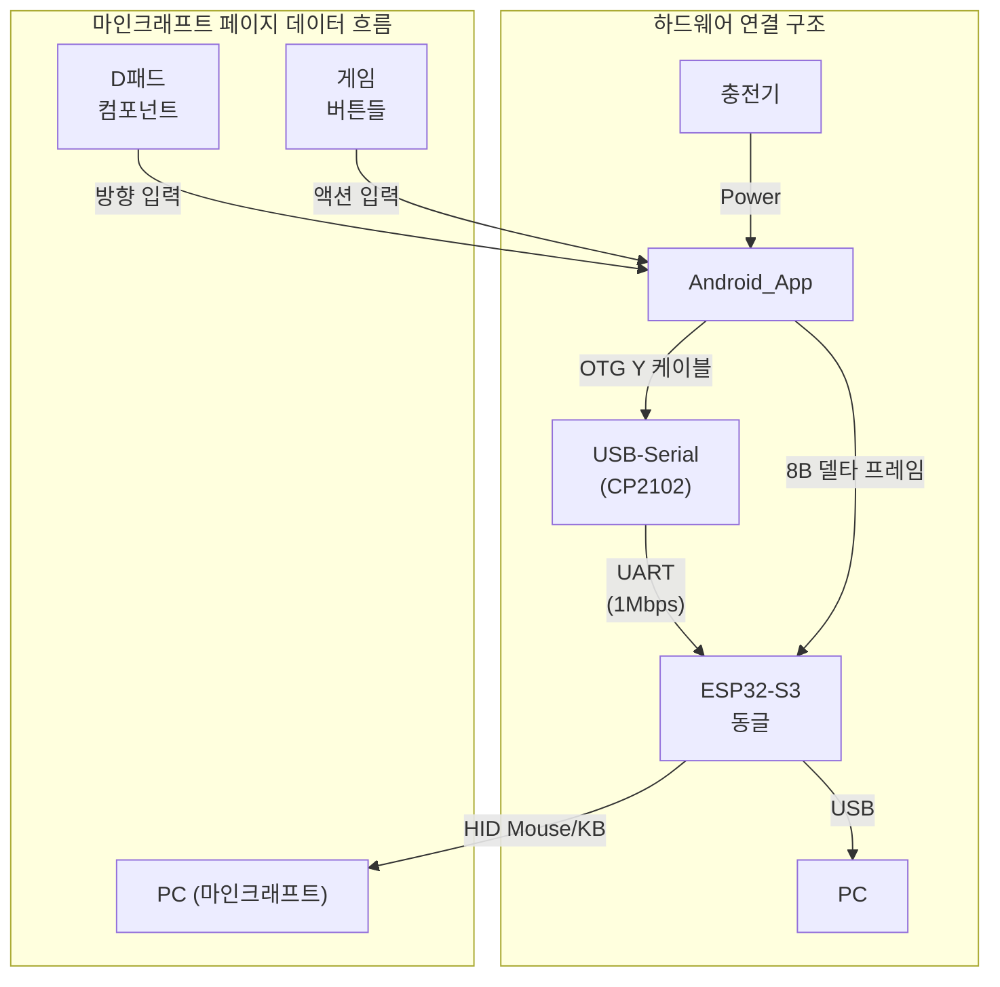

## 목차
- 1. 개요
- 2. 레이아웃 구조
  - 2.1 좌측 Touchpad 영역
  - 2.2 우측 Actions 패널
  - 2.3 Touchpad 통합(@touchpad.md)
  - 2.4 ASCII 레이아웃(개략)
- 3. DPad(필수)
- 4. Movement 보조 버튼
- 5. Camera Touch Area(시점)
- 6. Actions(전투/인벤토리/핫바)
- 7. 상호작용/상태/피드백
- 8. 반응형/적응
- 9. 구현 메모(개발자용)

## 시스템 아키텍처 개요



> **핵심**: 마인크래프트 게임플레이에 최적화된 D패드와 게임 버튼을 제공하는 페이지입니다.

## 용어집/정의

- Selected/Unselected: 선택 상태. DPad/버튼의 시각 선택 표현.
- Enabled/Disabled: 입력 가능 상태. 전투/인벤토리/핫바 버튼 상호작용 허용 여부.
- 상태 용어 사용 원칙(금칙어 포함): "활성/비활성" 금지. 선택은 Selected/Unselected, 입력 가능은 Enabled/Disabled [[memory:5809234]].

## 1. 개요

이 문서는 Minecraft 플레이에 특화된 Page 3의 스타일프레임을 정의합니다. 좌측에 이동을 담당하는 Movement Cluster(필수: DPad 4방향)를 배치하고, 우측에 시점 제어(Camera)와 전투/인벤토리/핫바 등 액션을 배치합니다. 선택 상태는 `Selected/Unselected`, 입력 가능 여부는 `Enabled/Disabled` 용어를 사용합니다 [[memory:5809234]].

참조: `Docs/design-guide-app.md` §1.2.1(DPad 예외 규칙), §5(토스트/인디케이터/햅틱), §9(토큰), `Docs/component-design-guide.md` §2(버튼/단축키), `Docs/touchpad.md` §3(터치 가이드), `Docs/usb-hid-bridge-architecture.md`(HID 주입 규칙).

## 2. 레이아웃 구조

- 2-열 구조: 좌측 Touchpad, 우측 Actions.
- 권장 비율(가로 기준): 좌측 64% / 우측 36% (Page 1과 동일 권장값). 소형 화면에서는 좌 60%/우 40%까지 허용.
- 여백: 바깥 16dp, 컬럼 간 12dp, 그룹 간 세로 12~16dp.

### 2.1 좌측 Touchpad 영역

- 배치: 좌측 모서리에 밀착(anchor-left), 상하 중앙 정렬.
- 크기: 컬럼 폭의 100% 사용, 세로 방향 가용 높이 내 비율 유지.
- 종횡비: 1:2 (Width:Height), 최소 폭 320dp, 최소 높이 560dp.
- 모서리/마스크: 12dp 라운드, 상태 우선순위에 따른 테두리 표시(`Docs/touchpad.md` §2.2, §3 참조).
- 모드/옵션: 패드 내부 상단 15% 높이에 `ControlButtonContainer`(Click/Move/Scroll/Cursor, DPI/Scroll 감도) 오버레이.

게임 매핑 메모:
- Touchpad 드래그=시점 이동(마우스 X/Y). 스크롤 모드=Hotbar 스크롤(Wheel step), 클릭 모드=Attack/Use.

### 2.2 우측 Actions 패널

- 스크롤 컨테이너. 상단에서 하단: Movement(DPad + 보조), Combat & Use, Inventory/Hotbar/Utility.
- 그룹 헤더: 굵게, 보조 캡션 12sp. 터치 타겟 ≥ 56dp, 간격 8~12dp, 리플 비활성.

### 2.3 Touchpad 통합(@touchpad.md)

- 기반 컴포넌트: Page 1과 동일한 전체 `TouchpadWrapper` + `TouchpadAreaWrapper` + `ControlButtonContainer`를 그대로 사용합니다.
  - 참조: `Docs/touchpad.md` §1.1~§1.6, §2, §3, §5.
- 게임 특화 매핑:
  - Click 모드: 좌클릭=Attack, 우클릭=Use/Place.
  - 스크롤 모드: Hotbar 스크롤로 매핑(Wheel step).
  - 커서 모드: 싱글/멀티 커서 정책은 기본 규칙 준수(멀티 커서가 필요 없다면 기본 싱글 유지).

### 2.4 ASCII 레이아웃(개략)

```text
┌──────────────────────────────────────┐  ┌──────────────────────────────────────┐
│           Touchpad (Camera)          │  │          Movement (DPad)            │
│  [Control Buttons · 15% overlay]     │  │               [↑]                   │
│  Click · Move · Scroll · Cursor      │  │           [←] [ ] [→]               │
│                                      │  │               [↓]                   │
└──────────────────────────────────────┘  ├──────────────────────────────────────┤
                                          │        Combat & Use                  │
                                          │   LClick   RClick   MClick(opt)     │
                                          ├──────────────────────────────────────┤
                                          │     Inventory / Utility              │
                                          │   E  Q  F  F5  ESC  T               │
                                          ├──────────────────────────────────────┤
                                          │              Hotbar                  │
                                          │   [1][2][3][4][5][6][7][8][9]  ^ v  │
                                          └──────────────────────────────────────┘
  «권장 비율: 좌 64% / 우 36%, Portrait 기준»
```

## 3. DPad(필수)

 - 형식: 4방향(Up/Left/Right/Down). 기본 단방향 입력. 대각선은 기본 미지원.
- 예외 규칙: 동일 포인터 유지 상태에서 드래그로 방향 전환 허용(`Docs/design-guide-app.md` §1.2.1).
- 크기/비율: 정사각형, 최소 변 220dp(소형 화면 200dp까지 허용), 라운드 12dp.
- 피드백: 방향 전환 시 Light 햅틱. 오류 입력 시 Error 햅틱.
- 상태: 입력 중 `Selected`, 비입력 `Unselected`.

HID 매핑(기본):
- Up=W, Left=A, Down=S, Right=D.
- 입력 지속 시 키다운 유지, 해제 시 키업. 전환 시(예: W→A) 이전 키업 후 다음 키다운.

## 4. Movement 보조 버튼

### 4.1 Jump(Space)
- 탭: 단발 점프.
- 길게: 점프 유지(게임 내 의미 제한적, 기본 비권장). 디바운스 300ms.

### 4.2 Sneak(Shift)
- 탭: 800ms 홀드.
- 더블탭: 토글 유지(상태 `Selected`), 다시 더블탭 또는 길게 누르기 해제로 복귀.

### 4.3 Sprint(Ctrl)
- 탭: 800ms 홀드.
- 더블탭: 토글 유지. Sneak와 동시 토글 충돌 시 마지막 입력 우선, 이전 상태 자동 해제.

## 5. Camera Touch Area(시점)

- 목적: 마우스 이동만 담당. 스크롤/버튼은 액션 그룹에서 제공.
- 비율: 1:1.2(가로:세로) 소형 패드, 최소 폭 200dp.
- 감도: 기본 Normal. `Docs/touchpad.md`의 DPI/감도 정책을 약식 적용.
- 제스처: 드래그=시점 이동. 더블탭/롱프레스는 미사용.

HID 매핑: 마우스 X/Y 상수 입력. i16→−127..127 분할 주입 규칙 준수(`Docs/usb-hid-bridge-architecture.md`).

## 6. Actions(전투/인벤토리/핫바)

### 6.1 Combat & Use
- Attack: LClick(단발). 길게=지속 공격.
- Use/Place: RClick(단발). 길게=지속 사용/설치.
- Pick Block: MClick(선택적, 리소스 팩/크리에이티브에 유용).

### 6.2 Inventory/Utility
- Inventory: `E`.
- Drop: `Q`(단발), 길게=연속 드롭 허용(주의: 기본 비권장, `Disabled` 옵션 가능).
- Swap items in hands: `F`.
- Perspective: `F5` 토글.
- Pause/Menu: `ESC`.
- Chat: `T`.

### 6.3 Hotbar
- 숫자 1~9 버튼 또는 Wheel Up/Down(두 개의 작은 버튼) 제공.
- 연속 휠 스크롤은 25~30Hz 상한으로 스로틀.

## 7. 상호작용/상태/피드백

- 용어: 선택 상태 `Selected/Unselected`, 입력 가능 `Enabled/Disabled` [[memory:5809234]].
- 디바운스: 버튼/단축키 500ms(휠/시점 제외). Danger 액션은 기본 `Disabled`.
- 토스트: 주요 상태 전환/토글에만 사용. 과다 피드백 방지(토스트+햅틱 중복 금지).
- 접근성: 버튼 라벨을 명령형으로 간단히. 상태/토글 여부를 리드아웃.

## 8. 반응형/적응

- 폭 < 360dp: Camera 패드를 축소하고 Hotbar를 수평 스크롤로 전환.
- 폭 ≥ 600dp: DPad와 Camera 패드를 모두 확대, Hotbar 숫자 1~9를 고정 표시.
- 높이 제약: Utility 그룹(Chat/Pause 등)을 우선 스크롤 이동.

## 9. 구현 메모(개발자용)

- HID 키 프레이밍: 키다운→키업. DPad 전환 시 이전 키업 후 다음 키다운 순서 보장.
- 시점 입력: i16 분할 주입, 프레임당 60Hz 목표. 입력 지연 < 50ms 유지.
- 상태 저장: Sneak/Sprint 토글, 마지막 Hotbar, Camera 감도. 비정상 종료 복구 시 세션 동기화.
- Disabled 처리: 연속 드롭/위험 조합은 정책에 따라 기본 `Disabled` 설정.

---

문서 간 역할 분리: UI 정책은 `Docs/design-guide-app.md`, 컴포넌트 동작은 `Docs/component-design-guide.md`, 터치/시점/감도는 `Docs/touchpad.md`, HID 세부는 `Docs/usb-hid-bridge-architecture.md`를 우선 참조하세요.


