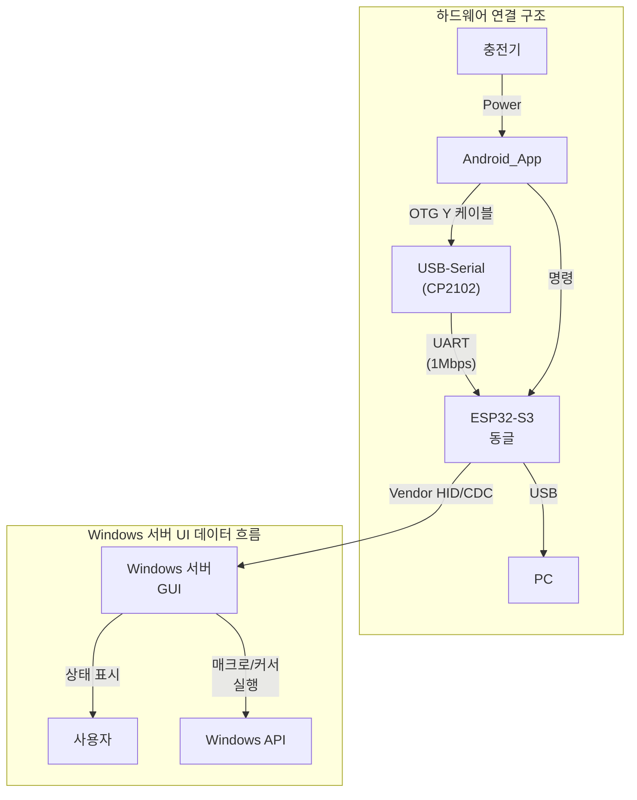

# PCRemote Windows 서버 스타일프레임

## 시스템 아키텍처 개요

```mermaid
graph TD
    subgraph "하드웨어 연결 구조"
        Android_App -- "OTG Y 케이블" --> USB_Serial["USB-Serial<br/>(CP2102)"]
        USB_Serial -- "UART<br/>(1Mbps)" --> ESP32_S3["ESP32-S3<br/>동글"]
        ESP32_S3 -- "USB" --> PC
        Charger["충전기"] -- "Power" --> Android_App
    end

    subgraph "Windows 서버 UI 데이터 흐름"
        Server_UI["Windows 서버<br/>GUI"] -- "상태 표시" --> User["사용자"]
        Android_App -- "명령" --> ESP32_S3
        ESP32_S3 -- "Vendor HID/CDC" --> Server_UI
        Server_UI -- "매크로/커서<br/>실행" --> Windows_API["Windows API"]
    end
```

> **핵심**: Windows 서버 프로그램의 GUI 디자인과 사용자 인터페이스를 위한 스타일프레임입니다.

(내용 추가 예정)
