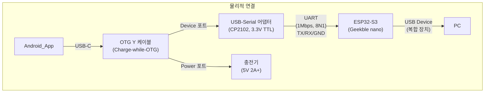
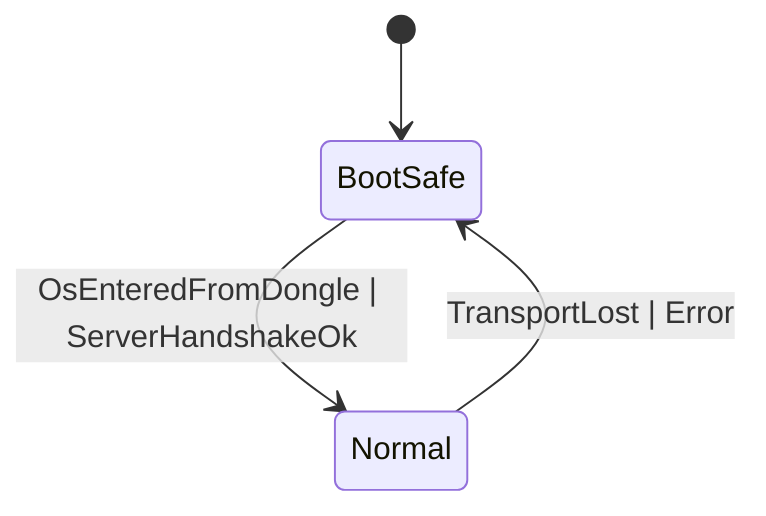

## 용어집/정의

- Selected/Unselected: 선택 상태. 시각 강조/선택 표시. 입력 가능과 혼동 금지.
- Enabled/Disabled: 입력 가능 상태. 포인터/키 입력 허용 여부.
- BootSafe/Normal: 운용 상태. Boot 단계 최소 기능, OS 진입 후 확장 기능.
- TransportState: NoTransport | UsbOpening | UsbReady | BleOpening | BleReady.
- RFC2119: MUST/SHOULD/MAY 규범 용어.
- 상태 용어 사용 원칙(금칙어 포함): "활성/비활성" 금지. Selected/Unselected, Enabled/Disabled로 표기[[memory:5809234]].

## 목차
- 1. 목적/범위/용어
  - 1.1 문서 역할 정의
  - 1.2 범위 및 용어
- 2. 상수/임계값 표(Standardized Constants)
- 3. 시스템 개요
- 4. 프로토콜(8바이트 프레임/flags/분할주입/keep‑alive)
- 5. 상태 모델(BootSafe↔Normal)
- 6. 제스처/모드/옵션 알고리즘
- 7. 성능 KPI/측정법
- 8. 오류/폴백
- 9. 플랫폼 계약(Android/ESP32‑S3/Windows)
- 10. 변경관리/추적성

## 1. 목적/범위/용어

### 1.1 문서 역할 정의
본 문서는 **PCRemote 프로젝트의 SSOT(Single Source of Truth) 규범 문서**입니다:
- **목적**: 프로토콜·상태·알고리즘·성능·오류 정책을 중앙에서 규정해 문서 간 드리프트를 방지
- **성격**: 기술 명세 및 플랫폼 간 계약서 ("**무엇을**" 해야 하는가)

### 1.2 범위 및 용어
- **범위**: 앱↔동글↔PC 입력 경로 전반. UI 시각 규칙은 `Docs/design-guide-app.md`를 참조하되, 상호작용 알고리즘은 본 문서가 우선
- **용어**: `Selected/Unselected`(선택), `Enabled/Disabled`(입력 가능), `BootSafe/Normal`(운용 상태), `TransportState` 등

## 2. 상수/임계값 표(Standardized Constants)

아래 표는 본 프로젝트 전반에서 사용하는 상수/임계값을 단일 출처로 표준화한 것입니다. 값 변경은 본 표를 우선 수정하고, 참조 문서와 구현은 본 표에 동기화해야 합니다.

| 키(Key) | 단위(Unit) | 기본값(Default) | 범위(Range) | 출처(Source) | 비고(Notes) |
|---|---|---:|---|---|---|
| FRAME_SIZE_BYTES | B | 8 | 고정 | `technical-spec` §3 | 8바이트 고정 프레임
| KEEP_ALIVE_INTERVAL_MS | ms | 5000 | 고정 | `technical-spec` §3, §8 | 5초 주기, 누락 3회 시 불안정
| KEEP_ALIVE_MISSED_THRESHOLD | count | 3 | 고정 | `technical-spec` §3, §8 | 재연결 백오프로 전이
| TX_PERIOD_MS | ms | — | 4–8 | `usb-hid-bridge` §3, §7 | 전송 주기 권장 범위
| HID_SPLIT_DELTA_LIMIT | count | 127 | 고정 | `usb-hid-bridge` §3.2 | −127..127로 분할 주입
| E2E_LATENCY_TARGET_MS | ms | 50 | ≤50 | `technical-spec` §6 | 엔드투엔드 목표
| RENDER_FPS_TARGET | fps | 60 | ≥60 | `design-guide-app` §9.5 | 렌더 프레임 목표
| DEADZONE_PX | px | 8 | 기기별 조정 | `touchpad` §4.1 | 클릭/드래그 판정 데드존
| CLICK_MAX_DURATION_MS | ms | 200 | 고정 | `touchpad` §4.1 | 짧은 탭 클릭 판정 상한
| DOUBLE_TAP_MAX_INTERVAL_MS | ms | 300 | 고정 | `touchpad` §4.1 | 스크롤 종료 제스처 간격
| SNAP_INITIAL_DISTANCE_PX | px | 18 | 고정 | `touchpad` §4.2 | 스냅 축 결정 최소 이동
| SNAP_AXIS_HORIZONTAL_BAND_DEG | deg | 22.5 | 고정 | `touchpad` §4.2 | 수평 밴드
| SNAP_AXIS_VERTICAL_BAND_DEG | deg | 67.5 | 고정 | `touchpad` §4.2 | 수직 밴드
| AXIS_SWITCH_DEVIATION_DEG | deg | 35 | 고정 | `touchpad` §4.2 | 축 전환 편차각 임계
| AXIS_SWITCH_SUSTAIN_DISTANCE_PX | px | 12 | 고정 | `touchpad` §4.2 | 축 전환 유효 지속 이동
| AXIS_SWITCH_COOLDOWN_MS | ms | 150 | 고정 | `touchpad` §4.2 | 축 전환 쿨다운
| MICRO_JITTER_SUPPRESS_DISTANCE_PX | px | 6 | 고정 | `touchpad` §4.2 | 미세 변동 억제 임계
| SCROLL_NORMAL_UNIT_PX | px | 20 | 고정 | `touchpad` §4.3 | 일반 스크롤 1단위 거리
| SCROLL_HAPTIC_DURATION_MS | ms | 50 | 고정 | `touchpad` §4.3 | 단위 진동 길이
| SCROLL_SENSITIVITY_MULTIPLIER_SLOW | × | 0.8 | 0.6–1.0 권장 | `touchpad` §4.3 | 감도 배율(느림)
| SCROLL_SENSITIVITY_MULTIPLIER_NORMAL | × | 1.0 | 고정 | `touchpad` §4.3 | 감도 배율(보통)
| SCROLL_SENSITIVITY_MULTIPLIER_FAST | × | 1.25 | 1.1–1.5 권장 | `touchpad` §4.3 | 감도 배율(빠름)
| INFINITE_SCROLL_DECELERATION_TAU_MS | ms | 350 | 250–500 권장 | `touchpad` §4.3 | 지수 감쇠 시정수
| INFINITE_SCROLL_STOP_THRESHOLD_PX_PER_S | px/s | 2 | 1–5 권장 | `touchpad` §4.3 | 정지 임계 속도
| SCROLL_GUIDELINE_HIDE_DELAY_MS | ms | 150 | 100–300 권장 | `touchpad` §4.3 | 가이드 숨김 지연
| DPI_MULTIPLIER_LOW | × | 0.7 | 0.5–0.9 권장 | `touchpad` §4.4 | 이동 DPI 배율(낮음)
| DPI_MULTIPLIER_MEDIUM | × | 1.0 | 고정 | `touchpad` §4.4 | 이동 DPI 배율(보통)
| DPI_MULTIPLIER_HIGH | × | 1.4 | 1.2–1.8 권장 | `touchpad` §4.4 | 이동 DPI 배율(높음)
| TOUCHPAD_ASPECT_RATIO | ratio | 1:2 | 고정 | `touchpad` §4.5 | 가로:세로 비율
| TOUCHPAD_MIN_SIZE_DP | dp | 160×320 | ≥160×320 | `touchpad` §4.5 | 최소 크기
| CONTROL_BUTTON_CONTAINER_HEIGHT_PCT | % | 15 | 15(48–72dp) | `touchpad` §4.5 | 높이 비율
| CONTROL_BUTTON_SPACING_PCT | % | 2 | 2(≥4dp) | `touchpad` §4.5 | 버튼 간격
| CONTROL_BUTTON_INSET_PCT | % | 3 | 3(≥8dp) | `touchpad` §4.5 | 컨테이너 여백
| BUTTON_PRESS_ANIM_DURATION_MS | ms | 200 | 150–250 권장 | `touchpad` §4.6 | 버튼 프레스 애니메이션
| BUTTON_PRESS_ANIM_SCALE | × | 0.95 | 0.92–0.98 권장 | `touchpad` §4.6 | 프레스 스케일
| CURSOR_MODE_TOGGLE_ANIM_DURATION_MS | ms | 300 | 250–400 권장 | `touchpad` §4.6 | 싱글↔멀티 전환
| HAPTIC_BUTTON_MS | ms | 50 | 10–60 권장 | `design-guide-app` §5.4.4 | 일반 터치
| HAPTIC_MODE_CHANGE_MS | ms | 100 | 80–150 권장 | `design-guide-app` §5.4.4 | 모드 전환
| HAPTIC_ERROR_MS | ms | 200 | 150–250 권장 | `design-guide-app` §5.4.4 | 오류
| HAPTIC_SUCCESS_PATTERN | pattern | 50×2 | 고정 | `design-guide-app` §5.4.2 | 더블 클릭 패턴
| MIN_TOUCH_TARGET_DP | dp | 48 | ≥48(권장 56) | `design-guide-app` §4.2 | 최소 히트 타겟
| PAGE_SWIPE_THRESHOLD_PCT | % | 20 | 고정 | `design-guide-app` §10.3.1 | 페이지 전환 임계
| PAGE_SWIPE_ANIM_MS | ms | 400 | 300–450 권장 | `design-guide-app` §10.3.1 | 전환 애니메이션
| TOAST_ENTRANCE_MS | ms | 350 | 300–400 권장 | `design-guide-app` §5.2.4 | 등장
| TOAST_EXIT_MS | ms | 300 | 250–350 권장 | `design-guide-app` §5.2.4 | 사라짐
| TOAST_INFO_DURATION_MS | ms | 2000 | 1500–3000 권장 | `design-guide-app` §5.2.5 | 정보 토스트 표시
| TOAST_SUCCESS_DURATION_MS | ms | 3000 | 2000–4000 권장 | `design-guide-app` §5.2.5 | 성공 토스트 표시
| TOAST_ERROR_DURATION_MS | ms | 5000 | 4000–6000 권장 | `design-guide-app` §5.2.5 | 오류 토스트 표시

참조 링크 표기 규칙: 문서 상대경로+섹션 앵커를 사용합니다. 예: `Docs/touchpad.md#4-코드-레벨-커스터마이징-옵션빌드-타임-상수`.

## 3. 시스템 개요

### 3.1 하드웨어 연결 구조



### 3.2 데이터 흐름 경로

```
Android(App) ─8B프레임→ USB-Serial ─UART→ ESP32-S3 ─HID→ PC(BIOS/OS)
                            └─────── Vendor/CDC ─────┘ (확장 기능)
```

- 기본 경로는 유선 USB이며, BIOS/로그온/UAC 단계에서도 HID Boot Mouse로 동작 MUST.
- 확장 기능은 Vendor HID 또는 CDC-ACM을 통한 양방향 통신으로 Windows 서비스와 연동 MAY.
- 상세 하드웨어/펌웨어 구성은 `Docs/usb-hid-bridge-architecture.md`를 참조.

## 4. 프로토콜(8바이트 프레임/flags/분할주입/keep‑alive)

- 프레임(고정 8바이트, Little‑Endian) MUST:
  - 0: `seq(u8)`, 1: `buttons(u8)`(bit0 L, bit1 R, bit2 M), 2..3: `dx(i16)`, 4..5: `dy(i16)`, 6: `wheel(i8)`, 7: `flags(u8)`.
- 분할 주입: `dx/dy`가 −127..127 범위를 초과하면 동글이 다중 HID 리포트로 분할 주입 MUST.
- keep‑alive: 앱→동글 5s 주기 MUST, 누락 3회 시 재연결 백오프 SHOULD.
- flags(예시): bit0 `IS_KEEPALIVE`, bit1 `EMERGENCY_STOP`, bit2 `ACTIVE_CURSOR_ID`, bit3 `RESERVED_SCROLLING`, bit4 `RESERVED_RIGHT_ANGLE_MOVE`.
- 재동기화: 8B 정렬 손상 시 1바이트씩 전진하며 유효 경계에서 재정렬 MUST.

## 5. 상태 모델(BootSafe↔Normal)



- BootSafe: HID Boot Mouse 제한(휠 보고 금지). Normal: Report Protocol 확장 허용.
- 전환 트리거: 동글이 `SET_PROTOCOL=REPORT` 감지 OR 서버 핸드셰이크 OK.

## 6. 제스처/모드/옵션 알고리즘

- 데드존/보상: 초기 미세 떨림 억제, 일정 임계 이하 속도 감쇠 MUST.
- 축 스냅(직각 이동): 첫 축 우선, 직교 전환 시 히스테리시스 임계 적용 SHOULD.
- 스크롤
  - 일반: 드래그 벡터→휠 step 변환, 종료 후 즉시 숨김.
  - 무한: 관성 감쇠, 정지 판정 후 `SCROLL_GUIDELINE_HIDE_DELAY_MS` 지연 SHOULD.
- DPI/감도: 3단계(낮음/보통/높음) 순환, 각 단계별 스케일 계수 정의 MUST.
- 디바운스/스로틀: 버튼 150~500ms 범위 정책 준수 SHOULD.

## 7. 성능 KPI/측정법

- 엔드투엔드 입력 지연(E2E) < 50 ms MUST, 렌더 60 fps 유지 SHOULD.
- 측정: 앱 송신 시퀀스/동글 회신 로그 RTT, 오실로스코프(터치→UART→USB SOF) 병행.
- 전송 주기: 4–8 ms(125–250 Hz) 권장.

## 8. 오류/폴백

- Transport 끊김: 즉시 BootSafe 회귀 MUST, 마지막 출력은 중립 프레임 MUST.
- UART 에러/오버런: 드라이버 플러시/재초기화, HID 출력 중립 유지 MUST.
- EMERGENCY_STOP: 즉시 버튼 Up/이동 0 처리 MUST.

## 9. 플랫폼 계약(Android/ESP32‑S3/Windows)

- **Android(App)**
  - 터치 입력을 8바이트 프레임으로 매핑하여 전송 MUST
  - `SEND_PERIOD_MS` 주기로 정확한 타이밍 유지 MUST
  - 상태/토스트/햅틱 정책은 `Docs/design-guide-app.md` 준수
  - 장기 작업 시 UI Disable/Force Enable 계약을 서버와 합의 SHOULD
  
- **ESP32‑S3(Firmware)**
  - TinyUSB HID Boot Mouse 프로토콜 지원 MUST
  - UART를 통한 8바이트 프레임 수신 및 HID 리포트 변환 MUST
  - `SET_PROTOCOL(BOOT|REPORT)` 전환 감지/적용 MUST
  - 분할 주입 알고리즘 (`HID_SPLIT_DELTA_LIMIT`) 준수 MUST
  
- **Windows(Server)**
  - 매크로 트리거/완료 신호 계약 준수 MUST
  - UI Disable/Force Enable 신호와 앱 토스트 표시 정책 연동 SHOULD
  - HID Boot Mouse 및 Report Protocol 모두 지원 MUST

## 10. 변경관리/추적성

- PRD·디자인·컴포넌트·펌웨어 문서에 대한 교차 링크 유지.
- 중대한 규범 변경은 ADR에 기록(예: `Docs/adr/0001-doc-architecture-hybrid.md`).
- 구현 문서(`Docs/usb-hid-bridge-architecture.md`, Android/Windows 가이드)는 본 명세 변경을 즉시 반영.
