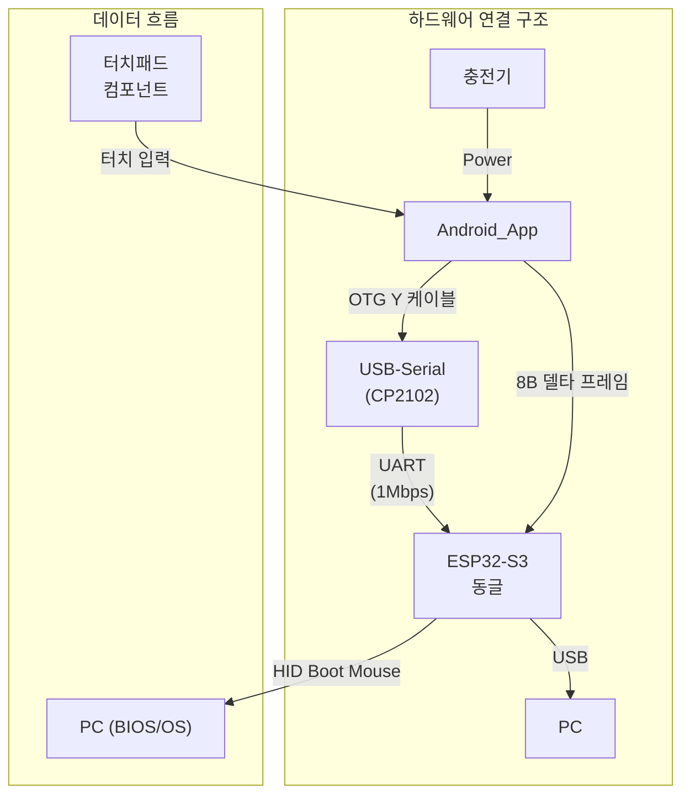

# PCRemote Component Touchpad 명세서
---
title: "PCRemote Touchpad 컴포넌트 명세"
description: "TouchpadWrapper/Area/ControlButtons 구조, 색상/플로우, Disabled 규칙, 코드 상수 스펙"
tags: ["component", "touchpad", "ui", "compose"]
version: "v0.1"
owner: "UX"
updated: "2025-08-13"
status: "draft"
---
# PCRemote Component Touchpad 명세서

## 시스템 아키텍처 개요

> **핵심**: 터치패드 컴포넌트는 사용자의 터치 입력을 받아 상대적 마우스 이동(dx, dy)과 버튼 상태를 생성하며, 이는 8바이트 프레임으로 인코딩되어 동글로 전송됩니다.

## 목차
1. 내부 컴포넌트 구성
- 1.1 터치패드 래퍼 (TouchpadWrapper)
- 1.2 터치패드 영역 래퍼 (TouchpadAreaWrapper)
- 1.3 제어 버튼 컨테이너 (ControlButtonContainer)
- 1.4 제어 버튼 공통 구조
- 1.5 스크롤 가이드라인 (ScrollGuideline)
- 1.6 컴포넌트 간 상호작용
2. 터치패드 색상 시스템
3. 상세 유저 플로우
4. 코드 레벨 커스터마이징 옵션(빌드 타임 상수)
5. Disabled 상태(입력 차단)
부록: USB HID 브리지 통합 안내

## 용어집/정의

- Selected/Unselected: 선택 상태. 테두리/버튼 하이라이트 등 시각 선택 표현.
- Enabled/Disabled: 입력 가능 상태. 패드 제스처/컨트롤 입력 허용 여부.
- BootSafe/Normal: 운용 상태. Boot-safe 페이지 제약과 OS 진입 후 확장 기능 구분.
- 상태 용어 사용 원칙(금칙어 포함): "활성/비활성" 금지. 선택은 Selected/Unselected, 입력 가능은 Enabled/Disabled [[memory:5809234]].

## 개요

- PCRemote 앱의 핵심 기능으로, PC의 마우스를 대체하는 고급 터치 인터페이스를 제공합니다.
- `TouchpadAreaWrapper`와 `ControlButtonContainer`를 포함하는 래퍼 컴포넌트로, 다양한 모드와 기능을 통해 사용자가 직관적이고 효율적으로 PC를 제어할 수 있도록 설계되었습니다.
- 본 문서에는 UX 수준 요약 및 파라미터만 작성하며, 실제 구현과 관련된 상세 알고리즘은 `Docs/technical-specification.md`에 작성 예정입니다.
 - 본 문서에는 UX 수준 요약 및 파라미터만 작성하며, 실제 구현과 관련된 상세 알고리즘은 `Docs/technical-specification.md#5-제스처모드옵션-알고리즘`에 작성합니다.

### 상위 가이드 준수 및 용어/정책 통일

- 본 문서는 상위 가이드라인 `Docs/design-guide-app.md`를 따른다. 특히 다음 항목을 명시적으로 준수한다.
  - 상태 명칭: 선택 상태는 "Selected/Unselected", 입력 가능 상태는 "Enabled/Disabled"로 표기한다(§10.4 참조).
  - 색상 시스템: 기본 팔레트는 `#121212`(배경), `#FFFFFF`(텍스트), `#2196F3`(Primary), `#C2C2C2`(Disabled/Unselected), `#FF9800`(진행), `#F44336`(오류)이며, 본 문서의 추가 색상은 컴포넌트 전용 서브 팔레트로 사용한다(§2 참조).
  - 터치 타겟: 모든 터치 가능한 요소의 히트 영역은 최소 48×48dp를 보장한다(§4.2). 시각적 크기가 작을 경우에도 보이지 않는 패딩/히트 슬롭으로 보장한다.
- 햅틱: OS 사전 정의(Predefined) 효과 우선 사용(§5.4). 본 문서의 상호작용별 햅틱은 Light/Medium/Strong/Error 카테고리로 매핑한다(§3.5.1).

### 간이 터치패드 요약

- 목적: 페이지/서브페이지에서 고급 기능을 숨기고 핵심 입력만 빠르게 통합하기 위한 최소 사양.
- 구조:
  - Wrapper: 1:2 비율 고정(`TOUCHPAD_ASPECT_RATIO`), `TouchpadAreaWrapper` 단일 계층 사용. `ControlButtonContainer`는 기본 숨김.
  - 표시: `Touchpad1Area`만 사용, `CursorMode=SINGLE` 고정.
  - 테두리: `2.2 테두리 색상 적용 규칙` 준수. 스크롤 비활성 시 기본 단색 `#2196F3` 적용.
- 상호작용 요약:
  - 탭: 좌클릭. `ClickMode=LEFT` 고정(§3.2.1.1).
  - 드래그: 커서 이동. `MoveMode=FREE` 고정, 데드존/보상 규칙 적용(§3.2.0, §3.2.2.1).
  - 더블탭/롱프레스: 정의하지 않음(무시).
  - 스크롤/우클릭/멀티 커서/DPI/스크롤 감도: UI 비노출, 입력 시 무효 처리.
- 간이 유저 플로우:
  1) 진입 → `PrimaryMode=MOVE`, `ClickMode=LEFT`, `MoveMode=FREE`, 테두리 `#2196F3`(§3.1).
  2) 탭 → 좌클릭 전송(§3.2.1.1).
  3) 드래그 → 이동 전송(§3.2.2.1).
  4) 오류/연결 끊김 → §3.4.1 규칙에 따라 표시/처리.
- 구현 노트:
  - 필요 시 상단 제어 버튼 일부만 조건부 노출 가능하나, 간이 모드 기본은 숨김 유지.
  - BIOS/Boot-safe 페이지에서는 본 요약보다 `Docs/styleframe-BIOS.md` §2.1/§4의 제약을 우선한다.

## 1. 내부 컴포넌트 구성

### 1.1 터치패드 래퍼 (TouchpadWrapper)

#### TouchpadWrapper 크기 규칙
- 기본 비율: 1:2 (가로:세로)
- 최소 크기: 160dp × 320dp (1:2 비율 유지)
- 최대 크기: 제한 없음 (부모 컨테이너에 따라 조정)
- 반응형 크기: 부모 컨테이너 크기에 따라 자동 조정
- 비율 고정: 모든 크기에서 1:2 비율 강제 유지

#### 크기 조정 규칙:
- 비율은 항상 1:2로 고정 (왜곡 방지)
- 내부 요소들은 터치패드 크기에 비례하여 자동 스케일링
- 제어 버튼 크기: 터치패드 너비의 8% × 16% (최소 24dp × 48dp, 최대 36dp × 72dp)
- 제어 버튼 컨테이너 높이: 터치패드 높이의 15% (최소 48dp, 최대 72dp)

#### Wrapper 구성 요소:
- `TouchpadAreaWrapper`: 터치패드1 영역, 터치패드2 영역을 감싸는 컨테이너
- `ControlButtonContainer`: `TouchpadAreaWrapper` 상단에 오버레이되는 제어 버튼 컨테이너
- 내부 레이아웃: `TouchpadAreaWrapper` 위에 `ControlButtonContainer`가 겹쳐진 형태

#### 마스크 기능:
- Wrapper 경계: 래퍼 밖으로 나가는 모든 컴포넌트는 보이지 않음
- 애니메이션 지원: 버튼 숨김/표시 시 래퍼 경계를 벗어나면서 자연스럽게 보이지 않게 됨
- 클리핑: `Modifier.clipToBounds()` 설정으로 래퍼 영역을 벗어나는 요소들 자동 마스킹

### 1.2 터치패드 영역 래퍼 (TouchpadAreaWrapper)
`TouchpadWrapper` 내부의 터치 인터페이스 컨테이너:
- 크기: `TouchpadWrapper` 전체 크기 (1:2 비율 고정)
- 둥근 모서리: 터치패드 너비의 3% (최소 8dp, 최대 16dp)
- 모드별 테두리: 터치패드 너비의 0.8% (최소 2dp, 최대 4dp)
- 기능: 터치 이벤트 감지 및 처리, 드래그 앤 드롭, 스크롤 동작
- 위치: `TouchpadWrapper` 전체 영역 (`ControlButtonContainer` 아래 레이어)

#### 1.2.1 터치패드1 영역 (Touchpad1Area)
`TouchpadAreaWrapper` 내부의 첫 번째 터치 인터페이스:
- 크기: `TouchpadAreaWrapper` 전체 크기 (싱글 커서 모드) / 왼쪽 50% 영역 (멀티 커서 모드)
- 기능: 첫 번째 터치 포인트 감지 및 처리, 드래그 앤 드롭, 스크롤 동작
- 테두리: 현재 모드에 따른 색상 적용(멀티 커서 시 Selected 영역에만 표시)
- 위치: `TouchpadAreaWrapper` 전체 영역 (싱글 커서 모드) / 왼쪽 영역 (멀티 커서 모드)

#### 1.2.2 터치패드2 영역 (Touchpad2Area)
`TouchpadAreaWrapper` 내부의 두 번째 터치 인터페이스:
- 표시 조건: 멀티 커서 모드 활성화 시에만 나타남
- 크기: `TouchpadAreaWrapper` 오른쪽 50% 영역
- 기능: 두 번째 터치 포인트 감지 및 처리, 드래그 앤 드롭, 스크롤 동작
- 테두리: 현재 모드에 따른 색상 적용(멀티 커서 시 Selected 영역에만 표시)
- 위치: `TouchpadAreaWrapper` 오른쪽 영역

### 1.3 제어 버튼 컨테이너 (ControlButtonContainer)
`TouchpadWrapper` 내부의 상단 제어 버튼 영역:
- 위치: `TouchpadAreaWrapper` 상단에 오버레이되는 가로 띠
- 크기: 터치패드 너비 × 터치패드 높이의 15% (최소 48dp, 최대 72dp)
- 여백: 터치패드 너비의 3% (최소 8dp, 최대 16dp)
- 기능: 제어 버튼들을 담는 컨테이너 역할
- 위치: `TouchpadAreaWrapper` 상단에 겹쳐진 오버레이 영역

### 1.4 제어 버튼 공통 구조
- 내부 구성: 배경 도형 + 텍스트 + 아이콘
- 비율: 1:2
- 크기: 터치패드 너비의 8% × 터치패드 너비의 16% (최소 24dp×48dp, 최대 36dp×72dp)
- 배경 도형: 하단이 둥근 모서리 직사각형
- 테두리: 없음
- 텍스트: 버튼 높이의 30% 크기, 중앙 정렬
- 아이콘: 버튼 높이의 40% 크기, 텍스트 하단에 배치
- 상태 표시: 현재 모드에 따라 배경 도형의 색상, 텍스트, 아이콘이 변경됨 (색상 정보는 `2. 터치패드 색상 시스템` 참조)
- 터치 피드백: 햅틱 피드백, 클릭 애니메이션 (스케일 1.0 → 0.95 → 1.0)
- 터치 히트 영역: 상위 가이드(§4.2)를 따라 모든 버튼의 히트 영역은 최소 48×48dp를 보장한다. 시각적 폭이 48dp 미만일 경우 좌우 보이지 않는 패딩으로 히트 슬롭을 확보한다.

#### 1.3.1 터치패드 모드 제어 버튼
- 터치패드의 동작 모드를 변경하는 제어 버튼들입니다.
- 지정된 두 모드를 서로 전환하는 기능을 수행합니다.
- 버튼에는 터치패드의 현재 모드가 아니라, 터치 시 전환될 다음 모드 정보가 표시됩니다.
  ex) 현재 "좌클릭 모드" 상태라면 버튼은 "우클릭 모드"라고 표시됨
- 각 모드 제어 버튼의 모드는 조합이 가능합니다.
  ex) 우클릭 모드 + 자유 커서 이동 모드 + 일반 스크롤 모드 + 멀티 커서 모드
용어/상태 정의:
- 스크롤 비활성(`PrimaryMode=MOVE`): 스크롤 모드가 아닌 커서 이동 모드가 1차 모드로 활성인 상태. 별도의 "이동 Off" 상태는 존재하지 않음.
- 스크롤 모드(`PrimaryMode=SCROLL`): 스크롤이 1차 모드로 활성인 상태.
  * 일반 스크롤: `PrimaryMode=SCROLL(일반)`
  * 무한 스크롤: `PrimaryMode=SCROLL(무한)`
- 전환 규칙: 스크롤 모드 진입/종료에 따라 PrimaryMode만 전환됨.
- 본 문서의 "PrimaryMode=SCROLL(일반/무한)" 표기는 상태를 설명하기 위한 라벨이며, 실제 코드 변수명을 의미하지 않습니다.

##### 1.3.1.1 클릭 모드 버튼 (ClickModeButton)
- 위치: 제어 버튼 컨테이너 내 좌측 첫 번째
- 텍스트: "좌클릭 모드" / "우클릭 모드"
- 아이콘: VectorDrawable 권장(`ic_lclick.xml` / `ic_rclick.xml`). 기존 SVG는 빌드 타임에 VectorDrawable로 변환.
- 기능: 좌클릭 모드 ↔ 우클릭 모드 전환
- 기본 상태: 좌클릭 모드
- 숨김 처리: `PrimaryMode=SCROLL(일반/무한)` 상태에서 숨김

##### 1.3.1.2 커서 이동 모드 버튼 (MoveModeButton)
- 위치: 제어 버튼 컨테이너 내 좌측 두 번째
- 텍스트: "커서 직각 이동 모드" / "커서 자유 이동 모드" (버튼에는 다음 전환 모드 표시)
- 아이콘: VectorDrawable 권장(`ic_move_right_angle.xml` / `ic_move_free.xml`). 기존 SVG는 빌드 타임 변환.
- 기능: 커서 이동 모드 내 동작 전환(스크롤 모드와 무관)
- 기본 상태: 자유 커서 이동
- 표시 조건: `PrimaryMode=MOVE`일 때만 표시
  - 세부 규칙: 직각 커서 이동 시 3.2.2의 "직각 커서 이동(축 스냅)" 세부 알고리즘을 따름

##### 1.3.1.3 스크롤 모드 버튼 (ScrollModeButton)
- 위치: 제어 버튼 컨테이너 내 좌측 세 번째
- 텍스트/아이콘(상태에 따른 다음 전환 표시):
  * 스크롤 비활성 상태(`PrimaryMode=MOVE`): "일반 스크롤" / `ic_scroll_normal.xml` (탭 시 스크롤 모드(일반) 활성)
  * 일반 스크롤 상태: "무한 스크롤" / `ic_scroll_infinite.xml` (탭 시 무한 스크롤 모드로 전환)
  * 무한 스크롤 상태: "일반 스크롤" / `ic_scroll_normal.xml` (탭 시 일반 스크롤 모드로 전환)
- 기능: 스크롤 비활성 → 스크롤 모드(일반) 진입, 스크롤 모드에서는 일반 ↔ 무한 전환
- 종료: 스크롤 모드에서 TouchpadArea 더블탭으로 스크롤 모드 종료
- 기본 상태: 스크롤 비활성(PrimaryMode=MOVE)
- 표시 조건: 항상 표시

##### 1.3.1.4 커서 모드 버튼 (CursorModeButton)
- 위치: 제어 버튼 컨테이너 내 좌측 네 번째
- 텍스트: "멀티 커서" / "싱글 커서"
- 아이콘: VectorDrawable 권장(`ic_multi_cursor.xml` / `ic_single_cursor.xml`). 기존 SVG는 빌드 타임 변환.
- 기능: 멀티 커서 모드 ↔ 싱글 커서 모드 전환
- 기본 상태: 싱글 커서 모드

#### 1.3.2 터치패드 옵션 수치 제어 버튼
터치패드의 동작 옵션 수치를 조절하는 제어 버튼들입니다.

##### 1.3.2.1 DPI 조절 버튼 (DPIControlButton)
- 위치: 제어 버튼 컨테이너 내 우측 세 번째
- 텍스트: "DPI" + 현재 레벨 (낮음/보통/높음)
- 아이콘 매핑: VectorDrawable 권장. 낮음=`ic_speed_slow.xml`, 보통=`ic_speed_normal.xml`, 높음=`ic_speed_fast.xml`(기존 SVG는 빌드 타임 변환)
- 기능: DPI 순환 (낮음 → 보통 → 높음 → 낮음)
- 숨김 처리: `PrimaryMode=SCROLL(일반/무한)` 상태에서 숨김

##### 1.3.2.2 스크롤 감도 버튼 (ScrollSensitivityButton)
- 위치: 스크롤 모드 시 제어 버튼 컨테이너 내 우측 첫 번째
- 텍스트: "스크롤" + 현재 레벨 (보통/빠름/느림)
- 아이콘 매핑: VectorDrawable 권장. 느림=`ic_speed_slow.xml`, 보통=`ic_speed_normal.xml`, 빠름=`ic_speed_fast.xml`
- 기능: 스크롤 감도 순환 (보통 → 빠름 → 느림 → 보통)
- 표시 조건: `PrimaryMode=SCROLL(일반/무한)` 상태에서만 표시

### 1.5 스크롤 가이드라인 (ScrollGuideline)
- 목적: 유저가 현재 어느 방향으로 스크롤하고 있는지 직관적으로 표시
- 위치: 테두리 영역을 제외한 터치패드 내부
- 색상: `PrimaryMode=SCROLL(일반)`에서는 `#84E268`, `PrimaryMode=SCROLL(무한)`에서는 `#F32121`
- 표시 조건: `PrimaryMode=SCROLL(일반)` 또는 `PrimaryMode=SCROLL(무한)` 상태에서 유저가 드래그 시작 시
- 숨김 조건:
  - 일반/무한 공통: 유저가 스크롤을 정지한 것으로 판정되는 시점부터 `SCROLL_GUIDELINE_HIDE_DELAY_MS` 경과 후 숨김
  - 스크롤 모드 종료 더블탭 입력으로 `PrimaryMode=MOVE`로 전환되는 순간 즉시
- 동작 방식:
  - 가로 스크롤: 동일 간격의 세로 선들이 유저의 스크롤 속도에 맞춰 밀려나감
  - 세로 스크롤: 동일 간격의 가로 선들이 유저의 스크롤 속도에 맞춰 밀려나감
  - 무한 스크롤: 관성 감속 구간 동안 표시 유지, 정지 판정 이후 지연 후 숨김

### 1.6 컴포넌트 간 상호작용
`TouchpadWrapper` 내부 컴포넌트 간 관계:
- 제어 버튼들: 독립적으로 작동하지만 모드 간 우선순위 규칙 적용
- 버튼 상태 변경: 즉시 TouchpadArea 동작과 시각적 피드백에 반영
- 모드 전환: 관련 컴포넌트들의 표시/숨김 상태 자동 관리
- 애니메이션: 모든 전환 효과는 200ms 이하로 부드럽게 처리
- 햅틱 피드백: 모든 버튼 상호작용에 진동 피드백 제공
TouchpadWrapper 크기 조정 시 상호작용:
- TouchpadWrapper 크기 변경 시 모든 내부 요소들이 비례적으로 스케일링
- 제어 버튼 간격: 터치패드 너비의 2% (최소 4dp, 최대 8dp)
- 버튼 컨테이너 내 여백: 터치패드 너비의 3% (최소 8dp, 최대 16dp)
- 반응형 레이아웃: 모든 요소가 TouchpadWrapper 크기에 맞춰 자동 조정
- ControlButtonContainer 오버레이: TouchpadArea 상단에 겹쳐진 형태로 고정

---

## 2. 터치패드 색상 시스템

- ### 2.1 색상 팔레트
- `#1E1E1E`
  - Touchpad1Area, Touchpad2Area 배경색
  - 제어 버튼 텍스트/아이콘 색상(모든 버튼 공통)
- `#2196F3`
  - 기본 상태 대표 색상(스크롤 비활성(PrimaryMode=MOVE), 좌클릭, 커서 단일 등 기본 상태)
  - 버튼 기본 배경색(별도 명시가 없는 모든 버튼의 기본 배경)
- `#F3D021`
  - 우클릭 모드 대표 색상
- `#84E268`
  - 일반 스크롤 모드 대표 색상
  - 일반 스크롤 모드 가이드라인 색상
- `#20D8AD`
  - "느림" 레벨 대표 색상(DPI 낮음, 스크롤 감도 느림)
- `#818BFF`
  - "빠름/높음" 레벨 대표 색상(DPI 높음, 스크롤 감도 빠름)
- `#B552F6`
  - 멀티 커서 모드 대표 색상
- `#FF8A00`
  - 직각 커서 이동 모드 대표 색상
- `#F32121`
  - 무한 스크롤 모드 대표 색상
  - 무한 스크롤 모드 가이드라인 색상

### 2.2 테두리 색상 적용 규칙

적용 대상:
- 싱글 커서 모드: `Touchpad1Area` 테두리
- 멀티 커서 모드: `Touchpad1Area`, `Touchpad2Area` 테두리(Selected 터치패드에만 표시, Unselected 터치패드는 테두리 없음)
- 제어 버튼(ControlButton)은 `1.4 제어 버튼 공통 구조`에 따라 테두리 없음.

의존 규칙:
- 우선순위는 `3.3.1 조합 개요와 우선순위`를 따른다.
- 버튼 배경/텍스트/아이콘은 2.3의 버튼 규칙을 따르며, 본 규칙(테두리 색상)과는 독립적으로 적용된다.

결정 기준(현재 활성 모드 기준):
1) 무한 스크롤 활성: `#F32121` (단색)
2) 일반 스크롤 활성: `#84E268` (단색)
3) 스크롤 비활성(PrimaryMode=MOVE): 클릭×커서 이동 모드 조합
   - 클릭 색상: 좌클릭=`#2196F3`, 우클릭=`#F3D021`
   - 이동 색상: 자유=`#2196F3`, 직각=`#FF8A00`
   - 결정 규칙:
     a. 클릭=파랑 AND 이동=파랑 → `#2196F3` 단색
     b. 둘 중 하나만 파랑 → 파랑이 아닌 쪽 단색 사용(`#F3D021` 또는 `#FF8A00`)
     c. 둘 다 파랑 아님(노랑/주황) → 좌=`#F3D021`, 우=`#FF8A00` 그라데이션(좌=클릭, 우=이동)
4) 멀티 커서 활성:
   - 색상 산출에는 영향을 주지 않으나, 표시 대상은 Selected 터치패드로 제한(Unselected 터치패드는 테두리 표시 없음).
   - 싱글 커서는 1~3 규칙을 단일 영역에 적용.

예시:
- 우클릭 + 커서 직각 이동 모드(스크롤 비활성): 좌=`#F3D021` → 우=`#FF8A00` 그라데이션
- 좌클릭 + 커서 직각 이동 모드(스크롤 비활성): `#FF8A00` 단색
- 우클릭 + 커서 자유 이동 모드(스크롤 비활성): `#F3D021` 단색
- 좌클릭 + 커서 자유 이동 모드(스크롤 비활성): `#2196F3` 단색

### 2.3 터치패드 제어 버튼 배경 색상 규칙

#### 2.3.1 모드 제어 버튼(Click/Move/Scroll/Cursor)

- 공통 원칙: 모든 모드 제어 버튼은 "현재 상태"가 아니라 "다음 전환 모드"의 대표 색상을 배경 도형색으로 사용합니다.
- 상태 메모리: 각 모드는 마지막으로 사용한 하위 모드/상태를 내부적으로 저장합니다. UI에서 해당 버튼이 숨겨져 있거나 해당 모드가 비활성 상태인 동안에도 이 값은 보존되며, 버튼이 다시 보일 때 표시 색상은 이 값(다음 전환 대상)에 따라 결정됩니다.

- 클릭 모드 버튼(ClickModeButton)
  - 현재 좌클릭 상태(다음=우클릭): `#F3D021`
  - 현재 우클릭 상태(다음=좌클릭): `#2196F3`
  - `PrimaryMode=SCROLL(일반/무한)` 상태에서 버튼 자체는 UI에서 숨김(배경색 비적용)
- 커서 이동 모드 전환 버튼(MoveModeButton, 커서 자유 이동/커서 직각 이동)
  - 현재 자유 커서 이동 상태(다음=직각 커서 이동): `#FF8A00`
  - 현재 직각 커서 이동 상태(다음=자유 커서 이동): `#2196F3`
- 스크롤 모드 버튼(ScrollModeButton)
  - 스크롤 비활성 상태(PrimaryMode=MOVE): 바로 직전에 사용한 스크롤 모드가 다음 전환 대상이 됩니다.
    - 직전=일반 스크롤: `#84E268`
    - 직전=무한 스크롤: `#F32121`
  - 일반 스크롤 상태(다음=무한 스크롤): `#F32121`
  - 무한 스크롤 상태(다음=일반 스크롤): `#84E268`
- 커서 모드 버튼(CursorModeButton)
  - 현재 싱글 커서 상태(다음=멀티 커서): `#B552F6`
  - 현재 멀티 커서 상태(다음=싱글 커서): `#2196F3`

#### 2.3.2 옵션 수치 제어 버튼(DPI/스크롤 감도)

- 공통 원칙: 옵션 수치 버튼도 버튼 배경 도형색으로 현재 선택값의 대표 색상을 사용합니다.
- DPI 조절 버튼(DPIControlButton) — 스크롤 비활성(PrimaryMode=MOVE)에서만 표시
  - 낮음: `#20D8AD`
  - 보통: `#2196F3`
  - 높음: `#818BFF`
- 스크롤 감도 버튼(ScrollSensitivityButton) — `PrimaryMode=SCROLL(일반/무한)`에서만 표시
  - 느림: `#20D8AD`
  - 보통: `#2196F3`
  - 빠름: `#818BFF`

### 2.4 스크롤 가이드라인 색상
- 일반 스크롤: `#84E268`
- 무한 스크롤: `#F32121`

### 2.5 가시성 및 상태 요약(색상 적용 범위)
- `PrimaryMode=SCROLL(일반/무한)`:
  - 스크롤 모드 버튼, 스크롤 감도 버튼 표시.
  - 클릭 모드/DPI 버튼 숨김(해당 버튼 색상 미적용, 내부 상태만 보존).
- `PrimaryMode=MOVE`:
  - 클릭 모드/DPI 버튼 표시(보존 상태 복원).
  - 스크롤 모드/감도 버튼 숨김.
- 멀티 커서:
  - Selected 터치패드에만 `2.2 테두리 색상 적용 규칙`에 따른 테두리 표시(Unselected 터치패드는 테두리 없음).
- 멀티 커서 상태 자체는 버튼 배경 도형색(`#B552F6`)으로도 표시.

### 2.6 스크롤 모드 종료 입력(제스처)
- 제스처: TouchpadArea 더블탭(300ms 이내 2회 탭)
- 동작: 스크롤(일반/무한) 즉시 종료 → 이동 모드 복귀(PrimaryMode=MOVE)
- 테두리: 2.2 규칙 우선순위에 따름. 스크롤 비활성 조합색(클릭×이동)을 적용
- 버튼 UI: 클릭 모드/DPI 표시 복구, 스크롤 감도 숨김

---

## 3. 상세 유저 플로우

### 3.1 초기 진입 플로우
사용자 액션: PCRemote 앱에서 터치패드가 포함된 페이지 진입
시스템 응답:
1. TouchpadWrapper 컴포넌트 로드 (1:2 비율, 기본 크기 적용)
2. TouchpadArea와 ControlButtonContainer 초기화
3. 기본 모드 설정 (좌클릭 모드, 커서 이동 모드, 싱글 커서)
4. ControlButtonContainer 표시 (TouchpadWrapper 상단 15% 영역)
5. 터치패드 테두리 `#2196F3` 색상으로 표시 (스크롤 비활성 및 기본 상태)
6. 기본 제어 버튼들 표시:
  - 클릭 모드 버튼: "우클릭 모드" 표시 (현재 좌클릭 모드, 다음 전환 모드 표시)
   - 스크롤 모드 버튼: "일반 스크롤" 표시(직전 사용 모드가 무한이면 "무한 스크롤" 표시)
  - 커서 모드 버튼: "멀티 커서" 표시 (현재 싱글 커서, 다음 전환 모드 표시)
  - DPI 조절 버튼: "DPI 보통" 표시 (현재 적용된 DPI 상태 표시)

### 3.2 단일 터치패드 모드별 유저 플로우

#### 3.2.0 클릭/드래그 판정 및 데드존 보상(연속 탭 오입력 보정)

- 목적: 연속 탭 시 두 번째 터치부터 발생할 수 있는 미세 드래그를 클릭으로 안정적으로 판정하면서도, 임계 직후의 실제 이동량 손실을 방지.
- 기본 임계:
  - 데드존 x px(터치다운 이후 누적 이동 거리 기준).
  - x는 코드 레벨 빌드 타임 상수(`DEADZONE_PX`, 4.1)이며 앱 내(UI)에서 변경 불가.
- 공통 규칙(PrimaryMode=MOVE에 적용, 3.2.1.1/3.2.1.2/3.2.2.1 참조):
  1) 데드존 억제: 누적 이동 |S| ≤ x px 동안에는 커서 이동 신호를 전송하지 않고 클릭 후보 상태 유지.
  2) 임계 초과 보상: |S| > x px이 되는 최초 순간, 그 시점까지의 누적 이동 |S| 전량을 1회 이동으로 즉시 출력(보상). 이후부터는 프레임별 이동량을 그대로 출력.
  3) 클릭 판정: 터치 업 시 경과시간 ≤ 200ms AND 누적 이동 |S| ≤ x px이면 클릭으로 처리(좌/우는 현재 `ClickMode` 적용).
  4) 예시: x+1 px 드래그 → 0~x px 구간은 억제, 초과 순간 x+1 px이 한 번에 이동되어 실제 커서도 x+1 px 이동. x−1 px 드래그 후 업 → 클릭.
  5) 연속 탭 보호: 두 번째 탭의 미세 떨림(≤ x px)은 이동으로 처리되지 않음(클릭 정확도 유지).
- 이동 모드와의 관계:
  - `MoveMode=FREE`: 보상 후부터 일반 이동.
  - `MoveMode=RIGHT_ANGLE`: 보상으로 커밋된 최초 유효 벡터를 기준으로 축을 결정(초과 전 미세 각도 변화는 무시). 축 전환은 3.2.2.2 규칙을 따름.

#### 3.2.1 클릭 모드 플로우 (ClickModeButton)
- 표시 조건: `PrimaryMode=MOVE`
- 기본 상태: 좌클릭
- 숨김: `PrimaryMode=SCROLL(일반/무한)`

##### 3.2.1.1 좌클릭 실행
- 전제조건: `PrimaryMode=MOVE`, `ClickMode=LEFT`
- 사용자 액션: `Touchpad1Area` 짧게 탭
- 시스템 응답:
  1) 짧은 터치 감지(터치 시간 < 200ms, 이동 ≤ x px)
  2) 마우스 좌클릭 명령 전송
- 완료 상태: `Touchpad1Area` 대기 유지
- 입력 보정: 본 클릭 판정은 ‘3.2.0 클릭/드래그 판정 및 데드존 보상’ 규칙을 따른다(≤ x px 이동 억제, 임계 초과 시 보상).

##### 3.2.1.2 우클릭 실행
- 전제조건: `PrimaryMode=MOVE`, `ClickMode=RIGHT`
- 사용자 액션: `Touchpad1Area` 짧게 탭
- 시스템 응답:
  1) 현재 클릭 모드 확인(테두리 `#F3D021`)
  2) 마우스 우클릭 명령 전송
- 완료 상태: `ClickMode=RIGHT` 유지
- 입력 보정: 본 클릭 판정은 ‘3.2.0 클릭/드래그 판정 및 데드존 보상’ 규칙을 따른다(≤ x px 이동 억제, 임계 초과 시 보상).

##### 3.2.1.3 좌↔우 전환
- 전제조건: `PrimaryMode=MOVE`
- 사용자 액션: 클릭 모드 버튼 탭(제어 버튼 컨테이너 좌측 첫 번째)
- 시스템 응답:
  1) 버튼 스케일 애니메이션(1.0 → 0.95 → 1.0, 200ms), 햅틱
  2) 아이콘/텍스트 전환: `ic_lclick.xml` ↔ `ic_rclick.xml`
  3) 테두리/버튼 배경색 전환: `#2196F3` ↔ `#F3D021`
- 완료 상태: 새로운 `ClickMode` 즉시 적용

#### 3.2.2 커서 이동 모드 플로우 (MoveModeButton)
- 표시 조건: `PrimaryMode=MOVE`
- 기본 상태: 자유 커서 이동(`MoveMode=FREE`)
- 전환 대상: 직각 커서 이동(`MoveMode=RIGHT_ANGLE`)
- 입력 보정: 이동 시작 판정 및 초기 이동량 반영은 ‘3.2.0 클릭/드래그 판정 및 데드존 보상’ 규칙을 따른다.

##### 3.2.2.1 자유 커서 이동
- 전제조건: `PrimaryMode=MOVE`, `MoveMode=FREE`
- 사용자 액션: `Touchpad1Area` 드래그
- 시스템 응답:
  1) 드래그 벡터 계산
  2) DPI 반영한 커서 이동 전송
  3) 실시간 이동 피드백
- 완료 상태: `Touchpad1Area` 대기 유지
- 입력 보정: 누적 이동이 x px을 초과하는 순간까지 이동 신호를 지연하고, 초과 시 누적량 전량을 1회 이동으로 반영(예: x+1 px 드래그 → 실제 x+1 px 이동). 이후에는 프레임별 이동을 그대로 적용.

##### 3.2.2.2 직각 커서 이동(축 스냅)
- 전제조건: `PrimaryMode=MOVE`, `MoveMode=RIGHT_ANGLE`
- 사용자 액션: `Touchpad1Area` 드래그
- 시스템 응답:
  1) 스냅 축 결정(임계 18px; 각도 규칙 ±22.5°/±67.5°)
  2) 선택 축 이외의 성분 무시(X 스냅: Δx만, Y 스냅: Δy만)
  3) 축 전환 조건: 편차각 > 35°가 12px 지속, 전환 쿨다운 150ms, 미세 변동 억제(≤35°, <6px)
- 완료 상태: 터치 업 시 스냅 해제, `MoveMode` 유지

#### 3.2.3 스크롤 모드 플로우 (ScrollModeButton)
- 표시 조건: 항상 표시(상태에 따라 전환 대상 안내)
- 전환 대상: `PrimaryMode=MOVE` ↔ `PrimaryMode=SCROLL(일반/무한)`

##### 3.2.3.1 진입/전환(버튼)
- 사용자 액션: 스크롤 모드 버튼 탭(제어 버튼 컨테이너 좌측 세 번째)
- 시스템 응답:
  1) 버튼 클릭 애니메이션, 햅틱
  2) `PrimaryMode=MOVE` → `PrimaryMode=SCROLL(일반)`로 전환(단, 직전 사용 모드가 무한이면 `SCROLL(무한)`으로 진입)
  3) 테두리 색 전환: `#84E268`(일반) / `#F32121`(무한)
  4) UI 전환: 클릭 모드/DPI 숨김, 스크롤 감도 버튼 표시

##### 3.2.3.2 일반 ↔ 무한 전환(버튼)
- 사용자 액션: 스크롤 모드 버튼 탭
- 시스템 응답:
  1) `SCROLL(일반)` ↔ `SCROLL(무한)` 전환
  2) 버튼/테두리/배경 색 전환: `#84E268` ↔ `#F32121`
  3) 스크롤 감도 버튼 유지

##### 3.2.3.3 스크롤 모드 종료(제스처)
- 사용자 액션: `TouchpadArea` 더블탭(300ms 이내 2회)
- 시스템 응답:
  1) `PrimaryMode=SCROLL(일반/무한)` → `PrimaryMode=MOVE`
  2) 테두리: 스크롤 비활성 조합색으로 즉시 전환(2.2 규칙)
  3) UI: 클릭 모드/DPI 복귀, 스크롤 감도 숨김
  4) 가이드라인: 즉시 숨김

##### 3.2.3.4 일반 스크롤 실행
- 전제조건: `PrimaryMode=SCROLL(일반)`
- 사용자 액션: `Touchpad1Area` 드래그
- 시스템 응답:
  1) 시작 좌표 기록, 가이드라인 `#84E268`, 카운터 0 리셋
  2) 방향 감지: 세로(Y>X)/가로(X>Y)
 3) 20px당 1단위 스크롤(HID Wheel ±1 step), 햅틱 50ms 동기
 4) 단위×감도 → USB로 직접 연결된 Geekble-nano-ESP32S3로 HID Wheel step 전송(가이드라인은 고정 단위)
- 완료 상태: 정지 판정 시점부터 `SCROLL_GUIDELINE_HIDE_DELAY_MS` 경과 후 가이드라인 숨김, 모드 유지

##### 3.2.3.5 무한 스크롤 실행
- 전제조건: `PrimaryMode=SCROLL(무한)`
- 사용자 액션: `Touchpad1Area` 드래그
- 시스템 응답:
  1) 시작 좌표 기록, 가이드라인 `#F32121`, 관성 시스템 활성
  2) 속도·방향 벡터 추적, 연속 스크롤(단위 제한 없음)
  3) 드래그 종료 후 지수 감속, 임계속도까지 지속
  4) 진행 중 터치 시 즉시 정지
- 완료 상태: 임계속도 이하로 정지 판정된 시점부터 `SCROLL_GUIDELINE_HIDE_DELAY_MS` 경과 후 가이드라인 숨김, 모드 유지

#### 3.2.4 커서 모드 플로우 (CursorModeButton)

- 버튼 전환(싱글 ↔ 멀티)
- 사용자 액션: 커서 모드 버튼 터치
- 위치: 제어 버튼 컨테이너 좌측 네 번째

1. 버튼 터치 감지: 클릭 애니메이션 및 햅틱
2. 멀티 커서 ON: 단일 → 분할(`Touchpad1Area`/`Touchpad2Area`), 버튼 텍스트/아이콘/배경 갱신(배경 도형색=`#B552F6`), 300ms 분할 애니메이션(ease-out)
3. 싱글 커서 ON: 분할 → 단일 복귀, 버튼 텍스트/아이콘/배경 갱신(배경 도형색=`#2196F3`), 300ms 통합 애니메이션(ease-in)
4. 적용: 애니메이션이 시작되는 순간부터 작업을 시작해 애니메이션 종료 시점에는 새로운 커서 모드 반영

##### 3.2.4.1 터치패드 전환 기반 커서 제어
1. 전환 감지: `pad1` 터치=커서 A 활성, `pad2` 터치=커서 B 활성, 동글 펌웨어에 `multi_cursor_switch` 전송
2. 상태 표시: 활성=2.2 규칙에 따른 테두리 표시, 비활성=테두리 없음, 전환 시 파란색 펄스(0.1s)
3. 통신: 동글 펌웨어 응답 확인, 실패 시 롤백

##### 3.2.4.2 멀티 커서 시각적 피드백
1. 터치패드 상태: 활성 영역에만 테두리 표시, Unselected 영역은 테두리 없음. 좌표 표시 유지
2. 전환 효과: 파란색 펄스 애니메이션(0.1s, 80% 투명)
3. 가상 커서: `show_virtual_cursor` 요청/확인

##### 3.2.4.3 멀티 커서 워크플로우 예시
1. 초기 설정: 왼쪽=pad1(코드), 오른쪽=pad2(브라우저)
2. 플로우: pad1 조작 → pad2 조작 → pad1 드래그 → pad2 드롭
3. 효율: 이동 0.1초 수준, 시간 단축 80%+

#### 3.2.5 DPI 옵션 플로우 (DPIControlButton)
- 표시 조건: `PrimaryMode=MOVE`
- 위치: 제어 버튼 컨테이너 우측 세 번째

##### 3.2.5.1 DPI 변경
- 사용자 액션: DPI 버튼 탭
- 시스템 응답:
  1) 버튼 클릭 애니메이션, 햅틱
  2) 순환: 보통 → 높음 → 낮음 → 보통(아이콘/배경: Normal → Fast → Slow → Normal)
  3) 적용: 새로운 DPI 즉시 반영, 다음 이동부터 적용

#### 3.2.6 스크롤 감도 옵션 플로우 (ScrollSensitivityButton)
- 표시 조건: `PrimaryMode=SCROLL(일반/무한)`
- 위치: 제어 버튼 컨테이너 우측 첫 번째

##### 3.2.6.1 감도 변경
- 사용자 액션: 스크롤 감도 버튼 탭
- 시스템 응답:
  1) 버튼 클릭 애니메이션, 햅틱
  2) 순환: 보통 → 빠름 → 느림 → 보통(아이콘/배경: Normal → Fast → Slow → Normal)
  3) 적용: 새로운 감도 즉시 반영, 다음 스크롤부터 적용

### 3.3 다중 모드 유저 플로우

#### 3.3.1 조합 개요와 우선순위
적용 대상:
- 조합 모드: 클릭(좌/우), 이동(자유/직각), 스크롤(비활성/일반/무한), 커서(싱글/멀티)
- 조합 옵션: DPI(낮음/보통/높음), 스크롤 감도(느림/보통/빠름)

표시 표준(1.4 반영):
- 모든 제어 버튼은 배경 도형+텍스트+아이콘 구성, 테두리 없음.
- 버튼 텍스트/아이콘/배경 도형색은 각 버튼 규칙(2.3)을 따름.
- 테두리 색상은 '현재 활성 모드' 기준으로 아래 우선순위를 따름(버튼 색상과 독립).

우선순위(시각/동작 적용 순):
1) 무한 스크롤 > 2) 일반 스크롤 > 3) 우클릭 > 4) 기본(좌클릭/커서 이동)

테두리 렌더링 요약:
- 멀티 커서: Selected 터치패드에만 적용(2.2 규칙). Unselected는 테두리 없음
- 무한 스크롤: `#F32121` 단색
- 일반 스크롤: `#84E268` 단색
- 스크롤 비활성: 파랑 중복 해소 규칙 적용(2.2 참조)
  • 클릭=파랑 AND 이동=파랑 → `#2196F3` 단색
  • 둘 중 하나만 파랑 → 파랑이 아닌 쪽 단색(`#F3D021` 또는 `#FF8A00`)
  • 둘 다 파랑 아님(노랑/주황) → 좌=`#F3D021`, 우=`#FF8A00` 그라데이션
- 기본: `#2196F3`

버튼 표시/숨김:
- `PrimaryMode=SCROLL(일반/무한)`: 스크롤 모드/스크롤 감도 버튼 표시. 클릭 모드/DPI 버튼 숨김(상태 보존).
- `PrimaryMode=MOVE`: 클릭 모드/DPI 버튼 표시. 스크롤 모드/감도 버튼 숨김.

#### 3.3.2 조합 전환 및 옵션 적용 규칙
1. 스크롤 모드 토글
   - 커서 이동 → 스크롤 전환 시: 클릭 모드/DPI는 내부 상태만 보존하고 UI에서 숨김. 무한/일반 스크롤 버튼과 스크롤 감도 버튼 표시.
   - 스크롤 → 커서 이동 전환 시: 진행 중인 무한 스크롤 즉시 중단, 스크롤 가이드라인 숨김. 클릭 모드/DPI 표시 및 이전 상태 복원.

2. 무한 스크롤 토글
   - 유효 범위: 스크롤 모드일 때만 동작. 이동 모드에서는 비활성 처리(토글 무시 + 비활성 시각 상태).
   - ON: 테두리 `#F32121`, 관성 스크롤 알고리즘 활성.
   - 해제: 테두리 `#84E268`, 일반 스크롤로 즉시 복귀.

3. 클릭 모드 토글(좌↔우)
   - 커서 이동 모드에서만 동작/표시. 스크롤 모드에서는 내부 상태만 유지하고 UI/동작에는 영향 없음.
   - 우클릭 Selected 시: 커서 이동 모드일 때 테두리 `#F3D021`.

4. 커서 모드 토글(싱글↔멀티)
   - 모든 모드에서 독립 동작. 영역 분할/통합 수행.
   - 테두리 색상에는 영향 없음(2.2 규칙 그대로 적용). 분할 레이아웃과 버튼 색상만 변경.
    - 전환 시 동글 펌웨어에 멀티 커서 전환 커맨드 전송(3.2.4 참조).

5. 옵션 적용(DPI/스크롤 감도)
   - DPI: 모드가 아닌 옵션. 커서 이동 모드에서만 UI 표시 및 적용. 스크롤 모드에선 숨김(값 보존), 테두리/모드에는 영향 없음.
   - 스크롤 감도: 모드가 아닌 옵션. 스크롤 모드에서만 UI 표시 및 적용. 무한/일반 모두 실시간 반영, 테두리/모드에는 영향 없음.

6. 테두리 렌더링 규칙(단색/그라데이션)
   - 멀티 커서: 색상 산출에는 영향 없으나, 테두리는 활성 터치패드에만 표시.
   - 무한 스크롤 활성: 단색 `#F32121`.
   - 스크롤(일반) 활성: 단색 `#84E268`.
   - 스크롤 비활성(PrimaryMode=MOVE): 파랑 중복 해소 규칙 적용
      - 클릭=파랑 AND 이동=파랑 → `#2196F3` 단색
      - 둘 중 하나만 파랑 → 파랑 무시, 파랑이 아닌 쪽 단색(`#F3D021` 또는 `#FF8A00`)
      - 둘 다 파랑 아님(노랑/주황) → 좌=`#F3D021`, 우=`#FF8A00` 그라데이션(좌=클릭, 우=이동)

#### 3.3.3 대표 조합 플로우
A) 우클릭 + 이동 + 싱글 커서
전제: 커서 이동 모드, 싱글 커서
1. 클릭 모드 버튼 탭 → 우클릭 Selected
2. 테두리: `#F3D021`, 클릭 동작은 우클릭으로 동작
3. DPI 옵션 버튼 표시/동작 유효

B) 좌클릭 + 스크롤(일반) + 싱글 커서
전제: 클릭 모드 내부 상태는 좌클릭, `PrimaryMode=SCROLL(일반)`
1. 스크롤/이동 버튼 탭 → 스크롤 모드 활성(테두리 `#84E268`)
2. 무한/일반 스크롤 버튼과 스크롤 감도 버튼 표시, 클릭 모드/DPI 숨김(상태 보존)
3. 드래그 시 20px 단위 스크롤 + 가이드라인 표시(3.2.3의 일반 스크롤 참조)

C) 우클릭 + 스크롤(무한) + 멀티 커서
전제: 우클릭이 내부 상태로 설정되어 있고, 멀티 커서 활성(`CursorMode=MULTI`)
1. `PrimaryMode=SCROLL(일반)` → 무한 스크롤 버튼 탭 → `PrimaryMode=SCROLL(무한)`
2. 테두리: Selected 터치패드에만 무한 스크롤 단색 `#F32121` 적용, Unselected는 테두리 없음. 관성 스크롤 동작(3.2.3의 무한 스크롤 참조)
3. 멀티 커서로 Touchpad1/2 분할, 전환 시 커서 A/B 활성 신호(3.2.4.1 참조)

D) 스크롤 중 이동으로 복귀(무한/일반 공통)
1. 스크롤 모드에서 스크롤/이동 버튼 탭 → 커서 이동 모드 전환
2. 진행 중 스크롤 즉시 중단(무한 스크롤이면 관성 중단)
3. 테두리: 우선순위 규칙에 따라 결정. 스크롤 비활성 상태가 되면 클릭 모드 색상과 커서 이동 모드 색상을 조합하여 단색/그라데이션 적용(2.2 참조)
4. 클릭 모드/DPI 표시 복구, 무한/일반/감도 버튼 숨김

E) 멀티 커서 + 스크롤(일반)
전제: 멀티 커서 활성(`CursorMode=MULTI`), `PrimaryMode=SCROLL(일반)`
1. 스크롤/이동 버튼 탭 → 스크롤 모드 활성
2. 테두리: Selected 터치패드에만 스크롤 단색 `#84E268` 적용, Unselected는 테두리 없음
3. 무한/일반, 스크롤 감도 버튼 표시. 클릭 모드/DPI 숨김.

F) 멀티 커서 + 우클릭 + 이동
전제: 커서 이동 모드, 멀티 커서 ON, 우클릭 Selected
1. 커서 모드 버튼 탭 → 멀티 커서 ON, 클릭 모드 버튼 탭 → 우클릭 ON
2. 테두리: Selected 터치패드에만 스크롤 비활성 기준 색상 적용(2.2의 파랑 중복 해소 규칙)
   - 자유 이동이면: `#F3D021` 단색(파랑 무시)
   - 직각 이동이면: 좌=`#F3D021` → 우=`#FF8A00` 그라데이션
3. DPI 옵션 버튼 표시/동작 유효

#### 3.3.4 예외 및 충돌 처리
- 커서 이동 모드에서 무한 스크롤 버튼 입력: 비활성 처리(동작 없음), 버튼 시각상 비활성 상태 유지.
 - 무한 스크롤 중 커서 모드 전환: 허용. 관성 스크롤 유지, Selected 패드 전환 시 즉시 적용. 테두리는 Selected 터치패드에만 스크롤 규칙(2.2)을 적용하고 Unselected는 테두리 없음.
- 스크롤 모드에서 클릭 모드 토글: 내부 상태만 변경(스크롤 동작/시각에는 영향 없음).
- 연결 오류 상태(3.4.1): 조합과 무관하게 모든 버튼 그레이아웃, 테두리 빨간색 점멸.
 - 현행 조합에선 세 모드 이상 고려 불필요: 무한/일반 스크롤, 클릭×이동 조합 규칙으로 충분. 스크롤/클릭 간 색상 충돌 없음.

### 3.4 오류 상황 및 예외 처리 플로우

#### 3.4.1 연결 오류 처리
상황: USB HID 동글(동글 펌웨어)과의 연결이 끊어진 경우

1. 연결 상태 감지
   - 시스템: USB HID 장치 연결/입출력 상태 모니터링
   - 오류 감지: 동글 펌웨어 응답 없음, HID 전송 실패, 장치 분리 감지

2. 오류 상태 표시
   - 터치패드 테두리: 현재 색상 → 빨간색 점멸
    - 오류 메시지: "장치 연결 끊김" 표시
   - 제어 버튼 비활성화: 모든 버튼 그레이아웃

3. 재연결 시도
    - 자동 재연결: 5초 간격으로 동글 재탐색/재연결 시도
    - 재연결 성공 시: 이전 상태로 복원
    - 재연결 실패 시: 수동 재연결 옵션 제공

4. 정상 상태 복원
   - 연결 재확립 시 모든 기능 즉시 활성화
   - 이전 설정값(DPI, 스크롤 감도 등) 자동 복원

### 3.5 사용성 플로우

#### 3.5.1 햅틱 피드백 다양화(상위 가이드 §5.4 준수)
목적: 촉각을 통한 사용자 경험 개선. OS 사전 정의(Predefined) 효과 우선 사용.

카테고리 및 매핑(상위 가이드 §5.4.2):
- Light: 일반 버튼 터치, 경미한 상태 변화
- Medium: 모드 전환, 설정 확정, 인디케이터 점프
- Strong: 페이지 전환, 중요 실행, 연결 성공
- Error: 입력 무효, 연결 실패, 경고

적용 규칙:
- 버튼 터치: Light 1회
- 모드 전환(Click/Move/Scroll/Cursor): Medium 1회
- 스크롤 단위 임계 통과 시: Light 간헐 트리거(최대 10Hz 권장)
- 오류/무효 입력: Error 1회
- 페이지 전환(해당 페이지에서): Strong 1회

비고:
- 실제 진폭·지속 시간은 OS 사전 정의 효과에 따르며, 기기별 체감 차이를 인정한다(상위 가이드 §5.4.2 참고).

---

## 4. 코드 레벨 커스터마이징 옵션(빌드 타임 상수)

본 컴포넌트의 동작/UX 관련 수치들은 앱 설정(UI)으로 노출하지 않으며, 코드 상수로만 조정한 뒤 빌드합니다. 별도 표기가 없으면 단위는 px/ms/deg 기준입니다. (레이아웃 비율의 최소/최대 dp는 디바이스 독립 단위)

> 중앙 표준 표: 모든 상수/임계값은 중앙 표준 표 `Docs/technical-specification.md` §1.1을 단일 출처로 참조합니다. 본 절의 값은 중앙 표와 동기화되어야 하며, 상충 시 중앙 표 우선입니다.

### 4.1 입력/제스처 임계값
- `DEADZONE_PX`(클릭/드래그 판정 데드존): 권장 기본값 8px. 연속 탭 시 미세 떨림 억제를 위해 임계 초과 시 누적량 보상 적용(3.2.0)
- `CLICK_MAX_DURATION_MS`(클릭 최대 지속시간): 200ms(3.2.0, 3.2.1.1)
- `DOUBLE_TAP_MAX_INTERVAL_MS`(스크롤 모드 종료 더블탭 최대 간격): 300ms(3.2.3.3)

### 4.2 커서 이동 스냅(직각 이동)
- `SNAP_INITIAL_DISTANCE_PX`(스냅 축 결정 최소 이동): 18px(3.2.2.2)
- `SNAP_AXIS_HORIZONTAL_BAND_DEG`/`SNAP_AXIS_VERTICAL_BAND_DEG`(축 분류 각도 밴드): 22.5° / 67.5°(3.2.2.2)
- `AXIS_SWITCH_DEVIATION_DEG`(축 전환 편차각 임계): 35°(3.2.2.2)
- `AXIS_SWITCH_SUSTAIN_DISTANCE_PX`(축 전환 유효 지속 이동): 12px(3.2.2.2)
- `AXIS_SWITCH_COOLDOWN_MS`(축 전환 쿨다운): 150ms(3.2.2.2)
- `MICRO_JITTER_SUPPRESS_DISTANCE_PX`(미세 변동 억제 임계): 6px(3.2.2.2)
 - 각도 기준: `atan2(dy, dx)` 기반, +X축을 0°로 하고 반시계 방향을 양(+)으로 정의

### 4.3 스크롤(일반/무한)
- `SCROLL_NORMAL_UNIT_PX`(일반 스크롤 한 칸의 픽셀 거리): 20px(3.2.3.4)
- `SCROLL_HAPTIC_DURATION_MS`(일반 스크롤 단위 진동): 50ms(3.2.3.4)
- `SCROLL_SENSITIVITY_MULTIPLIER_SLOW`/`_NORMAL`/`_FAST`: 0.8 / 1.0 / 1.25 (2.3.2, 3.2.6)
- `INFINITE_SCROLL_DECELERATION_TAU_MS`(무한 스크롤 지수 감쇠 시정수): 350ms(3.2.3.5)
- `INFINITE_SCROLL_STOP_THRESHOLD_PX_PER_S`(무한 스크롤 정지 임계 속도): 2(px/s)(3.2.3.5)
- `SCROLL_GUIDELINE_HIDE_DELAY_MS`(스크롤 정지 판정 후 가이드라인 숨김 지연): 150ms(1.5, 3.2.3.4, 3.2.3.5)

### 4.4 이동 DPI 배율
- `DPI_MULTIPLIER_LOW`/`DPI_MULTIPLIER_MEDIUM`/`DPI_MULTIPLIER_HIGH`: 0.7 / 1.0 / 1.4 (2.3.2, 3.2.5)

### 4.5 UI/레이아웃 비율(반응형)
- `TOUCHPAD_ASPECT_RATIO`(가로:세로): 1:2 고정(1.1)
- `TOUCHPAD_MIN_SIZE_DP`(최소 크기): 160dp × 320dp(1.1)
- `CONTROL_BUTTON_CONTAINER_HEIGHT_PCT`(컨테이너 높이): 패드 높이의 15%(최소 48dp, 최대 72dp)(1.1, 1.3)
- `CONTROL_BUTTON_SPACING_PCT`(버튼 간격): 패드 너비의 2%(최소 4dp, 최대 8dp)(1.6)
- `CONTROL_BUTTON_INSET_PCT`(컨테이너 여백): 패드 너비의 3%(최소 8dp, 최대 16dp)(1.3, 1.6)
- `CONTROL_BUTTON_SIZE_PCT`(버튼 크기): 패드 너비의 8% × 16%(최소 24×48dp, 최대 36×72dp)(1.4)
- `CONTROL_BUTTON_TEXT_SIZE_PCT_OF_BTN_HEIGHT`/`ICON_SIZE_PCT_OF_BTN_HEIGHT`: 30% / 40%(1.4)
- `PAD_CORNER_RADIUS_PCT_OF_WIDTH`(모서리 반경): 패드 너비의 3%(최소 8dp, 최대 16dp)(1.2)
- `PAD_BORDER_WIDTH_PCT_OF_WIDTH`(모드 테두리 두께): 패드 너비의 0.8%(최소 2dp, 최대 4dp)(1.2)

### 4.6 애니메이션/햅틱
- `BUTTON_PRESS_ANIM_DURATION_MS`/`BUTTON_PRESS_ANIM_SCALE`(버튼 클릭): 200ms / 0.95(1.4, 3.2.1.3)
- `CURSOR_MODE_TOGGLE_ANIM_DURATION_MS`(싱글↔멀티 전환): 300ms(3.2.4)
- `HAPTIC_BUTTON_MS`/`HAPTIC_MODE_CHANGE_MS`/`HAPTIC_ERROR_MS`/`HAPTIC_SUCCESS_PATTERN`: 50ms / 100ms / 200ms / 50ms×2(3.5.1)

### 4.7 연결/오류 처리
- `AUTO_RECONNECT_INTERVAL_MS`(자동 재연결 간격): 5000ms(3.4.1)

> 상기 상수 중 값이 본 명세서에 수치로 고정되어 있지 않은 항목(계수/감쇠 파라미터 등)은 코드 단에서 제품 특성에 맞게 정의합니다.
> 본 프로젝트 정책상 런타임 변경 UI는 제공하지 않으며, 빌드 전 코드 수정으로만 조정합니다.

> **참고**: 이 문서는 `Docs/component-design-guide.md`와 연계되어 있으며, 전체 컴포넌트 디자인 가이드의 일부입니다.

---

## 5. Disabled 상태(입력 차단)

상위 가이드라인 `Docs/design-guide-app.md` §10.4(컴포넌트 비활성화 플로우)를 준수한다. 본 절은 Touchpad 컴포넌트에 특화된 Disabled(입력 차단) 시각/동작 규칙을 정의한다.

### 5.1 목적/정의
- 목적: 장기 작업 실행 등으로 일시적으로 입력을 차단할 필요가 있을 때, Touchpad 관련 입력과 컨트롤의 오동작을 방지하고 사용자에게 명확한 상태를 전달한다.
- 정의: Enabled/Disabled는 입력 가능 여부를 의미한다. 선택 상태는 별개로 Selected/Unselected로 표현한다(§1, §2 참조).

### 5.2 트리거
- 국소 비활성: `UI_DISABLE_SELF_REQUEST(componentId)` 수신 시 대상 컴포넌트만 Disabled 처리.
  - 예: `TouchpadWrapper`(전체 차단), `TouchpadAreaWrapper`(패드 제스처만 차단), `ControlButtonContainer`(버튼만 차단), 개별 버튼 ID(특정 버튼만 차단).
- 페이지 일괄 비활성: `UI_DISABLE_ALL_TOUCHABLES_REQUEST(pageId)` 수신 시 페이지 내 터치 가능한 컴포넌트 전부 Disabled 처리. 강제 해제 규칙은 상위 §10.4.2를 따른다.

### 5.3 범위/레벨
- TouchpadWrapper 전체 Disabled: 패드 제스처·스크롤·모든 제어 버튼 입력 차단.
- TouchpadAreaWrapper만 Disabled: 패드 제스처(클릭/드래그/스크롤)만 차단, 제어 버튼은 Enabled 유지.
- ControlButtonContainer만 Disabled: 모드/옵션 버튼만 차단, 패드 제스처는 Enabled 유지.
- 특정 버튼 Disabled: 대상 버튼만 회색 처리 후 입력 차단, 나머지는 정상 동작.

### 5.4 시각 규칙(Colors/Alpha)
- 공통: Disabled 시 회색 톤다운(권장 `#C2C2C2`, alpha 0.6). ColorMatrix(흑백) 미사용. 리플/프레스 애니메이션 미표시.
- 패드 테두리: Disabled 동안 테두리 비표시. 단, 오류 상태(§3.4.1)의 빨간색 점멸이 활성인 경우 오류 표현이 우선한다.
- 스크롤 가이드라인: Disabled 동안 표시하지 않음(실행/관성 표시 중단).
- 버튼: 배경 도형/아이콘/텍스트에 토큰 기반 desaturate + alpha 적용. 테두리는 원칙적으로 사용하지 않음(§1.4).

### 5.5 동작 규칙(Input/Feedback)
- 입력: Disabled 대상의 모든 포인터/키 입력은 소비(consumed)되어 동작하지 않는다(`enabled=false` 또는 포인터 이벤트 소비 처리).
- 햅틱: Disabled 대상 탭 시 햅틱 없음. 무효 입력으로 분류하며 필요 시 Error 카테고리 1회 진동은 상위 정책(§5.4.2)을 따른다.
- 애니메이션: 버튼 프레스/전환, 커서/가이드라인 애니메이션 미실행.

### 5.6 예외/우선순위
- 오류 상태(§3.4.1)가 감지되면 오류 시각 표현이 Disabled보다 우선한다(테두리 빨간 점멸, 버튼 그레이아웃). 연결 복구 시 Disabled 상태가 유지되어야 할 합리적 근거가 없으면 해제한다(상위 §10.4.4 권고 준수).
- 페이지 일괄 비활성의 강제 해제(Force Release)는 상위 §10.4.2 규칙을 따른다. 국소 비활성에는 기본적으로 적용하지 않는다.

### 5.7 접근성(Accessibility)
- Disabled 오버레이가 활성인 경우 해당 영역에 `contentDescription="작업 중"`과 라이브 리전 알림을 제공한다(상위 §10.4.6 참고).
- Disabled 대상은 포커서블 해제 및 포커스 이동 금지.

### 5.8 상태 복귀/멱등
- 정상 완료: 동글 `TASK_COMPLETED` 수신 시 즉시 Enabled로 복귀(멱등). 원래의 모드/버튼 표시/테두리 규칙(§2, §3) 즉시 재적용.
- 실패/취소: 즉시 Disabled 해제 및 오류 토스트 표준 문구 적용(상위 §10.4.3 권고 준수).

### 5.9 구현 메모(Compose, 비코드 가이드)
- 표준 계층: 콘텐츠 레이어 위에 Disabled 대상만을 위한 오버레이 레이어를 추가하여 회색 표시 및 입력 차단을 수행한다. 전역 흑백 필터는 사용하지 않는다.
- 컨트롤/패드 분리: `TouchpadAreaWrapper`와 `ControlButtonContainer`에 각각 독립적인 Disabled 처리를 적용하여 조합적 케이스(패드만/버튼만 Disabled)를 지원한다.

---

## 부록: USB HID 브리지 통합 안내

- 본 문서의 터치/제스처 알고리즘은 Android 측 입력 생성에 집중하며, 최종 신호는 USB로 직접 연결된 Geekble-nano-ESP32S3(USB HID 동글)로 전송되어 표준 HID Mouse로 송신됩니다.
- BIOS/UAC 단계 지원 및 보안 차단 회피를 위해, 표준 Boot Protocol Mouse로 동작하는 동글 아키텍처를 채택합니다.
- 구현 세부(Report Descriptor, 동글 펌웨어, BLE GATT, 테스트 플랜)는 `Docs/usb-hid-bridge-architecture.md`를 참조하세요.